# About  {.unnumbered}

On this site you may view the nitty gritty details for how certain indicators for ecosystem condition for Norway has been calculated.

The web page is made to document the work related to a R&D project to develop indicators for ecosystem condition for three main ecosystems in Norway: wetlands, open areas below the forest line, and semi-natural land. These indicators are not yet used in real assessments, and may represent unfinished work pending future data availability. In addition, we may chose to also present some analyses documenting indicators that *are* used in existing assessments of ecosystem condition.

## eaTools  {.unnumbered}

`eaTools` is an R package aimed at solving common tasks in GIS oriented ecosystem accounting, especially ecosystem condition accounting. We will use functions from this package, such as this function to normalise condition variables seen in Figure \@ref(fig:eaTools-example).


```r
#devtools::install_github("NINAnor/eaTools")
library(eaTools)

# Import example data
data("ex_polygons")

# Use the questionmark to readabout the example data sets or to view the  function documentation 
#?ex_polygons

eaTools::ea_normalise(data = ex_polygons,
             vector = "condition_variable_2",
             upper_reference_level = 7,
             scaling_function = "sigmoid",
             plot = T)
```

<div class="figure">

<p class="caption">(\#fig:eaTools-example)A normalised condition variable is called an indicator. This indicator had been transformed with a sigmoid function.</p>
</div>

See the [package documentation](https://ninanor.github.io/eaTools/index.html), especially under *Articles* for more information and examples of use.

## Community review {.unnumbered}

We want our work to be transparent and credible. Therefor we encourage all types of feedback on the analyses of the indicators for ecological condition that you can read about on this web site. To submit your comments, please to to [*this github repository*](https://github.com/NINAnor/ecosystemCondition/issues) and open a new *issue* and we will answer them there.


## Author guidelines {.unnumbered}

This project uses a type of standardised reporting where reproducible workflows (typically code) for calculating each indicator is presented on separate webpages within a shared website. The website is built from the GitHub repo using seperate RMarkdown files for each chapter. These files must be in English. The process of authoring and sharing/distributing these Rmarkdown-files is explained below.

It is highly encouraged that the indicators are delivered as georeferenced maps, hereafter called indicator maps, and not a simple tables. There is a common structure that all indicator maps should follow. The indicator maps can be vector formats raster formats. For vector data, .Rdata or .rds files can be used, as for example shape files do not allow field names (i.e. column names) that are as long as the ones we use. All georeferenced data should use EPSG:25833 - ETRS89 / UTM zone 33N.

Indicator maps should have the highest possible spatial resolution possible but weighing this against the need for spatial representativity. For example, you may need to aggregate x number of data points to get an average which is stable and representative for a given region. There is no need to spatially aggregate indicator maps any further, for example to produce a national estimate.

The indicator values, reference values ect should be mapped to the following columns (vector data) or bands (raster data):

-   `v_YYYY` for variable value (i.e. un-scaled or raw indicator values) for year YYYY.
-   `sd_YYYY` for the standard deviation associated with v_YYYY. Other measures for uncertainty is currently not supported.
-   `referance_high` for the reference value, i.e. the value of the variable *v* under reference conditions. This value cannot vary between years.
-   `referance_low` for the lower limit reference value, i.e. the worst possible value of the variable *v*. This value cannot vary between years. If missing, this value is assumed to be zero.
-   `thr` for the threshold value defining *good condition* for variable *v*. If missing, this value will default to 0.6.
-   `i_YYYY` for the indicator value at year YYYY. This value depends on all the above values, but also the scaling function (.e. linear, exponential, two-sided, ect.). The scaling function needs to be presented in other documentation.

The rest of the workflow is as follows.

-   Obtain a *go ahead* signal from the coordination group to make sure you are free to start your work
-   Read the [`template.Rmd`](template.Rmd) file. Make a copy of it and store it, in the same (root) folder as `DRAFT_myIndicator.Rmd`. (For an example, see `DRAFT_breareal.Rmd`). Finish your documentation and analyses there.
    -   You can load data from internal NINA servers, from web hosts, of store smaller data set under `data`. The `data` folder also contains some supporting data sets that you may want to use, such as a delineation of the five regions used in the ecosystem assessment (`data/regions.shp`), and an outline of Norway (`outlineOfNorway_EPSG25833.shp`).
    -   To preview you rmarkdown file as html in R, type `rmarkdown::render('DRAFT_myIndicator.Rmd', output_format = "html_document", output_dir = "temp")` in the console (the knitr shortcuts don't work as expected inside bookdown projects).
    -   When filling out the template.Rmd file with your own work, try not to change the headers too much.
    -   Final result from the analyses should be written to the `indicators` folder. The preferred output is georeferenced data (rasters or shape files), and these should be placed under `indators/indicatorMaps`. Non-georeferenced data, like data tables, can be stored under `indicators`.
-   Make a pull request to the main [*GitHub repository*](https://github.com/NINAnor/ecosystemCondition) to submit your file. If you are not comfortable using GitHub, contac Anders to rrange sending the files via email.
-   Anders or someone else in the project wil conduct a rapid code review, making sure the code is reproducible, interpretable and that it renders locally on the R Studio server.
-   When approved, the reviewer will make a copy of the DRAFT\_ file, removing the DRAFT\_ part of the name, as well as the YML header, and as well as updating the rmd_files part of \_bookdown.yml. (For an example of such a file, see `breareal.Rmd`.)
-   To update the web site (this web site), an admin user needs to pull down the repo to R Studio server, compile the book there (Ctr+Shift+B), commit and push to main. The html version of the book will be in the `docs` folder.

<!--chapter:end:index.Rmd-->

# Overview of indicators {-}

*_Lacking content_*
The idea of this page is to give a quick overview of the available indicators, and to possibly present the Norwegian fact sheets for each. For now this page is just an example what it could look like.


## Areal av isbreer / Glacier area {-}
This indicator reflects the relative loss of glacial area between tha last climatic normal persion and today.


<table>
<caption>(\#tab:unnamed-chunk-1)Fakatark for tilstandindikatoren  Areal av isbreer </caption>
<tbody>
  <tr>
   <td style="text-align:left;"> Indikator </td>
   <td style="text-align:left;"> Areal av isbreer </td>
  </tr>
  <tr>
   <td style="text-align:left;"> Utfylling.av.protokollen </td>
   <td style="text-align:left;"> Anders L. Kolstad </td>
  </tr>
  <tr>
   <td style="text-align:left;"> Data.utfylt.revidert </td>
   <td style="text-align:left;"> 08.12.2021 </td>
  </tr>
</tbody>
</table>


## Indicator X {-}
And this indicator is about...


<!--chapter:end:02-overview.Rmd-->

# (PART\*) INDICATORS FROM THE ALPINE ASSESSMENT {-}

# Areal av isbreer


<br />

_Author and date:_
Anders Kolstad


```
#> [1] "2023-03-24"
```


<br />


|Ecosystem |Økologisk.egenskap          |ECT.class                              |
|:---------|:---------------------------|:--------------------------------------|
|Fjell     |Landskapsøkologiske mønstre |Landscape and seascape characteristics |

<br />
<br />
<hr />

## Introduction
This indicator describes the relative change in glacial extent for each of fire regions in Norway. A [slightly different indicator](https://ninanor.github.io/IBECA/faktaark.html#Areal_av_isbreer) was used in the alpine assessment.

## About the underlying data
The indicator uses the maps of glacier extent ( _breatlas_ ) from [2018-2019](https://www.nve.no/vann-og-vassdrag/vannets-kretsloep/bre/publikasjoner-publications/breatlas-glacier-inventories/) and compares it to a similar map from 1947-1985. Both maps are owned by NVE (Norsk vassdrags og energidirektorat). The new map is based on Sentinel images, and the old map is a digitised version of the N50 maps, with some additional areal photo interpretation on top. 

### Representativity in time and space
The data set (map) covers the entire Norwegian mainland. There are only two time steps, but we expect changes in glacial extent to be relatively linear or consistent over time.
The older map may have underestimated the glacial extent due to a better chance of smaller snow and ice patches being captured by Sentinel contra aerial photo interpretations. 

### Original units
Area units (e.g. km2)

### Temporal coverage
1947-2019

### Aditional comments about the dataset
None

## Ecosystem characteristic
### Norwegian standard
The indicator was initially assigned the _Abiotiske forhold_ characteristic, but now it is considered under _Landskapsøkologiske mønstre_. The initial justificaton was that glacial melting would influence water availability downstream. Now we put more weight on glaciers as not just resevoirs of ice and water, but as a habitat, and the presence or abundance of a specific habitat can be though of as an aspect of landscape state. 

### SEEA ECT
The indicator is similarly assiged to the SEEA ECT class _C1 Landscape characteristics_.

## Collinearities with other indicators
None that are known.

## Reference state and values
### Reference state
The indicator uses the same reference state as all or most of the indicators developed in this and in similar projects, and is defined in [Nybø et al (2017): Fagsystem for fastsetting av god økologisk tilstand](https://www.regjeringen.no/no/dokumenter/fagsystem-for-fastsetting-av-god-okologisk-tilstand/id2558481/). As glacial extent is primarily, or solely, dependent on climate, we are in a case where we have actual data from the climatic reference period which is the previous normal period 1961-1990. 

### Reference values, thresholds for defining _good ecological condition_, minimum and/or maximum values
The reference value is zero change in glacial extent over time. The threshold for defining good ecological condition as set at a 40% reduction in glacial extent, as a default solution. This normalization follows a linear model, although a sigmoidal weibull function might be more appropriate. 

The minimum value is set to zero.

## Uncertainties
Here we add a 3% error on each side of the estimates, same as what is reported for the glacier maps from NVE.

## References
* Andreassen, L.M., & Winsvold, S.H. (eds.). 2012. Inventory of Norwegian glaciers. NVE Rapport 38, Norges Vassdrags- og energidirektorat, 236 s

* Andreassen, L.M., Elvehøy, H., Kjøllmoen, B. & Belart, J.M.C. 2020. Glacier change in Norway since the 1960s – an overview of mass balance, area, length and surface elevation changes. Journal of Glaciology 66: 313–328

* Andreassen, L.M., Nagy, T., Kjøllmoen, B. & Leigh, J.R. 2022. A Sentinel-2 based inventory of Norway’s glaciers and ice-marginal lakes 2018/2019. Journal of Glaciology (in review)

* Winsvold, S.H., Andreassen, L.M. & Kienholz, C.. 2014. Glacier area and length changes in Norway from repeat inventories. The Cryosphere 8: 1885-1903


## Analyses

### Importing the data sets
There are four data sets:

* glacial atlas
* n50 (the old glacial atlas)
* the regional delineation for Norway (fire regions)
* an outline of mainland Norway

We are assuming all glaciers are found in the mountins, se we do not need to mask the glacial atlas data using an ecosystem delineation map. 


#### Glacial atlas
This is the new glacial atlas from 2018 and 2019 based on Sentinell (ref. Liss Marie Andreassen, NVE)

```r

# server path
breatlas_path <- '/data/P-Prosjekter/41201042_okologisk_tilstand_fastlandsnorge_2020_dataanaly/fjell2021/data/breatlas/breatlas_2018_2019/Breatlas_20182019_temp20210922_lma.shp'

# local path 
#breatlas_path <- 'P:/41201042_okologisk_tilstand_fastlandsnorge_2020_dataanaly/fjell2021/data/breatlas/breatlas_2018_2019/Breatlas_20182019_temp20210922_lma.shp'


breatlas <- sf::st_read(breatlas_path)
#> Reading layer `Breatlas_20182019_temp20210922_lma' from data source `/data/P-Prosjekter/41201042_okologisk_tilstand_fastlandsnorge_2020_dataanaly/fjell2021/data/breatlas/breatlas_2018_2019/Breatlas_20182019_temp20210922_lma.shp' 
#>   using driver `ESRI Shapefile'
#> Simple feature collection with 6915 features and 27 fields (with 4 geometries empty)
#> Geometry type: MULTIPOLYGON
#> Dimension:     XY
#> Bounding box:  xmin: -9874.591 ymin: 6624398 xmax: 810132 ymax: 7836994
#> Projected CRS: ETRS89 / UTM zone 33N
```

All maps made in this project need to have the same CRS:  EPSG:25833 - ETRS89 / UTM zone 33N.
This one is in UTM 33N ETRS89, even if it is defined in the old Proj.4 way.

There are 6915 polygons. Let's calculate the area of the polygons and study the distribution of size classes. 

```r
breatlas$area <- st_area(breatlas)
par(mfrow=c(1,2))
hist(breatlas$area)
plot(breatlas$area)
```


Most polygons are small, and then there are a couple of very big ones. The largest polygon is 50 km2, but note that some polygons are somewhat arbitrarily split.


#### Map of Norway
This map is stored on the GitHub repository under _indicators/data/_. 

```r
nor <- sf::read_sf("data/outlineOfNorway_EPSG25833.shp")

plot(nor$geometry, axes=T, main = "Breatlas 2018-2019")
  plot(breatlas$geometry, add=T, border = "blue")
```

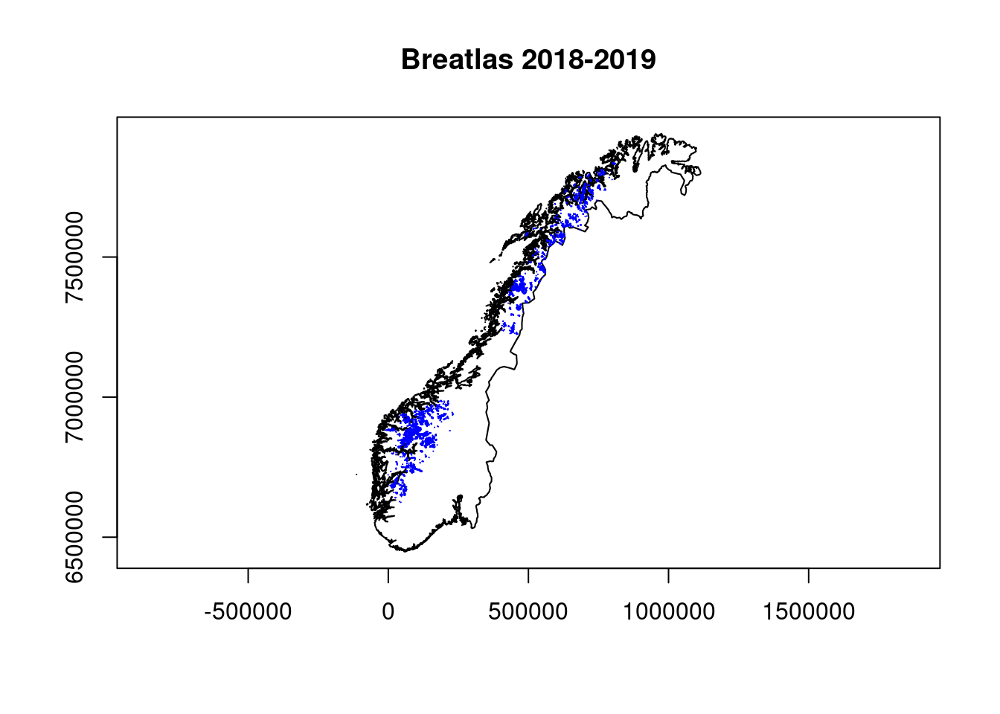


#### N50
This is the old glacial extent map. Import it and transform it, same as before.


```r

# server path
n50_path <- '/data/P-Prosjekter/41201042_okologisk_tilstand_fastlandsnorge_2020_dataanaly/fjell2021/data/breatlas/n50/cryoclim_GAO_NO_1952_1985_UTM_33N.shp'

# local path
#n50_path <- 'P:/41201042_okologisk_tilstand_fastlandsnorge_2020_dataanaly/fjell2021/data/breatlas/n50/cryoclim_GAO_NO_1952_1985_UTM_33N.shp'

n50 <- sf::st_read(n50_path)%>%
  st_transform(crs = crs(breatlas))
#> Reading layer `cryoclim_GAO_NO_1952_1985_UTM_33N' from data source `/data/P-Prosjekter/41201042_okologisk_tilstand_fastlandsnorge_2020_dataanaly/fjell2021/data/breatlas/n50/cryoclim_GAO_NO_1952_1985_UTM_33N.shp' 
#>   using driver `ESRI Shapefile'
#> Simple feature collection with 7141 features and 30 fields
#> Geometry type: POLYGON
#> Dimension:     XY
#> Bounding box:  xmin: -7278.562 ymin: 6623024 xmax: 812207.8 ymax: 7841654
#> Projected CRS: WGS 84 / UTM zone 33N
```


```r
plot(nor$geometry, axes=T, main = "n50 - 1952-1985")
  plot(n50$geometry, add=T, border = "red")
```


Let's now plot it all on top of each other.


```r

# define some boundary boxes for zooming in on specific regions
myExt <- raster::extent(c(0, 100000, 6840000, 6900000))
myExt2 <- raster::extent(c(5000, 10000, 6880000, 6885000))

# Prepare plotting device with one row, three columns
par(mfrow=c(1,3))

# Create three maps, each zooming in a bit further.
plot(nor$geometry, axes=T)
    plot(n50$geometry,  border = "orange", col = scales::alpha("orange", 1), add=T)
    plot(myExt, add=T, lwd=2)

plot(nor$geometry, xlim=c(0, 100000),
          ylim=c(6840000, 6900000),
          axes=T)
    plot(n50$geometry, add=T, col = "grey")
    plot(myExt2, add=T, lwd=3, col="orange")

# for this last map I plot the old extent in red and the new as grey on top. The red areas still visible will be areas where the glaciers have retreated.        
plot(nor$geometry, xlim=c(5000, 10000),
          ylim=c(6880000, 6885000),
     axes=T)
    plot(n50$geometry, add=T, col = "red")
    plot(breatlas$geometry, add=T, col = "grey")
```


The red areas in the map to the far right is where the ice has retreated for a selected glacier on the west coast. 
Now we need to devide the map into regions to then compare the area in n50 with the new glacial extent map _breatlas_.


#### Regions
Importing a shape file with the regional delineation. 


```r
reg <- st_read("data/regions.shp")
#> Reading layer `regions' from data source 
#>   `/data/scratch/Matt_bookdown__debug/ecosystemCondition/data/regions.shp' 
#>   using driver `ESRI Shapefile'
#> Simple feature collection with 5 features and 2 fields
#> Geometry type: POLYGON
#> Dimension:     XY
#> Bounding box:  xmin: -99551.21 ymin: 6426048 xmax: 1121941 ymax: 7962744
#> Projected CRS: ETRS89 / UTM zone 33N
st_crs(reg)
#> Coordinate Reference System:
#>   User input: ETRS89 / UTM zone 33N 
#>   wkt:
#> PROJCRS["ETRS89 / UTM zone 33N",
#>     BASEGEOGCRS["ETRS89",
#>         ENSEMBLE["European Terrestrial Reference System 1989 ensemble",
#>             MEMBER["European Terrestrial Reference Frame 1989"],
#>             MEMBER["European Terrestrial Reference Frame 1990"],
#>             MEMBER["European Terrestrial Reference Frame 1991"],
#>             MEMBER["European Terrestrial Reference Frame 1992"],
#>             MEMBER["European Terrestrial Reference Frame 1993"],
#>             MEMBER["European Terrestrial Reference Frame 1994"],
#>             MEMBER["European Terrestrial Reference Frame 1996"],
#>             MEMBER["European Terrestrial Reference Frame 1997"],
#>             MEMBER["European Terrestrial Reference Frame 2000"],
#>             MEMBER["European Terrestrial Reference Frame 2005"],
#>             MEMBER["European Terrestrial Reference Frame 2014"],
#>             ELLIPSOID["GRS 1980",6378137,298.257222101,
#>                 LENGTHUNIT["metre",1]],
#>             ENSEMBLEACCURACY[0.1]],
#>         PRIMEM["Greenwich",0,
#>             ANGLEUNIT["degree",0.0174532925199433]],
#>         ID["EPSG",4258]],
#>     CONVERSION["UTM zone 33N",
#>         METHOD["Transverse Mercator",
#>             ID["EPSG",9807]],
#>         PARAMETER["Latitude of natural origin",0,
#>             ANGLEUNIT["degree",0.0174532925199433],
#>             ID["EPSG",8801]],
#>         PARAMETER["Longitude of natural origin",15,
#>             ANGLEUNIT["degree",0.0174532925199433],
#>             ID["EPSG",8802]],
#>         PARAMETER["Scale factor at natural origin",0.9996,
#>             SCALEUNIT["unity",1],
#>             ID["EPSG",8805]],
#>         PARAMETER["False easting",500000,
#>             LENGTHUNIT["metre",1],
#>             ID["EPSG",8806]],
#>         PARAMETER["False northing",0,
#>             LENGTHUNIT["metre",1],
#>             ID["EPSG",8807]]],
#>     CS[Cartesian,2],
#>         AXIS["(E)",east,
#>             ORDER[1],
#>             LENGTHUNIT["metre",1]],
#>         AXIS["(N)",north,
#>             ORDER[2],
#>             LENGTHUNIT["metre",1]],
#>     USAGE[
#>         SCOPE["Engineering survey, topographic mapping."],
#>         AREA["Europe between 12°E and 18°E: Austria; Denmark - offshore and offshore; Germany - onshore and offshore; Norway including Svalbard - onshore and offshore."],
#>         BBOX[46.4,12,84.42,18]],
#>     ID["EPSG",25833]]
```

Let's plot it to make sure it is correct.

```r
plot(nor$geometry, axes=T)
  plot(reg$geometry, add=T, border = "black", 
       col = scales::alpha(c("blue", 
                             "red", 
                             "green",
                             "yellow",
                             "brown"), .2))
```


Get the region names

```r
unique(reg$region)
#> [1] "Nord-Norge"      "Midt-Norge"      "Ã\u0098stlandet"
#> [4] "Vestlandet"      "Sørlandet"
```

These are odd. Let me fix the Norwegian letters manually.

```r
reg$region[reg$region=="Ã\u0098stlandet"] <- "Østlandet"
reg$region[reg$region=="Sørlandet"] <- "Sørlandet"
```


Before going any further I need to fix a problem with glacier polygons crossing themselves. 

```r
table(st_is_valid(breatlas))
#> 
#> FALSE  TRUE 
#>    68  6847
```
 68 polygons are not valid. 
 Let's look at the first four reasons for why that is. 


```r
unique(st_is_valid(breatlas, reason=T))[1:5]
#> [1] "Valid Geometry"                                       
#> [2] "Ring Self-intersection[100236.4931 6912507.5864]"     
#> [3] "Ring Self-intersection[92500.2095999997 6900940.8003]"
#> [4] "Ring Self-intersection[91965.6612 6883260.4912]"      
#> [5] "Ring Self-intersection[120595.9254 6853573.4955]"
```

There is a convinient function to fix this.

```r
# requires lwgeom
breatlas2 <- st_make_valid(breatlas)
table(st_is_valid(breatlas2))
#> 
#> TRUE 
#> 6915

# same result:
#breatlas2 <- st_buffer(breatlas, 0.0)
#table(st_is_valid(breatlas2))
```


Let me plot the new, fixed map on top of the old to see if they match. I give the new valid map a blue transparent colour, and the old map a yellow and transparent colour.  

```r
plot(nor$geometry, xlim=c(5000, 10000),
          ylim=c(6880000, 6885000),
     axes=T)
    plot(breatlas2$geometry, add=T, col = scales::alpha("blue",0.5))
    plot(breatlas$geometry, add=T, col = scales::alpha("yellow",0.5))
```


This seems to have worked. 
Notice also how some of these larger polygons are somewhat arbitrarely divided into several adjoining polygons. This is only so for the new map, not the old n50 map.

Delete the invalid data set.

```r
breatlas <- breatlas2
rm(breatlas2)
```


### Glacial area per region
#### Contemporary area

Here is one method for getting the glacial area for each region.

```r
# This intersection operation is a bit heavy, so I do it once and store it locally so that I can import it again quickly. 
#brealtas_reg <- st_intersection(breatlas, reg)
#saveRDS(brealtas_reg, "indicators/data/brealtas_reg_helperfile.rds")

# Importing what I create above
brealtas_reg <- readRDS("data/brealtas_reg_helperfile.rds")
```


Checking what happens to polygons that span to regions. Central Norway in red and western Norway in green. 50% transparency means we should get a third colour where and if they overlap.

```r
plot(brealtas_reg$geometry[brealtas_reg$region=="Midt-Norge"], 
    col = scales::alpha("red",0.5), border=NA, axes=T, 
     ylim=c(6900000, 6905000),
     xlim=c(85000, 100000))
plot(brealtas_reg$geometry[brealtas_reg$region=="Vestlandet"], 
     col = scales::alpha("green",0.5), border=NA, add=T)
  plot(nor$geometry, add=T)
```


It worked fine. 

Calculating the area of the polygons

```r
#Calculating the area of the polygons
brealtas_reg$area_crop <- st_area(brealtas_reg)

# summing the area for each region
bretabell <- tapply(
       brealtas_reg$area_crop,
       brealtas_reg$region,
       FUN = sum)

# converting from m2 to km2
bretabell <- bretabell/1000000

# plotting
barplot(
  bretabell,
  ylab="Breareal (km2)"
)
```


Southern Norway has <1km2 of glaciers in 2018-2019.


#### Same for N50

```r
n50x <- st_make_valid(n50)
#n50_reg <- st_intersection(n50x, reg)
#saveRDS(n50_reg, "indicators/data/n50_helperfile.rds")
n50_reg <- readRDS("data/n50_helperfile.rds")
```


```r
plot(n50_reg$geometry[n50_reg$region=="Midt-Norge"], 
    col = scales::alpha("red",0.5), border=NA, axes=T, 
     ylim=c(6900000, 6905000),
     xlim=c(85000, 100000))
plot(n50_reg$geometry[n50_reg$region=="Vestlandet"], 
     col = scales::alpha("green",0.5), border=NA, add=T)
  plot(nor$geometry, add=T)
```


Thats good. 
Now I will plot the reference values (n50) and the contemporary data together.

```r
n50_reg$area_crop <- st_area(n50_reg)

n50tabell <- tapply(
       n50_reg$area_crop,
       n50_reg$region,
       FUN = sum)
n50tabell <- n50tabell/1000000 


barplot(
  n50tabell,
  ylab="Breareal (km2)",
  col="grey"
)
barplot(
  bretabell,
  ylab="Breareal (km2)",
  add=T,
  col="grey30"
)
```


In the figure above, the glacial area in the reference periond is in light grey and todays area is in dark grey. The height of the light grey bar depicts the reduction in glacial area.

There was a little more glaicers in southern Norway in the reference period, but only 4 km2. The condition here will be very poor! I'm not entirely sure this is representative. The alternative is to set it to be NA, and I think I will do this - one could argue that glaciers are not as important of central to the alpine ecosystems in the south. 


### Scaled indicator values
Making a table with the indicator values.

```r
myTbl <- tibble(region           = names(bretabell),
                indikator        = bretabell,
                referanseverdi   = n50tabell)
myTbl$skalert_indikator <- myTbl$indikator/myTbl$referanseverdi

knitr::kable(myTbl)
```


|region     |    indikator| referanseverdi| skalert_indikator|
|:----------|------------:|--------------:|-----------------:|
|Midt-Norge |   69.8685069|     173.436069|         0.4028488|
|Nord-Norge |  928.5326204|    1409.196007|         0.6589095|
|Østlandet  |  251.3490789|     365.357472|         0.6879538|
|Sørlandet  |    0.7033655|       3.739583|         0.1880866|
|Vestlandet | 1077.9902876|    1372.939792|         0.7851694|

Scaling and clipping the regions against the outline of Norway


```r
# paste the scaled indicato values into the shape file with the regions, using the match function to make sure the align correctly
reg$skalert_indikator <- myTbl$skalert_indikator[match(reg$region, myTbl$region)]

# cutting away the marine areas
reg_clipped <- st_intersection(reg, nor)
#> Warning: attribute variables are assumed to be spatially
#> constant throughout all geometries
```


```r
# round of to 2 decimals
reg_clipped$skalert_indikator_r <- round(reg_clipped$skalert_indikator, 2)
```


Plotting a static map with scaled indicator values

```r
tmap_mode("plot") # mode 'view' takes a lot longer to render, but looks better
#> tmap mode set to plotting
tm_shape(reg_clipped) + 
  tm_polygons(col="skalert_indikator", 
              border.col = "white")+
  tm_text("skalert_indikator_r", size=1.5)+
  tm_shape(nor)+
  tm_polygons(alpha = 0,border.col = "black")
```


```r
# removing the value for souther norway
reg_clipped$skalert_indikator[reg_clipped$region=="Sørlandet"] <- NA
```

Calculating total change of glacier extent

```r
sum(bretabell)/sum(n50tabell)
#> [1] 0.7003536
```

We've lost 30% of the glacial area over this time.


### Uncertainty
NVE reports a 3% uncertainty with their method. This is interpret as if +- 3% represent a 99.9%CI for the estimate (ca 2 SD).
In the [original indicator](https://ninanor.github.io/IBECA/areal-av-isbreer.html) I re-sampled the indicator value 10000 times here, with a 0.015sd, to get a distribution of indicator values. This time I will settle for reporting the sd as a single value below. 


## Prepare export
Now I can prepare the final exported data file. It will be a shape file with raw and scaled indicator values, reference reference values, and uncertainties.

The names of the columns are standardised (region, v_YYYY, sd_YYYY, i_YYYY, and reference).


```r
names(reg_clipped)
#> [1] "id"                  "region"             
#> [3] "skalert_indikator"   "GID_0"              
#> [5] "NAME_0"              "geometry"           
#> [7] "skalert_indikator_r"
```


```r
# paste the raw variable estimates
reg_clipped$v_2019 <- myTbl$indikator[match(reg_clipped$region, myTbl$region)]              

# paste the reference values
reg_clipped$reference <- myTbl$referanseverdi[match(reg_clipped$region, myTbl$region)]      

# add 3% (one-sided) errors (SD=1.5% so that 1.95SD equals about 3%). 
reg_clipped$sd_2019 <- reg_clipped$v_2019*0.015
        
# subset the shape file to include only the columns of interest, and rename the column with the scaled indicator values, assigning the value to year 2019.
exp <- dplyr::select(reg_clipped,
                     region,
                     v_2019,
                     sd_2019,
                     reference,
                     i_2019 = skalert_indikator,
                     geometry)

```


### Eksport shape file (final product)


```r
sf::st_write(exp, "indicators/indicatorMaps/breareal.shp")
```


```r
knitr::kable(exp[,1:5])
```


|region     |       v_2019|     sd_2019|   reference|    i_2019|geometry                       |
|:----------|------------:|-----------:|-----------:|---------:|:------------------------------|
|Nord-Norge |  928.5326204| 13.92798931| 1409.196007| 0.6589095|MULTIPOLYGON (((353978.3 72... |
|Midt-Norge |   69.8685069|  1.04802760|  173.436069| 0.4028488|MULTIPOLYGON (((148280.6 69... |
|Østlandet  |  251.3490789|  3.77023618|  365.357472| 0.6879538|MULTIPOLYGON (((236668.3 66... |
|Vestlandet | 1077.9902876| 16.16985431| 1372.939792| 0.7851694|MULTIPOLYGON (((875.0099 64... |
|Sørlandet  |    0.7033655|  0.01055048|    3.739583|        NA|MULTIPOLYGON (((-4329.09 64... |


<!--chapter:end:breareal.Rmd-->

# (PART\*) INDICATORS{-}

# Slitasje og kjørespor

*Author and date:* 

Anders L. Kolstad

March 2023


|Ecosystem                                                           |Økologisk.egenskap                       |ECT.class                      |
|:-------------------------------------------------------------------|:----------------------------------------|:------------------------------|
|Våtmark, Naturlig åpne områder under skoggrensa, Semi-naturlig mark |Primærproduksjon (evt. Abiotiske fohold) |Physical state characteristics |

<hr/>

## Introduction
This indicator represent human caused damage or **disturbance to soils and vegetation**, typically from things like recreational activities and off-road vehicle traffic. The data come from a combination non-random field surveys and area-representative surveys. Disturbance to soils and vegetation is recorded in the various data sets are NiN variables 7SE and 7TK, or as the similar, but more fine-scaled variable, PRSL and PRTK. Effects from domestic animal is not included in the definition of these variables, and the upper reference value is therefore set to 0% disturbance. 

Since the data is not sampled in a systematic or random way, we must take extra care not to over-extrapolate in space. We delineate _homogeneous impact areas_ (HIA) based on four classes of increasing infrastructure, and we say that the field data is representative inside the HIA and region (_five regions in Norway_) where it was recorded. We then calculate an area weighted mean (and error) indicator value for each HIA and region combination, as long as there is more than 150 data points for a give combination of HIA and region.     

Here is a general workflow for the calculation of the indicator.

1.  Import [Nature type data](#NTM) data set (incl. GRUK) and [ANO data
    set](#ANO-import)

2.  Identify the [relevant](#naturtype) nature types and [subset](#NTM)
    the data

3.  Convert [ANO points to polygons](#ANO-points-to-poly)

4.  For each polygon, extract the NiN-variable that has the lowest value
    (one-out all-out principle), e.g. Fig. \@ref(fig:slitasje-naturetype).

5.  [Combine](#combine-nt-ano) data sets

6.  [Scale](#scale-slitasje-ind) the `slitasje` variable based on
    reference values.

7.  Define [homogeneous impact areas](#HIA) (HIA)

8.  [Aggregate and spread](#spread-slitasje) indicator value across HIAs
    and assessment regions

9.  Confirm relationship between infrastructure index and indicator
    values to justify the extrapolation

10. TO DO: Prepare ecosystem delineation maps and us ethese to mask the extrapolated indicator maps

11. Spatial aggregation of indicator values and uncertainties to accounting areas

12. Export indicator maps and regional extrapolated maps

## About the underlying data

The indicator uses a data set from a standardised field survey of nature
types. You can read more about the preliminary analyses
[here](#naturtype). See also the [official
site](https://www.miljodirektoratet.no/ansvarsomrader/overvaking-arealplanlegging/naturkartlegging/naturtyper/)
of the Environment Agency. I also import a data set called
[ANO](#ANO-import), which you can read about
[here](https://www.miljodirektoratet.no/ansvarsomrader/overvaking-arealplanlegging/miljoovervaking/overvakingsprogrammer/natur-pa-land/arealrepresentativ-naturovervakning-ano/)

### Representativity in time and space

The nature type mapping is not random and cannot be said to be area
representative. The ANO data set however, is area representative. The
data is from 2018 to present. The data from one field season usually
becomes available early the following year.

### Original units

The variables are recorded on a coarse four-step ordinal scale (Fig.
\@ref(fig:four-step)) or eigth-step scale.

### Temporal coverage

The data goes back to 2018. I therefore bulk all the data from 2018 to 2022 into one time step. I then use the mean date for the raw data,
and define the variable as belonging to the year 2020 (read more
[here](#scaled-slitasje-variable)).

### Aditional comments about the dataset

For a run through of the nature type data set, see [here](#naturtype).

## Ecosystem characteristic

### Norwegain standard

The indicator is tagged to the *Økologisk egenskap* called
**Primærproduksjon** (Primary productivity). This is tentative, and
perhaps *abiotiske forhold* is more suited. But the thought behind the
choice is that *slitasje* affect the potential for primary productivity.

### UN standard

The indicator is tagged as a **Physical state characteristics**
indicator. This is quite clear. It's a type of abiotic characteristic that
has to do with the physical structure rather than the chemical
composition.

## Collinearities with other indicators

_Slitasje_ is not thought to exhibit collinearity with any other indicator at
the present.

## Reference condition and values

### Reference condition

The reference condition is one with minimal negative human impact. This
is also true for semi-natural ecosystems. For example, in the reference
condition, *slitasje* in semi-natural ecosystems is defined to be zero,
even though at no point in time would this condition be realized.

### Reference values, thresholds for defining *good ecological condition*, minimum and/or maximum values

* Upper = 0%

* Threshold = 10%

* Lower = 100%

The upper reference value is 0 (no *slitasje*), and the lower reference
value is 100%. Note that 100% _slitasje_ does not mean that all the area
must be scarred or damaged, but that all hypothetical quadrats around a
point is affected (the variable is frequency-driven, and not
amount-driven). The threshold for good ecosystem condition is 10%
damage. Perhaps is should be set somewhat higher, like 20 or 30%.
The indicator value could be interpretted differently at the polygon
vs at the landscape scale. At the polygon scale, 10% damage may seem 
like not that much, whilst at the landscape scale, 10% seems more serious.
This final threshold value should be debated and illustrated with examples.

Read about the normalisation [here](##scaled-slitasje-variable).

## Uncertainties

Uncertainties/errors are estimated for aggregated indicator values by
bootstrapping individual indicator values 1000 times and calculating a
distribution of area weighted means. See the documentation for `eaTools::ea_spread` [here](https://ninanor.github.io/eaTools/reference/ea_spread.html). 
This uncertainty is different from 
the spatial variation which we could get more straight forward without 
bootstrapping. When aggregating a second time,
from homogeneous impact areas to accounting areas, we assume a normal
distribution around the indicator values, with the already mentioned
errors, and sample _n_ times from these and combine the resamples into an
a new, area weighted, distribution. The errors for the accounting areas
thus represents both the spatial variation, and the precision, of the
indicator values within the accounting areas.

## References

No additional references.

## Analyses

### Data sets

#### Nature type mapping {#NTM}

This indicator uses the data set
`Naturtyper etter Miljødirektoratets Instruks`, which can be found
[here](https://kartkatalog.geonorge.no/metadata/naturtyper-miljoedirektoratets-instruks/eb48dd19-03da-41e1-afd9-7ebc3079265c).
See also [here](#naturtype) for a detailed description of the data set.

We also have a separate [summary file](##exp-natureType-summary) where
the nature types are manually mapped the NiN variables and to the correct NiN-main types. We can use this to find the nature types associated with the NiN main types
that we are interested in.


```r
naturetypes_summary_import <- readRDS("data/naturetypes/natureType_summary.rds")
```

We are only interested in a mapping units that include our target variables.


```r
myVars <- c('7TK', '7SE', 'PRTK', 'PRSL')
```


```r
naturetypes_summary <- naturetypes_summary_import %>%
  rowwise() %>%
  mutate(keepers = sum(c_across(
    all_of(myVars))>0, na.rm=T)) %>%
  filter(keepers > 0) %>%
  select(Nature_type, NiN_mainType, Year)
```

This deleted 17 nature types and left us with these:


```r
DT::datatable(naturetypes_summary)
```

```{=html}
<div class="datatables html-widget html-fill-item-overflow-hidden html-fill-item" id="htmlwidget-94494b72aa0d78d02217" style="width:100%;height:auto;"></div>
<script type="application/json" data-for="htmlwidget-94494b72aa0d78d02217">{"x":{"filter":"none","vertical":false,"data":[["1","2","3","4","5","6","7","8","9","10","11","12","13","14","15","16","17","18","19","20","21","22","23","24","25","26","27","28","29","30","31","32","33","34","35","36","37"],["Slåttemyr","Eng-aktig sterkt endret fastmark","Sørlig kaldkilde","Åpen flomfastmark","Høgereligende og nordlig nedbørsmyr","Øyblandingsmyr","Strandeng","Nakent tørkeutsatt kalkberg","Kystlynghei","Sørlig slåttemyr","Konsentrisk høymyr","Boreal hei","Sanddynemark","Semi-naturlig strandeng","Rik åpen jordvannsmyr i mellomboreal sone","Sørlig nedbørsmyr","Atlantisk høymyr","Terrengdekkende myr","Åpen grunnlendt kalkrik mark i boreonemoral sone","Rik åpen sørlig jordvannsmyr","Aktiv skredmark","Semi-naturlig myr","Silt og leirskred","Eksentrisk høymyr","Øvre sandstrand uten pionervegetasjon","Kalkrik helofyttsump","Fuglefjell-eng og fugletopp","Isinnfrysingsmark","Åpen grunnlendt kalkrik mark i sørboreal sone","Sørlig etablert sanddynemark","Rik åpen jordvannsmyr i nordboreal og lavalpin sone","Fossepåvirket berg","Fosse-eng","Svært tørkeutsatt sørlig kalkberg","Kanthøymyr","Platåhøymyr","Palsmyr"],["V9","T41","V4","T18","V3","V1","T12","T1","T34","V9","V3","T31","T21","T33","V1","V3","V3","V3","T2","V1","T17","V9","T17","V3","T29","L4","T8","T20","T2","T21","V1","T1","T15","T1","V3","V3","V3"],["2018, 2019, 2020, 2021, 2022","2018, 2019, 2020, 2021, 2022","2018, 2019, 2020, 2021, 2022","2018, 2019, 2020, 2021, 2022","2019, 2020, 2021, 2022","2019, 2020, 2021, 2022","2018, 2019, 2020, 2021, 2022","2019, 2020, 2021, 2022","2018, 2019, 2020, 2021, 2022","2019, 2020, 2021, 2022","2019, 2020, 2022","2018, 2019, 2020, 2021, 2022","2018, 2019, 2020, 2021, 2022","2018, 2019, 2020, 2021, 2022","2019, 2020, 2021, 2022","2019, 2020, 2021, 2022","2019, 2020, 2021, 2022","2019, 2020, 2021, 2022","2018, 2019, 2020, 2021, 2022","2018, 2019, 2020, 2021, 2022","2019, 2020, 2021, 2022","2019, 2020, 2021, 2022","2019, 2020, 2021, 2022","2019, 2020, 2021, 2022","2019, 2020, 2021, 2022","2019, 2020, 2021, 2022","2019, 2020, 2021, 2022","2018, 2019, 2020, 2021, 2022","2019, 2020, 2021","2018, 2019, 2020, 2021, 2022","2019, 2020, 2021, 2022","2019, 2020, 2021, 2022","2019, 2020, 2022","2019, 2020, 2021, 2022","2019, 2020, 2021, 2022","2019, 2020, 2021, 2022","2021, 2022"]],"container":"<table class=\"display\">\n  <thead>\n    <tr>\n      <th> <\/th>\n      <th>Nature_type<\/th>\n      <th>NiN_mainType<\/th>\n      <th>Year<\/th>\n    <\/tr>\n  <\/thead>\n<\/table>","options":{"columnDefs":[{"orderable":false,"targets":0}],"order":[],"autoWidth":false,"orderClasses":false}},"evals":[],"jsHooks":[]}</script>
```

Importing and sub-setting the main data file, fix duplicate _hovedøkosystem_, calculate area, split one column in two, make numeric, and select target variables:

```r
naturetypes <- sf::st_read(dsn = path) %>%
  filter(naturtype %in% naturetypes_summary$Nature_type) %>%
  mutate(hovedøkosystem = recode(hovedøkosystem,
                                 "naturligÅpneOmråderUnderSkoggrensa" = "naturligÅpneOmråderILavlandet"),
         area = st_area(.)) %>%
  separate_rows(ninBeskrivelsesvariable, sep=",") %>%
  separate(col = ninBeskrivelsesvariable,
           into = c("NiN_variable_code", "NiN_variable_value"),
           sep = "_",
           remove=F) %>%
  mutate(NiN_variable_value = as.numeric(NiN_variable_value)) %>%
  filter(NiN_variable_code %in% myVars)
#> Reading layer `Naturtyper_nin_0000_norge' from data source 
#>   `/data/R/GeoSpatialData/Habitats_biotopes/Norway_Miljodirektoratet_Naturtyper_nin/Original/Naturtyper_nin_0000_norge_25833_FILEGDB/Naturtyper_nin_0000_norge_25833_FILEGDB.gdb' 
#>   using driver `OpenFileGDB'
#> Simple feature collection with 117427 features and 36 fields
#> Geometry type: MULTIPOLYGON
#> Dimension:     XY
#> Bounding box:  xmin: -74953.52 ymin: 6448986 xmax: 1075081 ymax: 7921284
#> Projected CRS: ETRS89 / UTM zone 33N
#> Warning: There was 1 warning in `stopifnot()`.
#> ℹ In argument: `NiN_variable_value =
#>   as.numeric(NiN_variable_value)`.
#> Caused by warning:
#> ! NAs introduced by coercion
```


```r
ggplot(data = naturetypes, aes(x = naturtype, fill = hovedøkosystem))+
  geom_bar()+
  coord_flip()+
  theme_bw(base_size = 12)+
  theme(legend.position = "top",
        legend.title = element_blank(),
        legend.direction = "vertical")+
  #guides(fill = "none")+
  xlab("")+
  ylab("Number of localities")
```

<div class="figure">
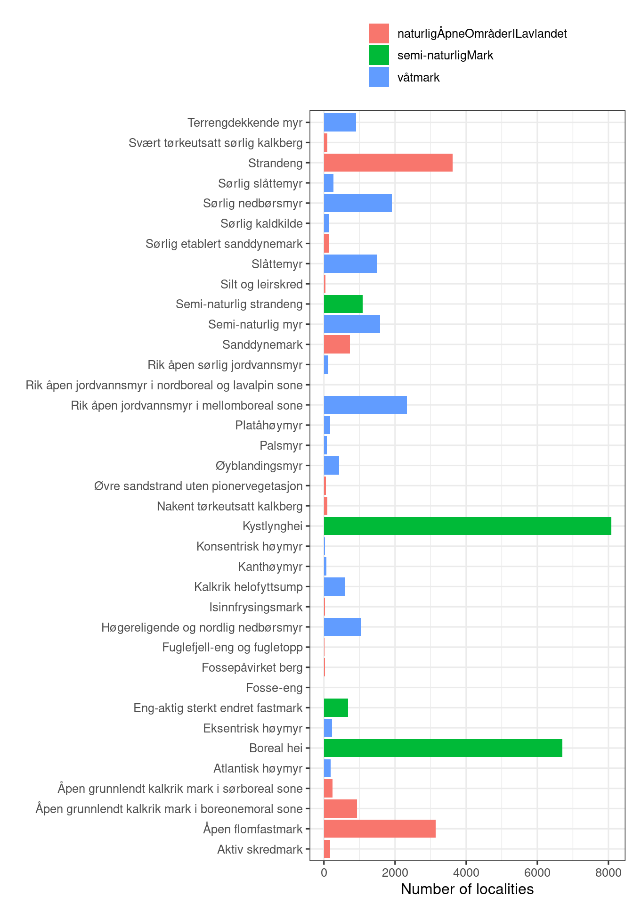
<p class="caption">(\#fig:unnamed-chunk-8)An overview of the naturetypes for which we will calculate the indicator. Colours refer to the main ecosystem affiliation.</p>
</div>

Column names starting with a number is problematic, so adding a prefix


```r
naturetypes$NiN_variable_code <- paste0("var_", naturetypes$NiN_variable_code)
```


```r
barplot(table(naturetypes$kartleggingsår))
```

<div class="figure">

<p class="caption">(\#fig:unnamed-chunk-10)Distribution of data points over time.</p>
</div>


Now I need to create a single row per locality with a new variable which
is a product/function of the four variables "7SE", "7TK", "PRTK" and
"PRSL". I want to base this indicator on whichever of the variables have the highest value (worst condition). Therefore I first convert the ordinal scale to a continuous scale, using the median value of each ordinal step.

The variables use slightly different scales. PRSL and PRTK use this 8
step scale:


```r
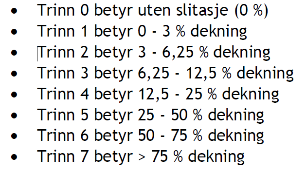
```

<div class="figure">

<p class="caption">(\#fig:eight-step)Eight step condition scale</p>
</div>

7TK and 7SE use a 4 step scale


```r
knitr::include_graphics("images/ninAR4b.PNG")
```

<div class="figure">

<p class="caption">(\#fig:four-step)Four step condition scale</p>
</div>

I here transfer these ordinal variables over to a continuous scale.


```r
naturetypes <- naturetypes %>%
  mutate(NiN_variable_value = case_when(
    NiN_variable_code %in% c("var_7TK", "var_7SE") ~ 
      case_match(NiN_variable_value,
             0 ~ 0,
             1 ~ mean(c(0, 1/16))*100,
             2 ~ mean(c(1/16, 1/2))*100,
             3 ~ 75),
    NiN_variable_code %in% c('var_PRTK', 'var_PRSL') ~ 
      case_match(NiN_variable_value,
             0 ~ 0,
             1 ~ 1.5,
             2 ~ mean(c(3, 6.25)),
             3 ~ mean(c(6.25, 12.5)),
             4 ~ mean(c(12.5, 25)),
             5 ~ mean(c(25, 50)),
             6 ~ mean(c(50, 75)),
             7 ~ mean(c(75, 100)))
    )
  )
```


I will create a new data table where I calculate the new
variable which I then paste back into the sf object.


```r
naturetypes_wide <- pivot_wider(naturetypes,
                                names_from = "NiN_variable_code",
                                values_from = "NiN_variable_value",
                                id_cols = "identifikasjon_lokalId")
naturetypes_wide <- as.data.frame(naturetypes_wide)
head(naturetypes_wide, 10)
#>    identifikasjon_lokalId var_PRSL var_7TK var_7SE var_PRTK
#> 1         NINFP2210087853      0.0       0      NA       NA
#> 2         NINFP2210087857      0.0       0      NA       NA
#> 3         NINFP1910012022       NA      NA   0.000       NA
#> 4         NINFP1910005432      1.5      NA      NA       NA
#> 5         NINFP2210089748       NA       0   0.000       NA
#> 6         NINFP2210096062       NA      NA   0.000      0.0
#> 7         NINFP1910029434       NA      NA   3.125      1.5
#> 8         NINFP2010029112       NA       0   0.000       NA
#> 9         NINFP2010029325       NA       0   0.000       NA
#> 10        NINFP1910057556       NA      NA   0.000       NA
```

First I will combine 7TK and PRTK, and also 7SE and PRSL


```r
naturetypes_wide <- naturetypes_wide %>%
  mutate(TK = if_else(
    is.na(var_PRTK), var_7TK, var_PRTK),
    SE = if_else(
      is.na(var_PRSL), var_7SE, var_PRSL)
    )
```


SE has 10064
NA's, and TK has
7007.


```r
temp <- naturetypes_wide %>%
  group_by(SE) %>%
  summarise(sum = n())

ggplot(temp, aes(x = factor(SE),
                 y = sum))+
  geom_bar(stat="identity",
           fill="grey",
           colour = "black")+
  theme_bw(base_size = 12)+
  labs(x = "7SE or PRSL score",
       y = "Number of localities")
```

<div class="figure">
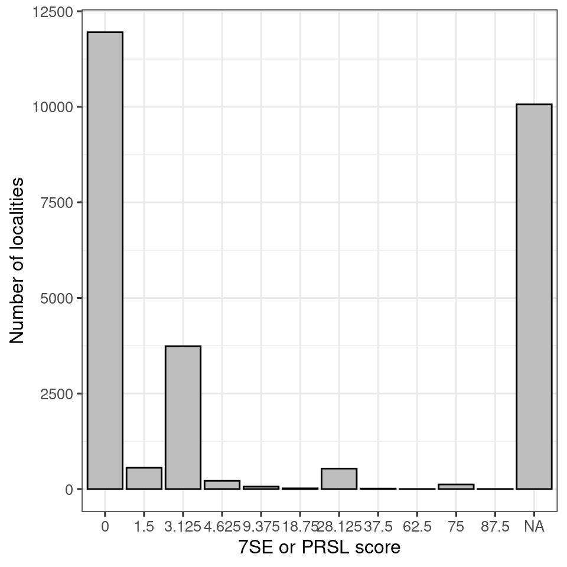
<p class="caption">(\#fig:unnamed-chunk-14)7SE scores in the naturetype dataset</p>
</div>

The NA fraction is quite big. These are localities with 7TK or PRTK recorded,
but not 7SE or PRSL.


```r
temp <- naturetypes_wide %>%
  group_by(TK) %>%
  summarise(sum = n())

ggplot(temp, aes(x = factor(TK),
                 y = sum))+
  geom_bar(stat="identity",
           fill="grey",
           colour = "black")+
  theme_bw(base_size = 12)+
  labs(x = "7TK og PRTK score",
       y = "Number of localities")
```

<div class="figure">

<p class="caption">(\#fig:unnamed-chunk-15)7TK scores in the nature type dataset</p>
</div>

Then I can combine these two variables into a composite variable called
`slitasje`


```r
naturetypes_wide$slitasje <- apply(naturetypes_wide[,c("TK", "SE")], 1, max, na.rm=T)
```

When both variables are NA, we get -Inf. There were 13 cases of this. Removing these now.


```r
naturetypes_wide <- naturetypes_wide[naturetypes_wide$slitasje>=0,]
```


```r
temp <- naturetypes_wide %>%
  group_by(slitasje) %>%
  summarise(sum = n())

ggplot(temp, aes(x = factor(slitasje),
                 y = sum))+
  geom_bar(stat="identity",
           fill="grey",
           colour = "black")+
  theme_bw(base_size = 12)+
  labs(x = "Slitasje score converted to percentage",
       y = "Number of localities") + 
  theme(axis.text.x = element_text(angle=90, vjust=0.5))
```

<div class="figure">
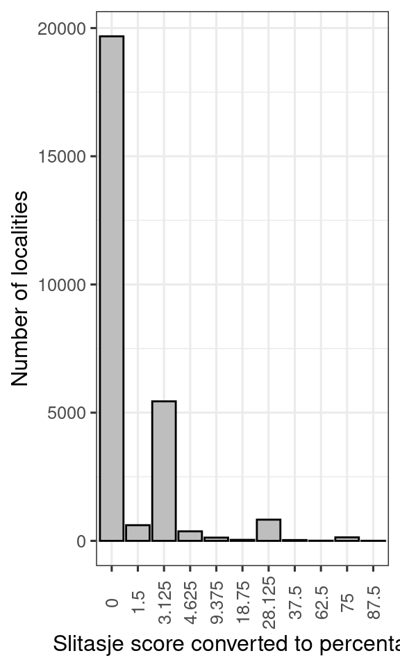
<p class="caption">(\#fig:slitasje-naturetype)Slitasje scores.</p>
</div>

It appears most localities are in good condition.

I would also like to know, when both tk and SE was recordedm
how often TK was defining of the slitasje-indicator, and how 
often it was SE. I can do this by taking the difference.


```r


diff <- naturetypes_wide$SE - naturetypes_wide$TK

diff <- ifelse(diff == 0, "TK and SE",
               ifelse(diff <0, "TK", "SE"))

diff_tbl <- as.data.frame(table(diff))

ggplot(diff_tbl, aes(x = diff, y = Freq))+
  geom_bar(stat = "identity",
           colour = "black",
           fill = "grey")+
  theme_bw(base_size = 12)+
  labs(x = "Defining variable",
       y = "Number of localities")
```

<div class="figure">
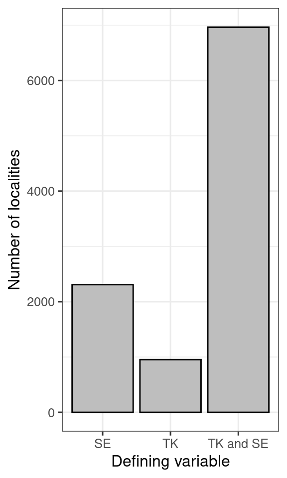
<p class="caption">(\#fig:unnamed-chunk-18)Counting the number of cases where TK or SE was defining of the slitasje indicator score.</p>
</div>

Looks like SE (= 7SE or PRSL) is more likely to be in a detrimental state.

Now I will copy these slitasje-values into the sf object.


```r
naturetypes$slitasje <- naturetypes_wide$slitasje[match(naturetypes$identifikasjon_lokalId, naturetypes_wide$identifikasjon_lokalId)]
#nrow(naturetypes[is.na(naturetypes$slitasje),])  # 13 cases
naturetypes <- naturetypes[!is.na(naturetypes$slitasje),]
```

#### GRUK

This variable is also recorded in
[GRUK](https://www.nina.no/Naturmangfold/Trua-natur/%C3%85pen-grunnlendt-kalkmark).
The nature type data set I'm working on here includes this data already
(presently only 2021 included). GRUK also records a related variable:
`% cover in 5m radii circles`, which is much more detailed. This data is
not published. In any case it is better to use the harmonized data set
in our case.

#### ANO {#ANO-import}

Arealrepresentativ Naturovervåking (ANO) consist of 1000 systematically
placed locations each with 18 sample points. In each sample point a
circle of 250 m2 is visualised, and the main ecosystem is recorded.
Depending on the main ecosystem, certain NiN variables are also
recorded. 7SE is recorded for våtmark, but not semi-natural areas or
naturally open areas. 7TK is recorded in våtmark and naturally open
areas only.

| Variable | Våtmark | Naturlig åpne områder | Semi-naturlige områder |
|----------|---------|-----------------------|------------------------|
| 7SE      | X       | \-                    | \-                     |
| 7TK      | X       | X                     | \-                     |

: Table showing which main ecosystems the two NiN variables 7SE and 7TK
is recorded in withing the ANO data set.

It would be very nice to have 7SE recorded for naturally open areas.
This variable is very relevant here.

I think I will only use våtmark here since my approach will be to the
'worst value' of the variable 7SE and 7TK (see below). I think not
having 7SE for naturally open areas will underestimate the degree of
degredation in these areas.


> *ANO could harmonise better with the Naturetype data set if it included
> 7SE and 7TK for Naturally open and Semi natural ecosystem.*


```r
ano <- sf::st_read(paste0(pData, "Naturovervaking_eksport.gdb"),
                   layer = "ANO_SurveyPoint") %>%
  dplyr::filter(hovedoekosystem_punkt == "vaatmark")
#> Reading layer `ANO_SurveyPoint' from data source 
#>   `/data/P-Prosjekter2/41201785_okologisk_tilstand_2022_2023/data/Naturovervaking_eksport.gdb' 
#>   using driver `OpenFileGDB'
#> Simple feature collection with 8974 features and 71 fields
#> Geometry type: POINT
#> Dimension:     XY
#> Bounding box:  xmin: -51950 ymin: 6467050 xmax: 1094950 ymax: 7923950
#> Projected CRS: ETRS89 / UTM zone 33N
```


```r
table(ano$aar)
#> 
#> 2019 2021 
#>  130  558
```

This data set only contains data from year 2019 and 2021. We need to
update this data set later. It is not clear why there is no data from
2020.

Each point/row here is 250 square meters. The data also contains
information about how big a proportion of this area is made up of the
dominant main ecosystem. However, there are
130
NA's here, which is 19% of the data.

It appears the proportion of each circle that is made up of the dominant
ecosystem was only recorded after year 2019. In fact, the main ecosystem
was not recorded at all in 2019:

```r
# Hard coding name change
#unique(ano$hovedtype_250m2)[3]
#ano$hovedtype_250m2[ano$hovedtype_250m2==unique(ano$hovedtype_250m2)[3]] <- "Aapen jordvassmyr"
```


```r
table(ano$hovedtype_250m2, ano$aar)
#>                             
#>                              2019 2021
#>   Åpen jordvannsmyr             0  416
#>   Boreal hei                    0    1
#>   Fjellhei leside og tundra     0    3
#>   Grøftet torvmark              0    5
#>   Helofytt-ferskvannssump       0    3
#>   Kaldkilde                     0    2
#>   Myr- og sumpskogsmark         0   51
#>   Nedbørsmyr                    0   53
#>   Rasmark                       0    1
#>   Semi-naturlig myr             0    7
#>   Semi-naturlig våteng          0    2
#>   Skogsmark                     0    2
#>   Strandsumpskogsmark           0    2
#>   Våtsnøleie og snøleiekilde    0    6
```

I can remove the NA's, and thus the 2019 data.

> *All of 2019 ANO data is excluded because of missing information*


```r
ano <- ano[!is.na(ano$andel_hovedoekosystem_punkt),]
```

Let's look at the variation in the recorded proportion of ecosystem
cover


```r
par(mar=c(5,6,4,2))
plot(ano$andel_hovedoekosystem_punkt[order(ano$andel_hovedoekosystem_punkt)],
     ylab="Percentage of the 250 m2 area\ncovered by the main ecosystem")
```

<div class="figure">
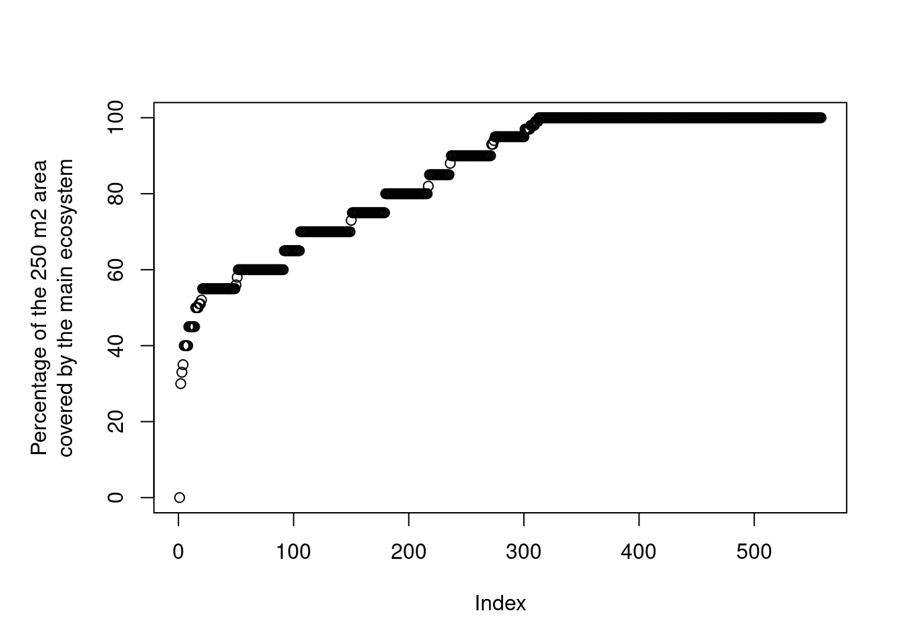
<p class="caption">(\#fig:unnamed-chunk-25)Distribution of the ANO variable andel_hovedoekosystem_punkt for wetland localities.</p>
</div>

The zero in there is an obvious mistake.


```r
ano <- ano[ano$andel_hovedoekosystem_punkt>20,]
```

Here's another plot of the distribution of the same variable:


```r
ggplot(ano, aes(x = andel_hovedoekosystem_punkt))+
         geom_histogram(fill = "grey",
                        colour="black",
                        binwidth = 1)+
  theme_bw(base_size = 12)+
  xlab("Percentage cover of the Våtmark main ecosystem\n in the 250m2 circle")+
  scale_x_continuous(limits = c(0,101),
                     breaks = seq(0,100,10))
```

<div class="figure">
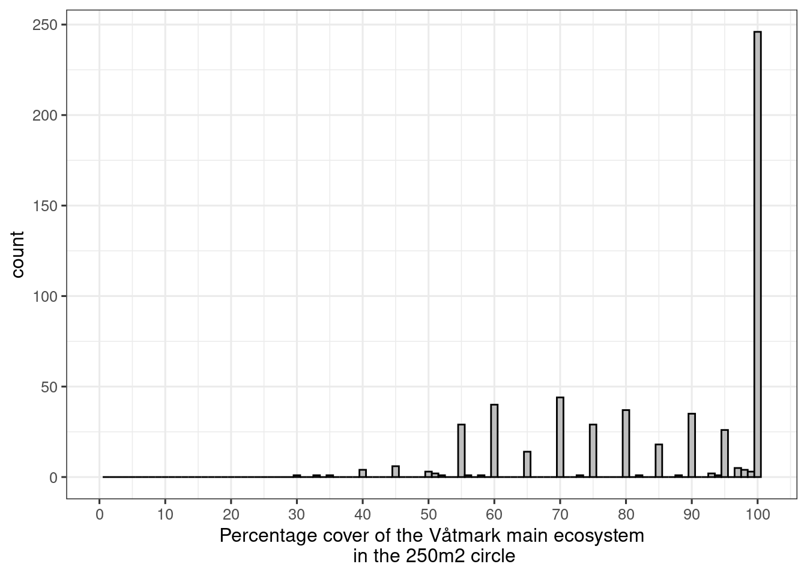
<p class="caption">(\#fig:unnamed-chunk-27)Percentage cover of the Våtmark main ecosystem in the 250m2 circle</p>
</div>

We can see that people tend to record the variable in steps of 5%, and
that most sample points are 100% belonging to the same main ecosystem.

We want to use area weighting in this indicator, so we can use this
percentage cover data to calculate the area. Note that both data sets
use m^2^ as area units.


```r
ano$area <- (ano$andel_hovedoekosystem_punkt/100)*250
```

Let's now look at the distribution of the variables. First I need to
separate the variable name from the values themselves. Now the data
looks like this:


```r
ano$bv_7se[1:6]
#> [1] "7SE_0" "7SE_0" "7SE_0" "7SE_0" "7SE_0" "7SE_0"
```

So I create a new variable prefixed var\_:


```r
ano$var_7SE <- as.numeric(sub(pattern = "7SE_",
                 replacement = "",
                 x = ano$bv_7se))
#> Warning: NAs introduced by coercion
```

The NA's is the case of blank cells. The field app should not allow
users leaving this field blank. I will need to remove these rows. There
are fourteen cases:


```r
nrow(ano[is.na(ano$var_7SE),])
#> [1] 14
```


```r
ano <- ano[!is.na(ano$var_7SE),]
```

Same with the other variable 7TK


```r
ano$var_7TK <- as.numeric(sub(pattern = "7TK_",
                 replacement = "",
                 x = ano$bv_7tk))
```

No NA's this time.


> *The ANO field app should not allow user to leave blank cells. This
> resulted in the exclusion of data.*


```r
par(mfrow=c(1,2))
barplot(table(ano$var_7TK), xlab="7TK scores")
barplot(table(ano$var_7SE), xlab="7SE scores")
```

<div class="figure">

<p class="caption">(\#fig:unnamed-chunk-34)Distribution of 7TK and 7SE scores in the ANO data</p>
</div>

The ANO sites seem to be in an even better condition than the localities in the naturtype data set.

Combining these two variables 7TJ and 7SE into one, same as for the nature
type data.


```r
temp <- as.data.frame(ano)
temp$slitasje <- apply(temp[,c("var_7TK", "var_7SE")], 1, max, na.rm=T)
ano$slitasje <- temp$slitasje
```

Then I extract the mid values for each ordinal range step, like I did previously for the nature type data set.


```r
ano <- ano %>%
  mutate(slitasje = case_match(slitasje,
             0 ~ 0,
             1 ~ mean(c(0, 1/16))*100,
             2 ~ mean(c(1/16, 1/2))*100,
             3 ~ 75))
```


```r
barplot(table(ano$slitasje), xlab="% Slitasje", ylab = "Number of localities")
```

<div class="figure">

<p class="caption">(\#fig:unnamed-chunk-37)Distribution of slitasje scores in the ANO data</p>
</div>

##### Combine Naturtype data and ANO {#combine-nt-ano}

We need to combine the nature type data set with the ANO data set. I
will add a column `origin` to show where the data comes from. I will
also add a column with the main ecosystem.


```r
ano$origin <- "ANO"
naturetypes$origin <- "Nature type mapping"
ano$hovedøkosystem <- "Våtmark"
ano$kartleggingsår <- ano$aar
```

Fix class


```r
naturetypes$kartleggingsår <- as.numeric(naturetypes$kartleggingsår)
naturetypes$area <- units::drop_units(naturetypes$area)
```

I use `dplyr::select` to reduce the number of columns to keep things a
bit more tidy.


```r
slitasje_data <- dplyr::bind_rows(select(ano,
                                  GlobalID,
                                  origin,
                                  kartleggingsår,
                                  hovedøkosystem,
                                  area,
                                  slitasje,
                                  SHAPE), 
                           select(naturetypes,
                                  identifikasjon_lokalId,
                                  origin,
                                  hovedøkosystem,
                                  kartleggingsår,
                                  area,
                                  slitasje,
                                  SHAPE))

unique(st_geometry_type(slitasje_data))
#> [1] POINT        MULTIPOLYGON
#> 18 Levels: GEOMETRY POINT LINESTRING POLYGON ... TRIANGLE
```

###### Points to polygons {#ANO-points-to-poly}

The ANO data is point data, and the nature type data is *multipolygon*.
Because later we might want to save this as a shape file, we cannot have
a mixed class type. I will therefore convert the points to polygons. I
use the area column to calculate a radii that gives that area.


```r
slitasje_data_points <- slitasje_data %>%
  mutate(g_type = st_geometry_type(.)) %>%
  filter(g_type =="POINT") %>%
  st_buffer(sqrt(slitasje_data$area/pi))
```

Checking now that the new polygons have the area corresponding to the
proportion of the point that was part of the same main ecosystem:


```r
slitasje_data_points$area2 <- st_area(slitasje_data_points)
plot(slitasje_data_points$area, slitasje_data_points$area2,
     xlab = "Target area",
     ylab = "Area of the new polygons")
abline(0,1)
```

<div class="figure">

<p class="caption">(\#fig:new-area)Checking that the area of the new polygons fall in line with the proportion of each point which is part of the main ecosystem.</p>
</div>

The area calculation seems to have worked fine. Checking that the new
data set contains **only polygons**.


```r
slitasje_data_polygons <- slitasje_data %>%
  mutate(g_type = st_geometry_type(.)) %>%
  filter(g_type !="POINT")

slitasje_data <- bind_rows(slitasje_data_points, slitasje_data_polygons)

unique(st_geometry_type(slitasje_data))
#> [1] POLYGON      MULTIPOLYGON
#> 18 Levels: GEOMETRY POINT LINESTRING POLYGON ... TRIANGLE
```

Ok.

#### Distribution of Slitasje scores


```r
temp <- as.data.frame(table(slitasje_data$slitasje))
ggplot(temp, aes(x = Var1,
                 y = Freq))+
  geom_bar(stat="identity",
           fill="grey",
           colour = "black")+
  theme_bw(base_size = 12)+
  labs(x = "slitasje score",
       y = "Number of localities")
```

<div class="figure">
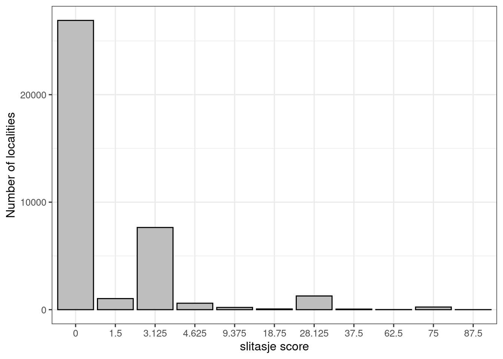
<p class="caption">(\#fig:unnamed-chunk-43)Slitasje scores (ANO Naturetype (and GRUK) data combined). The score for a locality equals the highest (worst) score of the related variables 7TK, 7SE, PRSL and PRTK.</p>
</div>

Let's see the proportion of data points (not area) origination from each
data set


```r
temp <- as.data.frame(table(slitasje_data$origin))

ggplot(temp, aes(x = Var1,
                 y = Freq))+
  geom_bar(stat="identity",
           fill="grey",
           colour = "black")+
  theme_bw(base_size = 12)+
  labs(x = "Data origin",
       y = "Number of localities")
```

<div class="figure">

<p class="caption">(\#fig:unnamed-chunk-44)Barplot show the contribution (number of localities) of different data sets to the slitasje indicator.</p>
</div>

So the ANO data is not very important here, but it can become more
important in the future so good to have them included in the workflow.

#### Outline of Norway and regions

The GIS layers are used to crop out marine areas, and to define
accounting areas, respectively.


```r
outline <- sf::read_sf("data/outlineOfNorway_EPSG25833.shp")
```


```r
regions <- sf::read_sf("data/regions.shp", options = "ENCODING=UTF8")
unique(regions$region)
#> [1] "Nord-Norge" "Midt-Norge" "Østlandet"  "Vestlandet"
#> [5] "Sørlandet"
```

### Scaled indicator values {#scale-slitasje-ind}

I can scale the indicator for each polygon, or I can chose to aggregate
them first. If the scaled value is representative and precise at the
polygon level, then I could scale at that level. I think they are.

However, the combined surveyed area is a very small fraction of the
total area of Norway, so that only producing indicator values for the
mapped areas leaves the indicator without much value for regional
assessments. When we do regional assessments and calculate regional
indicator values, we cannot simply do an area weighting of the polygons
in each region. This is because we don't want to assume that the
polygons are representative far outside of the mapped area. But perhaps
we can assume them to be representative inside *homogeneous ecological
areas,* or *Homoegeneous Impact Areas* (HIAs). That's where the
infrastructure index comes in. Here's the plan:

1.  normalise the indicators at the polygon level.

2.  take a simplified infrastructure index (vector data set with HIAs)
    and extract the corresponding indicator values that intersect with a
    given HIA, and extrapolate the area weighted mean of those values to
    the entire HIA withing a given geographical region. Errors are
    calculated from bootstrapping.

3.  Take the new area weighted indicator values for the HIAs and match
    them with ecosystem occurrences of the same HIA (possibly using
    randomly sampled points from the available ecosystem occurrences).
    The errors are the same as for the HIAs.

4.  calculate an indicator value for a region (accounting area) by doing
    a weighted average based of the relative area of ecosystem
    occurrences. Errors should be carried somehow, perhaps via weighted
    resampling.

#### Scaled variable {#scaled-slitasje-variable}

I will use the same reference levels/values for all of Norway:


```r
upper <- 0
lower <- 100
threshold <- 5
```

This implies that it is impossible to detect or measure a state when it
is in its most degraded form (100% disturbed). This is a problem with
the original data resolution. But I will compensate somewhat for this by
using a non-linear transformation.

Also, the threshold value is set quite conservatively (I think), and should be
discussed.

I need to do a little trick and reverse the upper and lower reference
values for the normalisation to work. This is a bug which can be fixed
inside eaTools.

<!-- THE BREAKPOINT IS AT 0.5 RATHER THAN 0.6. TEST CODE FROM HERE: https://ninanor.github.io/eaTools/articles/normalise-condition-variable.html -->


```r
eaTools::ea_normalise(data = slitasje_data,
                      vector = "slitasje",
                      upper_reference_level = lower,
                      lower_reference_level = upper,
                      break_point = threshold,
                      plot=T,
                      reverse = T
                      )
```

<div class="figure">
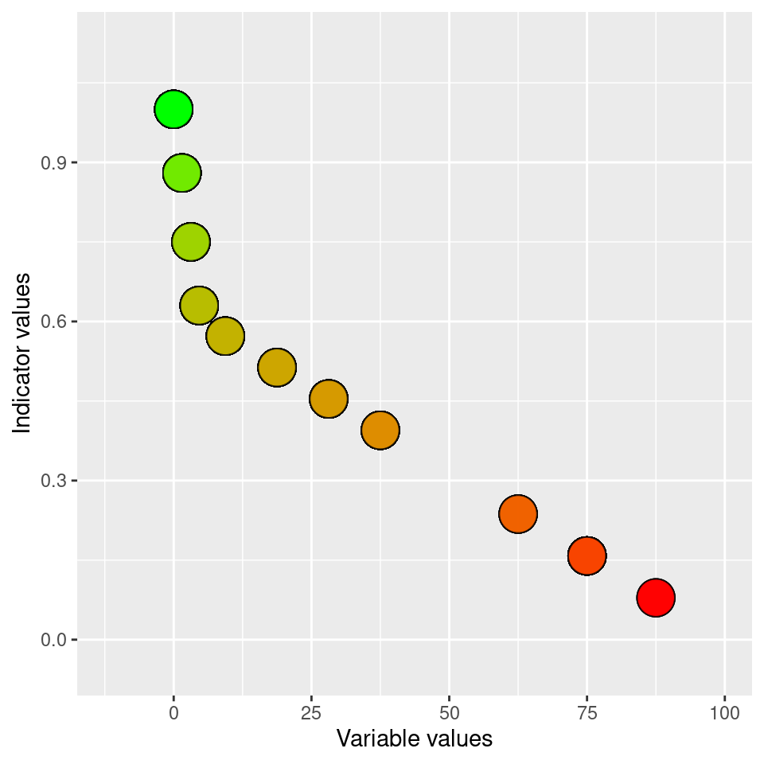
<p class="caption">(\#fig:slitasje-normalise)Performing a linear break-point type normalisation of the slitasje variable.</p>
</div>

This normalisation seems reasonable to me. I can save it as indicator
values. There is no point yet making this a time series, and I will
assign all the indicator value to the average year of the data.


```r
mean(slitasje_data$kartleggingsår)
#> [1] 2020.254
```

Assigning the indicator to year 2020.


```r
slitasje_data$i_2020 <- eaTools::ea_normalise(data = slitasje_data,
                      vector = "slitasje",
                      upper_reference_level = lower,
                      lower_reference_level = upper,
                      break_point = threshold,
                      reverse = T
                      )
```

### Homogeneous impact areas {#HIA}

I want to use the [Homogeneous Impact Areas](#HIA) (HIA) to define
smaller regions into which I can extrapolate the indicator values. This
data is generated by discretizing the Norwegian Infrastructure Index. I
refer to the ordinal values of the four HIA classes as their *Human
Impact Factor* (HIF). This is just to keep the approach separate from
the Norwegian Infrastructure Index.


```r
HIA <- readRDS(paste0(pData, "infrastrukturindeks/homogeneous_impact_areas.rds"))
```

I want to check that HIF is in fact a good predictor for *slitasje*.

I also want to split these four HIA classes based on their region. To do
this I need the two layers to have the same CRS.


```r
st_crs(HIA) == st_crs(regions)
#> [1] TRUE
```

Since the HIA map and the _region_ map are completely overlapping (HIA was masked using the region map), we can get the
intersections


```r
HIA_regions <- eaTools::ea_homogeneous_area(HIA,
                             regions,
                             keep1 = "infrastructureIndex",
                             keep2 = "region")
saveRDS(HIA_regions, "P:/41201785_okologisk_tilstand_2022_2023/data/cache/HIA_regions.rds")
```


Create a new column by crossing region and HIF


```r
HIA_regions <- HIA_regions %>%
  mutate(region_HIF = paste(region, infrastructureIndex))
```

#### Validate

I now have 20 unique areas (for each main ecosystem) that I will, given
there is data, extrapolate indicator values over.

###### Subset ETs

I will subset the `slitasje_data` into the three ecosystems. Note that
only for open wetland do we have good ecosystem delineation maps to base
a spatial averaging on.


```r
#Check spelling
#unique(slitasje_data$hovedøkosystem)

# Rename one level
slitasje_data <- slitasje_data %>%
  mutate(hovedøkosystem = recode(hovedøkosystem, "Våtmark" = "våtmark"))

#make valid
slitasje_data <- st_make_valid(slitasje_data)

#subset
wetlands <- slitasje_data[slitasje_data$hovedøkosystem == "våtmark",]
seminat <- slitasje_data[slitasje_data$hovedøkosystem == "semi-naturligMark",]
natOpen <- slitasje_data[slitasje_data$hovedøkosystem == "naturligÅpneOmråderILavlandet",]
```

Creating some summary statistics.


```r
wetland_stats <- ea_spread(indicator_data = wetlands,
          indicator = i_2020,
          regions = HIA_regions,
          groups = region_HIF,
          summarise = TRUE)

seminat_stats <- ea_spread(indicator_data = seminat,
          indicator = i_2020,
          regions = HIA_regions,
          groups = region_HIF,
          summarise = TRUE)

natOpen_stats <- ea_spread(indicator_data = natOpen,
          indicator = i_2020,
          regions = HIA_regions,
          groups = region_HIF,
          summarise = TRUE)

wetland_stats <- wetland_stats %>%
  add_column(eco = "wetland")

seminat_stats <- seminat_stats %>%
  add_column(eco = "semi-natural")

natOpen_stats <- natOpen_stats %>%
  add_column(eco = "Naturally-open")

all_stats <- rbind(wetland_stats,
                   seminat_stats,
                   natOpen_stats)
all_stats <- all_stats %>%
  separate(region_HIF,
           into = c("region", "HIF"),
           sep = " ")

saveRDS(all_stats, "/data/P-Prosjekter2/41201785_okologisk_tilstand_2022_2023/data/cache/all_stats.rds")
```


```r
temp_plot <- all_stats %>%
  mutate(HIF_NA = case_when(
    n > 150 ~ HIF
  ))

myColour_list <- unique(temp_plot$myColour)
names(myColour_list) <-   myColour_list

ggarrange(
ggplot(temp_plot, aes(x = region, y = n, group = HIF, fill = HIF_NA))+
  geom_bar(position = "dodge", stat = "identity", col="black")+
  theme_bw(base_size = 10)+
  scale_fill_brewer(palette="Oranges")+
  theme(axis.text.x = element_text(angle = 90, vjust=0.5))+
  coord_flip()+
  facet_wrap(.~eco),
ggplot(temp_plot, aes(x = region, y = w_mean, group = HIF, fill = HIF_NA))+
  geom_bar(position = "dodge", stat = "identity", col="black")+
  theme_bw(base_size = 10)+
  scale_fill_brewer(palette="Oranges")+
  theme(axis.text.x = element_text(angle = 90, vjust=0.5))+
  coord_flip()+
  facet_wrap(.~eco),
ggplot(temp_plot, aes(x = region, y = sd, group = HIF, fill = HIF_NA))+
  geom_bar(position = "dodge", stat = "identity", col="black")+
  theme_bw(base_size = 10)+
  scale_fill_brewer(palette="Oranges")+
  theme(axis.text.x = element_text(angle = 90, vjust=0.5))+
  coord_flip()+
  facet_wrap(.~eco),
ncol = 1)
```

<div class="figure">

<p class="caption">(\#fig:dense-stats)Barplot showing the number of data points, the area weighted indicator values and the sd for the slitasje indicator. Transparrent bars represents categories with less than 150 data points.</p>
</div>

In the figure above, colors refer to Human Impact Factor (amount or frequency of infrastructure) 
and NA means that there are less than 150 data points which we set as a threshold for evaluating the indicator values.

In the top row
we see that the sample size (number of polygons) varies between
ecosystems. For naturally open ecosystems many polygons are from high
infrastructure areas, not surprisingly, and there are few points for the
lowest impact class (zero such polygons in *Sørlandet* for example). We
may therefore not be able to extrapolate indicator values for Naturally
open areas in in *Sørlandet* with low levels of infrastructure. 

In semi-natural areas and wetlands, we have very little data from HIF
class 3.

We can also from the middle row see the association between the indicator
values (area weighted means) and the modified infrastructure index
(HIF). We should then not put any weight on the bars were there is
little data (transparent bars). Then we se the general pattern that the indicator 
value decreases with increasing HIF. But there are exceptions, like for Semi-natural areas
in Vestlandet.

Let us look at the indicator to pressure relationship across all ecosystems.


```r
temp_plot %>%
  filter(!is.na(HIF_NA)) %>%
  ggplot(aes(x = HIF_NA, y = w_mean))+
  geom_point(size=2, position = position_dodge2(.1))+
  geom_violin(alpha=0)+
  theme_bw()
```

<div class="figure">
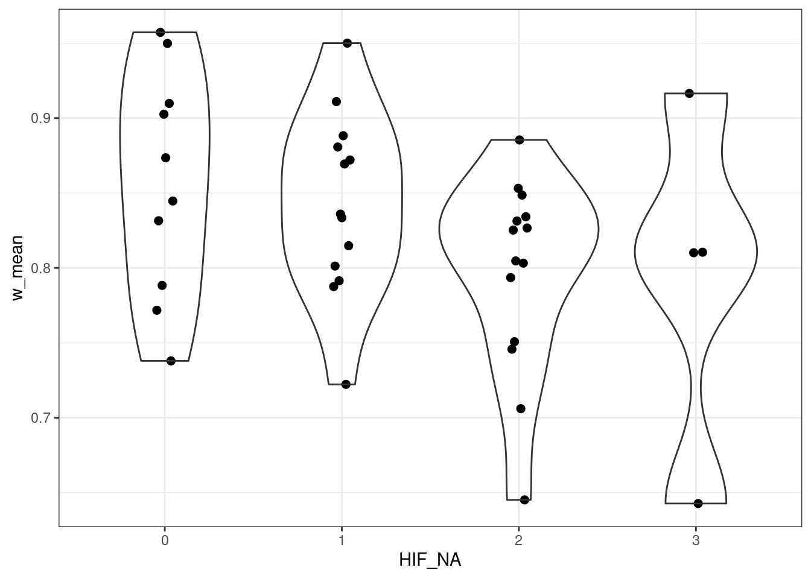
<p class="caption">(\#fig:unnamed-chunk-58)Indicator to pressure relationship across all ecosystems.</p>
</div>

The pattern is not perfect, and there is quite some noise. But this is perhaps also expected.

Let us look at the effect of sample size on the indicator uncertainty.


```r
temp_plot %>%
  ggplot(aes(x = n, y = sd))+
  geom_point(size=2, position = position_dodge2(.1))+
  theme_bw()+
    facet_wrap(.~eco)
```

<div class="figure">

<p class="caption">(\#fig:unnamed-chunk-59)Smaple size against indicator uncertainty.</p>
</div>

This shows that the uncertainty is inflated with sample sizes less than about 300-500.


```r
DT::datatable(all_stats)
```

<div class="figure">

```{=html}
<div class="datatables html-widget html-fill-item-overflow-hidden html-fill-item" id="htmlwidget-9f2d6a52cc90fbd18ddf" style="width:100%;height:auto;"></div>
<script type="application/json" data-for="htmlwidget-9f2d6a52cc90fbd18ddf">{"x":{"filter":"none","vertical":false,"data":[["1","2","3","4","5","6","7","8","9","10","11","12","13","14","15","16","17","18","19","20","21","22","23","24","25","26","27","28","29","30","31","32","33","34","35","36","37","38","39","40","41","42","43","44","45","46","47","48","49","50","51","52","53","54","55","56","57","58","59"],["Midt-Norge","Midt-Norge","Midt-Norge","Midt-Norge","Nord-Norge","Nord-Norge","Nord-Norge","Nord-Norge","Sørlandet","Sørlandet","Sørlandet","Sørlandet","Vestlandet","Vestlandet","Vestlandet","Vestlandet","Østlandet","Østlandet","Østlandet","Østlandet","Midt-Norge","Midt-Norge","Midt-Norge","Midt-Norge","Nord-Norge","Nord-Norge","Nord-Norge","Nord-Norge","Sørlandet","Sørlandet","Sørlandet","Sørlandet","Vestlandet","Vestlandet","Vestlandet","Vestlandet","Østlandet","Østlandet","Østlandet","Østlandet","Midt-Norge","Midt-Norge","Midt-Norge","Midt-Norge","Nord-Norge","Nord-Norge","Nord-Norge","Nord-Norge","Sørlandet","Sørlandet","Sørlandet","Vestlandet","Vestlandet","Vestlandet","Vestlandet","Østlandet","Østlandet","Østlandet","Østlandet"],["0","1","2","3","0","1","2","3","0","1","2","3","0","1","2","3","0","1","2","3","0","1","2","3","0","1","2","3","0","1","2","3","0","1","2","3","0","1","2","3","0","1","2","3","0","1","2","3","1","2","3","0","1","2","3","0","1","2","3"],[20425516.793161,55942079.0852367,25271797.033968,402403.654717704,4177429.11487822,39799602.0218486,21289663.1377251,119342.520216003,1199953.10537375,2555863.89072861,1316446.89966768,28747.3798501565,2429070.74019894,7091916.84858253,1976037.38284999,83419.9734570635,1338836.52571996,10667431.8327424,12151597.8760085,777759.443905594,45082128.9721422,105282331.371692,65698434.9289448,1458536.77645433,12119453.8140127,39689431.8549581,23764139.6700521,560734.383622149,12833361.1414629,55230811.320468,21059796.7186225,281368.955707136,62771221.3693583,171913529.764963,89577387.4688441,2762081.96649456,22722135.5559064,72301565.3418464,46433821.8958926,531602.555394967,38617.3295027119,1088104.72301855,4085898.43293656,551146.817578847,1145883.34854498,6747952.7632901,6810143.31086301,90891.4412507273,109835.996095306,882962.104436279,674506.417532786,13843.1727794531,198525.028855817,436639.782215109,47244.6292264749,17970.0303946844,671054.025118375,5315089.41465925,1026810.93562918],[1001,2507,1463,43,548,2503,1513,16,129,457,132,10,272,723,329,24,151,768,912,119,764,2361,2314,101,399,1323,1279,69,153,737,713,56,484,2239,2218,181,251,1104,1650,143,55,298,1098,189,223,1419,1422,52,39,385,254,18,111,246,34,11,216,1419,416],[0.771750910678313,0.7875186612059,0.793527794730975,0.865720748692812,0.831477335386509,0.801232017375005,0.745740593748365,0.791099692645648,0.906027687414072,0.911013644607549,0.798963551938973,1,0.957236019313803,0.880727771695884,0.825256022857242,0.791359885839299,0.788313328500717,0.791395245167583,0.750731099672693,0.923119549784727,0.902593418006151,0.83593202285124,0.80467219237372,0.807328459520766,0.873503412863498,0.83350830318046,0.831318829695963,0.951610294891564,0.94985520619026,0.888240984238651,0.853134247523411,0.729140255239416,0.9098194463842,0.869385864286768,0.885433805699666,0.916486246113373,0.737934602429538,0.722254276853415,0.706036226775658,0.630459416309339,0.951417060773914,0.95003102838554,0.84863012352793,0.810123844078759,0.844666568065667,0.814820273682474,0.803164434951812,0.753302327707886,0.838687587547142,0.645133805861738,0.642709425559455,0.933046230074286,0.969736857282128,0.834162035025874,0.545331235282478,0.893416505831439,0.872053422790955,0.826622204638684,0.810474925985478],[0.920985067564015,0.867491969852833,0.825670935712487,0.792117503059976,0.898993469074145,0.855201757890531,0.826648693776742,0.743125,0.95453488372093,0.933700909823794,0.861945773524721,1,0.946281927244582,0.933323505860086,0.90592225243961,0.835635964912281,0.896889159986058,0.858679070723684,0.816871537396122,0.871275984077842,0.948676632681179,0.90910575358345,0.862583814765955,0.849241792600313,0.955019126764279,0.91984425349087,0.921706514135221,0.946414950419527,0.984117647058824,0.955265300292794,0.900607145493467,0.773397556390977,0.953312309699869,0.930312286970217,0.924071353993641,0.907515266065717,0.877254141329419,0.820020022883295,0.779115789473684,0.738916083916084,0.972727272727273,0.917387848816673,0.891231665228645,0.857699805068226,0.95627802690583,0.904449946218612,0.883170478939966,0.845394736842105,0.857962213225371,0.683749145591251,0.664680895151264,0.916666666666667,0.935277382645804,0.854032948224219,0.826625386996904,0.931818181818182,0.864918372319688,0.815831200623122,0.732730263157895],[0.00521180430068777,0.00434945752819324,0.00602063114291312,0.0357420655181531,0.00788601096109206,0.0043498025604811,0.0057907664431112,0.0530979110767958,0.00965832014067245,0.0072080861750764,0.0181116104747688,0,0.00837811441658417,0.0056414016696469,0.00896478394465009,0.0450854963918842,0.0140911117320106,0.00740041633236665,0.00744264089345736,0.0171829338414869,0.00503700280784231,0.00364269206680451,0.00430006747608547,0.0217928162646461,0.00637942868020546,0.00453240639310002,0.00462555044884439,0.0172207735139846,0.00604208609205063,0.00471198160238452,0.00680508640195998,0.0365666211196643,0.00605252356670952,0.00328820222512962,0.00347028570681106,0.0126362557588608,0.0120587689199437,0.00661779589544552,0.00566362941182635,0.0225870247899212,0.0139374336521784,0.0107014488006716,0.00607389080650256,0.0135282003589769,0.00776844313926837,0.00526458585632371,0.00529260013803737,0.0321211661039465,0.0374330986359293,0.0147547583391982,0.0175217575275686,0.0362045873291141,0.0172631766042164,0.013918519872522,0.0378085287908935,0.0438071664018427,0.0159270768134006,0.00686810399276487,0.0135103015633108],["wetland","wetland","wetland","wetland","wetland","wetland","wetland","wetland","wetland","wetland","wetland","wetland","wetland","wetland","wetland","wetland","wetland","wetland","wetland","wetland","semi-natural","semi-natural","semi-natural","semi-natural","semi-natural","semi-natural","semi-natural","semi-natural","semi-natural","semi-natural","semi-natural","semi-natural","semi-natural","semi-natural","semi-natural","semi-natural","semi-natural","semi-natural","semi-natural","semi-natural","Naturally-open","Naturally-open","Naturally-open","Naturally-open","Naturally-open","Naturally-open","Naturally-open","Naturally-open","Naturally-open","Naturally-open","Naturally-open","Naturally-open","Naturally-open","Naturally-open","Naturally-open","Naturally-open","Naturally-open","Naturally-open","Naturally-open"]],"container":"<table class=\"display\">\n  <thead>\n    <tr>\n      <th> <\/th>\n      <th>region<\/th>\n      <th>HIF<\/th>\n      <th>total_area<\/th>\n      <th>n<\/th>\n      <th>w_mean<\/th>\n      <th>mean<\/th>\n      <th>sd<\/th>\n      <th>eco<\/th>\n    <\/tr>\n  <\/thead>\n<\/table>","options":{"columnDefs":[{"className":"dt-right","targets":[3,4,5,6,7]},{"orderable":false,"targets":0}],"order":[],"autoWidth":false,"orderClasses":false}},"evals":[],"jsHooks":[]}</script>
```

<p class="caption">(\#fig:unnamed-chunk-60)Summary statistics for the slitasje indicator.</p>
</div>

In addition to looking at the area weighted means and its relationship
with the pressure indicator (HIF), we can do the same at the polygon
level. Because the indicator is pseudo-continuous, boxplots for example
become useless, so I will present a relative frequency plot.


```r
corrCheck <- st_intersection(slitasje_data, HIA_regions)
saveRDS(corrCheck, "/data/P-Prosjekter2/41201785_okologisk_tilstand_2022_2023/data/cache/corrCheck.rds")
```


```r
ggplot(corrCheck, aes(x = factor(infrastructureIndex), fill = factor(round(i_2020,2))))+
  geom_bar(position="fill")+
  theme_bw(base_size = 12)+
  guides(fill = guide_legend("Sliatsje indicator"))+
  ylab("Fraction of data points")+
  xlab("HIF")+
  scale_fill_brewer(palette = "RdYlGn")+
  facet_grid(hovedøkosystem~region)
```

<div class="figure">
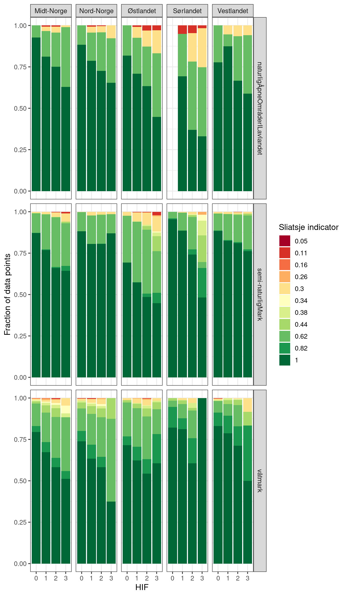
<p class="caption">(\#fig:slitasje-precentageplot)Relative frequency plot (conditioned on region and main ecosystem) showing the distribution of polygons with different indicator values.</p>
</div>

The figure above I think supports the indicator-pressure relationship
and justifies using the HIA+region intersections as local reference
areas. Especially when down-weighting the importance of those
groups/categories that have very little data.


#### Looking at the HIA

Here is a view of the data zooming in on Trondheim


```r
myBB <- st_bbox(c(xmin=260520.12, xmax = 278587.56,
                ymin = 7032142.5, ymax = 7045245.27),
                crs = st_crs(HIA_regions))
```

Cropping the raster to the bbox


```r
HIA_trd <- sf::st_crop(HIA_regions, myBB)
#> Warning: attribute variables are assumed to be spatially
#> constant throughout all geometries
```

Get map of major roads, for context


```r
hw_utm <- readRDS("data/cache/highways_trondheim.rds")
```


```r
(HIA_trd <- tm_shape(HIA_trd)+
  tm_polygons(col = "infrastructureIndex",
    title="Infrastructure index\n(modified 4-step scale)",
    palette = "-viridis",
    style="cat")+
  tm_layout(legend.outside = T)+
  tm_shape(hw_utm)+
  tm_lines(col="red")+
  tm_shape(outline)+
  tm_borders(col = "black", lwd=2))
```

<div class="figure">
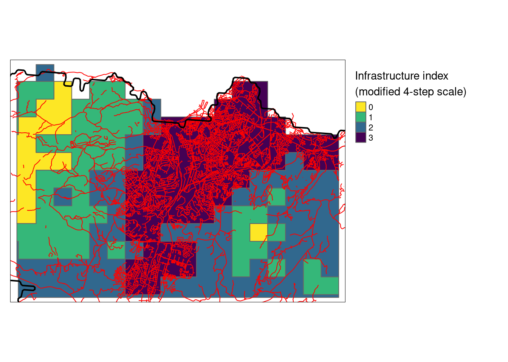
<p class="caption">(\#fig:unnamed-chunk-66)A closer look at the HIA designation over Trondheim</p>
</div>

Let's calculate the areas of these polygons and compare the HIF in the
five regions.


```r
HIA_regions$area <- sf::st_area(HIA_regions)
```


```r
temp <- as.data.frame(HIA_regions) %>%
  group_by(region, infrastructureIndex) %>%
  summarise(area = mean(area))
#> `summarise()` has grouped output by 'region'. You can
#> override using the `.groups` argument.

ggplot(temp, aes(x = region, y = area, fill = factor(infrastructureIndex)))+
  geom_bar(position = "stack", stat = "identity")+
  guides(fill = guide_legend("HIF"))
```

<div class="figure">

<p class="caption">(\#fig:HIF-region)Stacked barplot showing the distribution of human impact factor across five regions in Norway.</p>
</div>

The figure above shows that _Nord-Norge_ for example, has a lot of
relatively untouched areas, and that _Østlandet_ has the highest
proportion of impacted areas. This is expected.

### Aggregate and spread (extrapolate) {#spread-slitasje}

I now want to find the mean indicator value for each HIA (i.e. to
aggregate) and to spread these out spatially to the entire HIA within
each region (i.e. to extrapolate).

I want to add a threshold so that we don't end up over extrapolating
based on too few data points. I have previousl used 150 data pionts, and I think that was about right.


```r
wetlands_slitasje_extr <- ea_spread(indicator_data = wetlands,
                         indicator = i_2020,
                         regions = HIA_regions,
                         groups = region_HIF,
                         threshold = 150)

seminat_slitasje_extr <- ea_spread(indicator_data = seminat,
                         indicator = i_2020,
                         regions = HIA_regions,
                         groups = region_HIF,
                         threshold = 150)

natOpen_slitasje_extr <- ea_spread(indicator_data = natOpen,
                         indicator = i_2020,
                         regions = HIA_regions,
                         groups = region_HIF,
                         threshold = 150)
#saveRDS(wetlands_slitasje_extr, "/data/P-Prosjekter2/41201785_okologisk_tilstand_2022_2023/data/cache/wetlands_slitasje_extr.rds")
#saveRDS(seminat_slitasje_extr,  "/data/P-Prosjekter2/41201785_okologisk_tilstand_2022_2023/data/cache/seminat_slitasje_extr.rds")
#saveRDS(natOpen_slitasje_extr,  "/data/P-Prosjekter2/41201785_okologisk_tilstand_2022_2023/data/cache/natOpen_slitasje_extr.rds")
```


It's easier to see what's happening if we zoom in a bit. Lets get a
boundary box around Trondheim.


```r
myBB <- st_bbox(c(xmin=260520.12, xmax = 278587.56,
                ymin = 7032142.5, ymax = 7045245.27),
                crs = st_crs(wetlands_slitasje_extr))
```

Cropping the data to the bbox


```r
wetlands_slitasje_extr_trd <- sf::st_crop(wetlands_slitasje_extr, myBB)
seminat_slitasje_extr_trd <- sf::st_crop(seminat_slitasje_extr, myBB)
natOpen_slitasje_extr_trd <- sf::st_crop(natOpen_slitasje_extr, myBB)
```


```r
myCol <- "RdYlGn"
tmap_arrange(
tm_shape(wetlands_slitasje_extr_trd)+
  tm_polygons(col = "w_mean",
    title="Slitasje indicator",
    palette = myCol,
    style="cont",
    breaks = c(0,1))+
  tm_layout(legend.outside = T)+
  tm_shape(hw_utm)+
  tm_lines(col="blue")+
  tm_layout(title = "Wetland"),

tm_shape(seminat_slitasje_extr_trd)+
  tm_polygons(col = "w_mean",
    title="Slitasje indicator",
    palette = myCol,
    style="cont",
    breaks = c(0,1))+
  tm_layout(legend.outside = T)+
  tm_shape(hw_utm)+
  tm_lines(col="blue")+
  tm_layout(title = "Semi-natural areas"),

tm_shape(natOpen_slitasje_extr_trd)+
  tm_polygons(col = "w_mean",
    title="Slitasje indicator",
    palette = myCol,
    style="cont",
    breaks = c(0,1))+
  tm_layout(legend.outside = T)+
  tm_shape(hw_utm)+
  tm_lines(col="blue")+
  tm_layout(title = "Naturally open areas"),
HIA_trd)
```

<div class="figure">
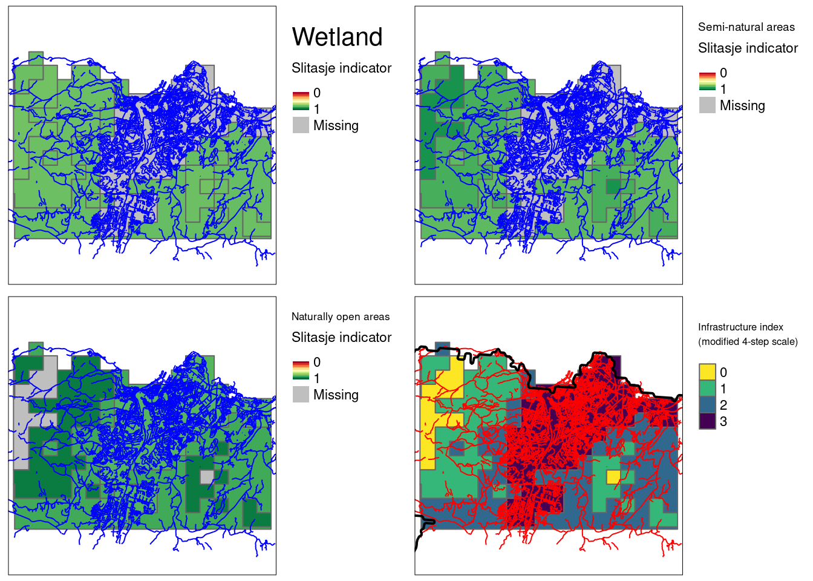
<p class="caption">(\#fig:extrapolated-slitasje)Slitasje indicator extrapolated over Trondheim</p>
</div>

Note that for wetland and semi-natural areas we did not
extrapolate values for the most urban areas, and that for naturally open
areas we did not extrapolate to the least affected areas.
For the other regions we generally excluded more HIFs. 

> *The maps above are easy to misunderstand, and they should therefor be
> communicated with caution. They should be considered as temporary
> files or as by-products.*


The next step now is to

1. Prepare ecosystem delineation maps in EPSG25833 and perfectly aligned to a master grid

2. Rasterize the extrapolated indicator map, using the ET map as a template (see Fig. \@ref(fig:#masking-example))

3. and mask it using the perfectly aligned ET map.


A faster way could be to:

1.  Draw *n* random point samples from the ET map, and

2.  extract indicator values at those points (from the extrapolated
    indicator map (a stars object)).

... but his will not provide spatially explicit indicator values for the
entire ecosystem delineation.

### Ecosystem map

See [here](https://github.com/NINAnor/ecosystemCondition/issues/34).

### Aggregate to region

We need to aggreate the ET occurence and their indicator values, to a
regional delineation. This functionality can be developed in `eaTools`,
but will in any case build around `exactextratr::exact_extract()`.

To carry the errors, we can for example
produce distributions for the indicator values for each ET
occurrence (or groups of them) and resample the distributions with an
area weighting.

### Uncertainty

The calculations of indicator uncertainty is done with bootstrapping, as
is described in eaTools.

## Eksport files (final product)

According to the workflow specifications, I will export the indicator
map at its highest resolution, for use in various web interfaces etc.
For the finest resolution indicator map I will not include columns for
uncertainty (because this will only be estimated at the aggregated
level), or reference levels (because there is no spatial variation).

I can also export a map of the indicator where we extrapolate the
indicator values to the homogeneous areas (e.g. Fig. \@ref(fig:extrapolated-slitasje) . This map should be
interpreted with caution, since they appear as providing explicit indicator
values for areas where there is no data. This map is mainly for
aggregation purposes. I will mark this map with the prefix
*homogeneous-areas*. I will also export this same map after masking it
with the ET map, and this output must come with the same disclaimers.

Finally I will export a map of the five accounting areas with
wall-to-wall indicator value and errors (e.g. Fig \@ref(fig:wall-to-wall-summer-temp-indicator)). This map can also contain data
covering other ETs. Otherwise the maps would not we visually
interpretative.

### Slitasje in wetlands

This is how I plan to export the final product.


```r
# keep col names short and standardized
exp_wetland <- ...
```


```r
exp_wetland_HIAextrapolated <- …
```


```r
exp_wetland_AAextrapolated <- …
```

Write to file


```r
st_write(exp_wetland, "indicators/indicatorMaps/slitasje/wetland_slitasje.shp",
         append = F)

st_write(exp_wetlandHIAextrapolated, 
         "indicators/indicatorMaps/extrapolated_to_homogeneous_areas/slitasje/homogeneous_areas_wetland_slitasje.shp",
         append = F)

st_write(exp_wetland, "indicators/indicatorMaps/extrapolated_to_accounting_areas/slitasje/accounting_areas_wetland_slitasje.shp",
         append = F)
```

<!--chapter:end:slitasje.Rmd-->

# Median Summer Temperature {#median-summer-temp}

<br />

*Author and date:*

Anders L. Kolstad

March 2023

<br />

<!-- Load all you dependencies here -->


|Ecosystem |Økologisk.egenskap   |ECT.class                      |
|:---------|:--------------------|:------------------------------|
|All       |Abiotiske egenskaper |Physical state characteristics |

<br /> <br />

<hr />

## Introduction

This chapters describes the workflow for an indicator describing the median summer temperature. For a more comprehensive documentation on the development of the workflow itself, see [here](#climate-indicators-explained). The data comes from interpolated climate surfaces from [SeNorge](https://senorge.no/) which contain one 1x1km raster for each day since 1957 to present. The reference levels are extracted from the time period 1961-1990 (a temporal reference condition). 

**Workflow**

1.  Collate variable data series, ending up with one raster per year after aggregating across days within a year


2.  Calculate spatially explicit reference values by aggregating across the years 1961-1990. The upper reference value is equal to the median value of this period, and the lower reference values (two-sided) is equal to 5 SD units. The indicator value is the mean over a five year period.


3.  Calculate indicator values through spatially explicit rescaling based on the reference values


4.  Mask by ecosystem type (*This step is not yet done as we do not have ready available ecosystem maps*)


5.  Aggregate in space (to accounting areas) and take the mean over a five year period to get final indicator values


6.  Make trend figure and spatially aggregated maps


## About the underlying data

The data is in a raster format and extends back to 1957 in the form of multiple interpolated climate variables. The spatial resolution is 1 x 1 km.

### Representativity in time and space

The data includes the last normal period (1961-1990) which defines the reference condition for climate variables. Therefore the temporal resolution is very good. Also considering the daily resolution of the data.

Spatially, a 1x1 km resolution is sufficient for most climate variables, esp. in homogeneous terrain, but this needs to be evaluation for each variable and scenario specifically.

### Original units

Varied. Specified below for each parameter.

### Temporal coverage

1957 - present

### Additional comments about the data set

The data format has recently changed from .BIL to .nc (netcdf) and now a single file contains all the rasters for one year (365 days), and sometimes for multiple variables also.

## Ecosystem characteristic

### Norwegian standard

These variables typically will fall under the *abiotiske egenskaper* class.

### SEEA EA

In SEEA EA, these variables will typically fall under A1 - Physical state characteristics.

## Collinearities with other indicators

Climate variables are most likely to be correlated with each other (e.g. temperature and snow). Also, some climate variables are better classed as pressure indicators, and these might have a causal association with several condition indicators.

## Reference condition and values

### Reference condition

The reference condition for climate variables is defined as the normal period 1961-1990.

### Reference values, thresholds for defining *good ecological condition*, minimum and/or maximum values

-   Un-scaled indicator value = median value over 5 year periods (5 years being a pragmatic choice. It is long enough to smooth out a lot of inter-annual variation, and it's long enough to enable estimating errors)

-   Upper reference level (best possible condition) = median value from the reference period

-   Thresholds for good ecosystem condition = 2 standard deviation units away from the upper reference level for the climate variable during the reference period.

-   Lower reference values (two-directional) = 5 standard deviation units for the climate variable during the reference period (implies linear scaling).


The choice to use 2 SD units as the threshold values is a subjective choice in many ways, and not founded in any empirical or known relationship between the indicators and ecosystem integrity. The value comes from the common practice of calling something _extreme weather_ when it is outside 2 SD units of the current running average. So, if the indicator value today is <0.6 it implies that the mean for that variable over the last year would have been referred to as _extreme_ if it had occurred between 1961 and 1990. This is I think a conservative threshold, since one would/could call it _extreme_ if only one year is outside the 2SD range, and having the mean of 5 years being outside this range is _really_ extreme.

## Uncertainties

For the indicator map (1 x 1 km raster) there is no uncertainty associated with the indicator values. For aggregated indicator values (e.g. for regions), the uncertainty in the indicator value is calculated from the spatial variation in the indicator values via bootstrapping. This might, however, be changed later to the temporal variation between the five years of each period.

## References

<https://senorge.no/>

*rr and tm are being download from:* <https://thredds.met.no/thredds/catalog/senorge/seNorge_2018/Archive/catalog.html>

### Additional resources

[Stars package](https://r-spatial.github.io/stars/)

[R as a GIS for economists](https://tmieno2.github.io/R-as-GIS-for-Economists/stars-basics.html) chapter 7

<hl/>

## Analyses

### Data set

The data is downloaded to a local NINA server, and updated regularly.


```r
path <- ifelse(dir == "C:", 
      "R:/GeoSpatialData/Meteorology/Norway_SeNorge2018_v22.09/Original",
      "/data/R/GeoSpatialData/Meteorology/Norway_SeNorge2018_v22.09/Original")
```

This folder contains folder for the different parameters


```r
(files <- list.files(path))
#>  [1] "age"        "fsw"        "gwb_eva"    "gwb_gwtcl" 
#>  [5] "gwb_q"      "gwb_sssdev" "gwb_sssrel" "lwc"       
#>  [9] "qsw"        "rr_tm"      "sd"         "sdfsw"     
#> [13] "swe"
```

We are interested in _tm_, which is temperatur in celcius. For some reason the same variable is called _tg_ in the data itself.


#### Regions

Importing a shape file with the regional delineation.


```r
reg <- sf::st_read("data/regions.shp", options = "ENCODING=UTF8")
#> options:        ENCODING=UTF8 
#> Reading layer `regions' from data source 
#>   `/data/scratch/Matt_bookdown__debug/ecosystemCondition/data/regions.shp' 
#>   using driver `ESRI Shapefile'
#> Simple feature collection with 5 features and 2 fields
#> Geometry type: POLYGON
#> Dimension:     XY
#> Bounding box:  xmin: -99551.21 ymin: 6426048 xmax: 1121941 ymax: 7962744
#> Projected CRS: ETRS89 / UTM zone 33N
#st_crs(reg)
```

Outline of Norway


```r
nor <- sf::st_read("data/outlineOfNorway_EPSG25833.shp")
#> Reading layer `outlineOfNorway_EPSG25833' from data source 
#>   `/data/scratch/Matt_bookdown__debug/ecosystemCondition/data/outlineOfNorway_EPSG25833.shp' 
#>   using driver `ESRI Shapefile'
#> Simple feature collection with 1 feature and 2 fields
#> Geometry type: MULTIPOLYGON
#> Dimension:     XY
#> Bounding box:  xmin: -113472.7 ymin: 6448359 xmax: 1114618 ymax: 7939917
#> Projected CRS: ETRS89 / UTM zone 33N
```

Remove marine areas from regions


```r
reg <- st_intersection(reg, nor)
```


```r
tm_shape(reg) +
  tm_polygons(col="region")
```

<div class="figure">

<p class="caption">(\#fig:unnamed-chunk-8)Five accounting areas (regions) in Norway.</p>
</div>

#### Ecosystem map

Coming soon ....

The climate indicators need to be masked with ecosystem type maps. This step is part of this chapter.

### Conceptual workflow

The general, the conceptual workflow is like this:

1.  Collate variable data series

    -   Import .nc files (loop though year 1961-1990) and subset to the correct attribute

    -   Filter data by dates (optional) (`dplyr::filter`). *This means reading all 365 rasters into memory, and it is much quicker to filter out the correct rasters in the importing step above (see examples later in this chapter)*

    -   Aggregate across time within a year (`stars::st_apply`). *This is the most time consuming operation in the workflow.*

    -   Join all data into one data cube (`stars:c`)

2.  Calculate reference values

    -   Aggregate (`st_apply)` across reference years (`dplyr::filter`) to get median and sd values

    -   Join with existing data cube (`stars:c`)

3.  Calculate indicator values

    -   Normalize climate variable at the individual grid cell level using the three reference values (`mutate(across()))`

4.  Mask by ecosystem type (*This could also be done in step one, but it doesn't speed things up to set some cells to NA*)

5.  Aggregate in space (to accounting areas) (*zonal statistics*)

    -   Aggregate across 5 year time steps to smooth out random inter-annual variation and leave climate signal

    -   Intersect with accounting area polygons `exactextrar::exact_extract` and get mean/median and (spatial) sd. (*Alternatively, get temporal sd at the grid cell level in the step above.*)

6.  Make trend figure and spatially aggregated maps


### Step 1 - temporal aggregation within a year


```r
path <- path <- ifelse(dir == "C:", 
      "R:/",
      "/data/R/")
  
path2 <- paste0(path, "GeoSpatialData/Meteorology/Norway_SeNorge2018_v22.09/Original/rr_tm/")

myFiles <- list.files(path2, pattern=".nc$",full.names = T)
# The last file (the last year) is incomplete and don't include all julian dates that we select below, so I will not include it:
myFiles <- myFiles[-length(myFiles)]

real_temp_summer <- NULL

# set up parallel cluster using 10 cores
cl <- makeCluster(10L)

# Get julian days after defining months
temp <- stars::read_ncdf(paste(myFiles[1]), var="tg")
start_month_num <-  6
end_month_num <- 8

julian_start <- yday(st_get_dimension_values(temp, "time")[1] %m+%
                       months(+start_month_num))
julian_end <- yday(st_get_dimension_values(temp, "time")[1] %m+%
                     months(+end_month_num))
step <- julian_end-julian_start


for(i in 1:length(myFiles)){
  
  tic("init")
  temp <- stars::read_ncdf(paste(myFiles[i]), var="tg", proxy=F,
                           ncsub = cbind(start = c(1, 1, julian_start), 
                              count = c(NA, NA, step)))
  year_temp <- year(st_get_dimension_values(temp, "time")[1])
  print(year_temp)
  lookup <- setNames("mean", paste0("v_", year_temp)) 
    # Perhaps leave out the v_ to get a numeric vector instead, 
    # which is easier to subset
  st_crs(temp) <- 25833
  toc()

  tic("filter and st_apply")
  temp <- temp %>%
    #filter(time %within% myInterval) %>%
    st_apply(1:2, mean, CLUSTER = cl) %>%
    rename(all_of(lookup)) 
  toc()
  
  tic("c()")
  real_temp_summer <- c(temp, real_temp_summer)
  #rm(temp)
  toc()
}

tic("Merge")
real_temp_summer <- real_temp_summer %>%
  merge(name = "Year") %>%
  setNames("climate_variable")
toc()

stopCluster(cl)

```

This takes about 20 sec per file/year, or 22 min on total. That is not too bad. About 6000 rasters are read into memory. Here's a test for the effect of splitting over more cores.


```r
write_stars(real_temp_summer, "/data/P-Prosjekter2/41201785_okologisk_tilstand_2022_2023/data/climate_indicators/aggregated_climate_time_series/real_temp_summer.tiff")
```


Note that GTiff automatically renames the third dimension *band* and also renames the attribute. I can rename them.


```r
summer_median_temp <- real_temp_summer %>% 
  st_set_dimensions(names = c("x", "y", "v_YEAR")) %>%
  setNames("temperature")
```


```r
ggplot()+
  geom_stars(data = summer_median_temp[,,,c(1,11,66)], downsample = c(10, 10, 0)) +
  coord_equal() +
  theme_void() +
  scale_fill_viridis_c(option = "D") +  
  scale_x_discrete(expand = c(0, 0)) +
  scale_y_discrete(expand = c(0, 0))+
  facet_wrap(~v_YEAR)
```

<div class="figure">

<p class="caption">(\#fig:unnamed-chunk-13)Showing three random slices of the year dimension.</p>
</div>

### Step 2 - calculate reference values

We need to first to define a reference period and then to subset our data `summer_median_temp`. 

First we need to rename our dimension values and turn them back into dates.


```r
new_dims <- as.Date(paste0(
  substr(st_get_dimension_values(summer_median_temp, "v_YEAR"), 3, 6), "-01-01"))
summer_median_temp_ref <- summer_median_temp %>%
  st_set_dimensions("v_YEAR", values = new_dims)
```

Then I can filter to leave only the reference period.


```r
summer_median_temp_ref <- summer_median_temp_ref %>%
  filter(v_YEAR %within% interval("1961-01-01", "1990-12-31"))
st_get_dimension_values(summer_median_temp_ref, "v_YEAR")
#>  [1] "1990-01-01" "1989-01-01" "1988-01-01" "1987-01-01"
#>  [5] "1986-01-01" "1985-01-01" "1984-01-01" "1983-01-01"
#>  [9] "1982-01-01" "1981-01-01" "1980-01-01" "1979-01-01"
#> [13] "1978-01-01" "1977-01-01" "1976-01-01" "1975-01-01"
#> [17] "1974-01-01" "1973-01-01" "1972-01-01" "1971-01-01"
#> [21] "1970-01-01" "1969-01-01" "1968-01-01" "1967-01-01"
#> [25] "1966-01-01" "1965-01-01" "1964-01-01" "1963-01-01"
#> [29] "1962-01-01" "1961-01-01"
```

And then we calculate the median and sd like above


```r
median_sd <- function(x) { c(median = median(x), sd = sd(x))}
```


```r
system.time({
cl <- makeCluster(10L)
summer_median_temp_ref <- summer_median_temp_ref %>%
  st_apply(c("x", "y"), 
           FUN =  median_sd,
           CLUSTER = cl)
stopCluster(cl)
})
```

| user  | system | elapsed |
|-------|--------|---------|
| 9.624 | 6.069  | 20.903  |


```r
write_stars(summer_median_temp_ref, "/data/P-Prosjekter2/41201785_okologisk_tilstand_2022_2023/data/climate_indicators/aggregated_climate_time_series/summer_median_temp_ref.tiff")
```


Pivot and turn dimension into attributes, and rename attributes:


```r
summer_median_temp_ref_long <- summer_median_temp_ref %>% 
  split("band") %>%
  setNames(c("reference_upper", "sd"))
```


```r
tmap_arrange(
tm_shape(st_downsample(summer_median_temp_ref_long, 10))+
  tm_raster("reference_upper")
,
tm_shape(st_downsample(summer_median_temp_ref_long, 10))+
  tm_raster("sd",
            palette = "-viridis")
)
```

<div class="figure">

<p class="caption">(\#fig:unnamed-chunk-21)Showing the upper reference levels and the standard deviation from actual data of median summer temperatures.</p>
</div>

I need to combine the variables and the ref values in one data cube


```r
y_var <- summer_median_temp %>%
  split("v_YEAR") %>%
  c(summer_median_temp_ref_long)
```

### Step 3 - normalise variable


```r
# select the columns to normalise
cols <- names(y_var)[!names(y_var) %in% c("reference_upper", "sd") ]
cols_new <- cols
names(cols_new) <- gsub("v_", "i_", cols)
```


```r
# The break point scaling is actually not needed here, since 
# having the lower ref value to be 5 sd implies that the threshold is
# 2 sd in a linear scaling.

system.time(
y_var_norm <- y_var %>%
  mutate(reference_low = reference_upper - 5*sd ) %>%
  mutate(reference_low2 = reference_upper + 5*sd ) %>%
  mutate(threshold_low = reference_upper -2*sd ) %>%
  mutate(threshold_high = reference_upper +2*sd ) %>%
  mutate(across(all_of(cols), ~ 
                  if_else(.x < reference_upper,
                  if_else(.x < threshold_low, 
                                        (.x - reference_low) / (threshold_low - reference_low),
                                        (.x - threshold_low) / (reference_upper - threshold_low),
                                        ),
                  if_else(.x > threshold_high, 
                                        (reference_low2 - .x) / (reference_low2 - threshold_high),
                                        (threshold_high - .x) / (threshold_high - reference_upper),
                                        )
                ))) %>%
  mutate(across(all_of(cols), ~ if_else(.x > 1, 1, .x))) %>%
  mutate(across(all_of(cols), ~ if_else(.x < 0, 0, .x))) %>%
  rename(all_of(cols_new)) %>%
  c(select(y_var, all_of(cols)))
)
```

| user   | system | elapsed |
|--------|--------|---------|
| 14.803 | 2.717  | 17.512  |


```r
gc()
saveRDS(y_var_norm, "/data/P-Prosjekter2/41201785_okologisk_tilstand_2022_2023/data/climate_indicators/aggregated_climate_time_series/summer_median_temp_normalised.RData")

# Tiff dont allow for multiple attributes:
#write_stars(y_var_norm, "/data/P-Prosjekter2/41201785_okologisk_tilstand_2022_2023/data/climate_indicators/aggregated_climate_time_series/summer_median_temp_normalised.tiff")
```


```r

lims <- c(-5, 22)

ggarrange(
ggplot() + 
  geom_stars(data = st_downsample(y_var_norm["v_1970"],10)) +
  coord_equal() +
  theme_void() +
  scale_fill_viridis_c(option = "D",
                       limits = lims) +  
  scale_x_discrete(expand = c(0, 0)) +
  scale_y_discrete(expand = c(0, 0))
,
ggplot() + 
  geom_stars(data = st_downsample(y_var_norm["reference_upper"], 10)) +
  coord_equal() +
  theme_void() +
  scale_fill_viridis_c(option = "D",
                       limits = lims) +  
  scale_x_discrete(expand = c(0, 0)) +
  scale_y_discrete(expand = c(0, 0))
,
ggplot() + 
  geom_stars(data = st_downsample(y_var_norm["reference_low"], 10)) +
  coord_equal() +
  theme_void() +
  scale_fill_viridis_c(option = "D",
                       limits = lims) +  
  scale_x_discrete(expand = c(0, 0)) +
  scale_y_discrete(expand = c(0, 0))
,

ggplot() + 
  geom_stars(data = st_downsample(y_var_norm["reference_low2"], 10)) +
  coord_equal() +
  theme_void() +
  scale_fill_viridis_c(option = "D",
                       limits = lims) +  
  scale_x_discrete(expand = c(0, 0)) +
  scale_y_discrete(expand = c(0, 0))
,

ggplot() + 
  geom_stars(data = st_downsample(y_var_norm["i_1970"],10)) +
  coord_equal() +
  theme_void() +
  scale_fill_viridis_c(option = "A",
                       limits = c(0, 1)) +  
  scale_x_discrete(expand = c(0, 0)) +
  scale_y_discrete(expand = c(0, 0))
, ncol=2, nrow=3, align = "hv"
)
```

<div class="figure">

<p class="caption">(\#fig:unnamed-chunk-27)Example showing median summer tempretur in 1970, the upper and lwoer reference temperture, i.e. median and 5 SD units of the temperature between  1961-1990, and finally, the scaled indicator values.</p>
</div>

The *real* indicator values should be means over 5 year periods. Calculating a running mean for all time steps is too time consuming. Therefore, the scaled, regional indicator values will be calculated for distinct time steps. The time series can perhaps still be presented with yearly resolution.

### Step 4 - Mask with ecosystem delineation map

This step we simply ignore for now. It should be relatively easy to do, when we have the maps.

### Step 5 - Make figures

To plot time series I first need to do a spatial aggregation. 


```r
system.time(
regional_means <- rast(y_var_norm) %>%
  exact_extract(reg, fun = 'mean', append_cols = "region", progress=T) %>%
  setNames(c("region", names(y_var_norm)))
  )
```

user; system; elapsed: 7.603; 3.071; 10.697


I could also get the sd like this, if I wanted to base the indicator uncertainty on a measure of spatial variation:


```r
system.time(
regional_sd <- rast(y_var_norm) %>%
  exact_extract(reg, fun = 'stdev', append_cols = "region", progress=T) %>%
  setNames(c("region", names(y_var_norm)))
  )
```

user; system; elapsed: 7.420; 2.921; 10.355


```r
saveRDS(regional_means, "temp/regional_means.rds")
saveRDS(regional_sd, "temp/regional_sd.rds")
```


Reshape and plot


```r
div <- c("reference_upper",
         "reference_low",
         "reference_low2",
         "threshold_low",
         "threshold_high",
         "sd")

temp <- regional_means %>%
  as.data.frame() %>%
  select(region, div)
  
regional_means_long <- regional_means %>%
  as.data.frame() %>%
  select(!all_of(div)) %>%
  pivot_longer(!region) %>%
  separate(name, into=c("type", "year")) %>%
  pivot_wider(#id_cols = region,
              names_from = type)  %>%
  left_join(temp, by=join_by(region)) %>% 
  mutate(diff = v-reference_upper) %>%
  mutate(threshold_low_centered = threshold_low-reference_upper) %>%
  mutate(threshold_high_centered = threshold_high-reference_upper)

#Adding the spatial sd
#(
#regional_means_long <- regional_sd %>%
#  select(!all_of(div)) %>%
#  pivot_longer(!region) %>%
#  separate(name, into=c("type", "year")) %>%
#  pivot_wider(names_from = type) %>%
#  rename(i_sd = i,
#         v_sd = v) %>%
#  left_join(regional_means_long, by=join_by(region, year))
#)
```


```r
regOrder = c("Østlandet","Sørlandet","Vestlandet","Midt-Norge","Nord-Norge")

regional_means_long %>%
  mutate(col = if_else(diff>0, "1", "2")) %>%
  ggplot(aes(x = as.numeric(year), 
           y = diff, fill = col))+
  geom_bar(stat="identity")+
  geom_hline(aes(yintercept = threshold_low_centered),
        linetype=2)+
  geom_hline(aes(yintercept = threshold_high_centered),
        linetype=2)+
  geom_segment(x = 1961, xend=1990,
               y = 0, yend = 0,
               linewidth=2)+
  scale_fill_hue(l=70, c=60)+
  theme_bw(base_size = 12)+
  ylab("Sommertemperatur\navvik fra 1961-1990")+
  xlab("")+
  guides(fill="none")+
  facet_wrap( .~ factor(region, levels = regOrder),
              ncol=3,
              scales = "free_y")
```

<div class="figure">

<p class="caption">(\#fig:summer-temp-time-series)Times series for median summer temperature centered on the median value during the reference period. The reference period is indicated with a thick horizontal line. Dottet horisontal lines are 2 sd units for the reference period.</p>
</div>

Then we can take the mean and sd over the last 5 years and add to a spatial representation.


```r
(
i_aggregatedToPeriods <- regional_means_long %>%
  mutate(year = as.numeric(year)) %>%
  mutate(period = case_when(
    year %between% c(2018, 2022) ~ "2018-2022",
    year %between% c(2013, 2017) ~ "2013-2017",
    year %between% c(2008, 2012) ~ "2008-2012",
    year %between% c(2003, 2007) ~ "2003-2007",
    .default = "pre 2003"
  )) %>%
  mutate(period_rank = case_when(
   period == "2018-2022" ~ 5,
   period == "2013-2017" ~ 4,
   period == "2008-2012" ~ 3,
   period == "2003-2007" ~ 2,
    .default = 1
  )) %>%
  group_by(region, period, period_rank) %>%
  summarise(indicator = mean(i),
            sd = sd(i)
            # If I inluded a spatial measure for the uncertainty, here is how I would carry the errors:
            #spatial_sd = sqrt(sum(i_sd^2))/length(i_sd)
            )
)
#> `summarise()` has grouped output by 'region', 'period'. You
#> can override using the `.groups` argument.
#> # A tibble: 25 × 5
#> # Groups:   region, period [25]
#>    region     period    period_rank indicator     sd
#>    <chr>      <chr>           <dbl>     <dbl>  <dbl>
#>  1 Midt-Norge 2003-2007           2     0.427 0.139 
#>  2 Midt-Norge 2008-2012           3     0.573 0.0992
#>  3 Midt-Norge 2013-2017           4     0.536 0.212 
#>  4 Midt-Norge 2018-2022           5     0.607 0.179 
#>  5 Midt-Norge pre 2003            1     0.642 0.182 
#>  6 Nord-Norge 2003-2007           2     0.460 0.149 
#>  7 Nord-Norge 2008-2012           3     0.675 0.0602
#>  8 Nord-Norge 2013-2017           4     0.641 0.127 
#>  9 Nord-Norge 2018-2022           5     0.625 0.110 
#> 10 Nord-Norge pre 2003            1     0.625 0.194 
#> # ℹ 15 more rows
```


```r
labs <- unique(i_aggregatedToPeriods$period[order(i_aggregatedToPeriods$period_rank)])

i_aggregatedToPeriods %>%
  ggplot(aes(x = period_rank, 
             y = indicator,
             colour=region))+
  geom_line() +
  geom_point() +
  geom_errorbar(aes(ymin=indicator-sd, 
                    ymax=indicator+sd), 
                    width=.2,
                 position=position_dodge(0.2)) +
  theme_bw(base_size = 12)+
  scale_x_continuous(breaks = 1:5,
                     labels = labs)+
  labs(x = "", y = "indikatorverdi")
```

<div class="figure">
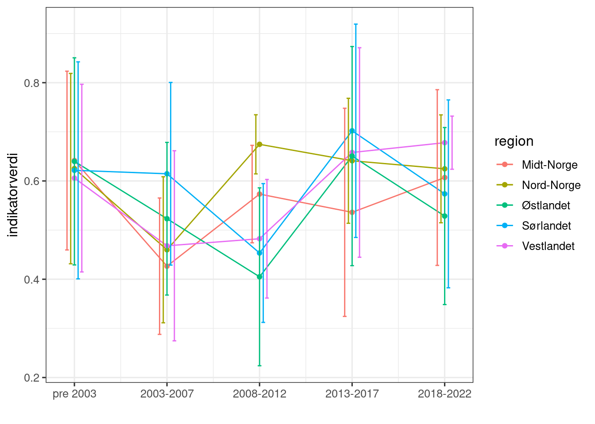
<p class="caption">(\#fig:summer-temp-time-periods)Scaled indicator values, aggregated over 5 year intervals. Errors represent temporal variation (standard errors) within regions and across 5 years.</p>
</div>

Finally, I can add these values to the sp object with the accounting areas.


```r
reg2 <- reg %>%
  left_join(i_aggregatedToPeriods[i_aggregatedToPeriods$period_rank==5,], by=join_by(region))
```


```r
myCol <- "RdYlGn"
myCol2 <- "-RdYlGn"

tm_main <- tm_shape(reg2)+
  tm_polygons(col="indicator",
              title="Indikator:\nsommertemperatur",
    palette = myCol,
    style="fixed",
    breaks = seq(0,1,.2)) 
  
tm_inset <- tm_shape(reg2)+
  tm_polygons(col="sd",
              title="SD",
              palette = myCol2,
              style="cont")+
  tm_layout(legend.format = list(digits=2))

tmap_arrange(tm_main, 
             tm_inset)
```

<div class="figure">

<p class="caption">(\#fig:wall-to-wall-summer-temp-indicator)Summer tempreature indicator values for five accounting areas in Norway. SD is the spatial variation.</p>
</div>


<!--chapter:end:medianSummerTemperature.Rmd-->

# (PART\*) DEPRECATED{-}

# Areal uten død eller skadet røsslyng i kystlynghei

<br />

_Author and date:_
Anders L. Kolstad


```
#> [1] "2023-03-24"
```

<br />

<!-- Load all you dependencies here -->


<!-- Fill in which ecosystem the indicator belongs to, as well as the ecosystem characteristic it should be linked to. It's OK to use some Norwegian here -->


|Ecosystem          |Økologisk.egenskap |ECT.class                      |
|:------------------|:------------------|:------------------------------|
|Semi-naturlig mark |Primærproduksjon   |Structual state characteristic |

<!-- Don't remove these three html lines -->
<br />
<br />
<hr />


<!-- Document you work below. Try not to change  the headers too much. Data can be stored on NINA server. Since the book is rendered on the R Server this works fine, but note that directory paths are different on the server compared to you local machine. If it is not too big you may store under /data/ on this repository -->

## Introduction
Here I quickly go through the ANO data set for the years 2019-2021 to investigate the frequeny of poins that fall within coastal heathlands (kystlynghei). This will decide whether we can use this data to inform an indicator about the proportion of dead _Calluna vulgaris_ (røsslyng).

## Analyses

#### ANO data
Data is downloaded from [here](https://kartkatalog.miljodirektoratet.no/Dataset/Details/2054).

Import and list terms: 

```r
ano <- sf::st_read("/data/P-Prosjekter2/41201785_okologisk_tilstand_2022_2023/data/Naturovervaking_eksport.gdb",
                   layer = "ANO_SurveyPoint")
#> Reading layer `ANO_SurveyPoint' from data source 
#>   `/data/P-Prosjekter2/41201785_okologisk_tilstand_2022_2023/data/Naturovervaking_eksport.gdb' 
#>   using driver `OpenFileGDB'
#> Simple feature collection with 8974 features and 71 fields
#> Geometry type: POINT
#> Dimension:     XY
#> Bounding box:  xmin: -51950 ymin: 6467050 xmax: 1094950 ymax: 7923950
#> Projected CRS: ETRS89 / UTM zone 33N
#st_crs(ano)
names(ano)
#>  [1] "GlobalID"                      
#>  [2] "registeringsdato"              
#>  [3] "klokkeslett_start"             
#>  [4] "ano_flate_id"                  
#>  [5] "ano_punkt_id"                  
#>  [6] "ssb_id"                        
#>  [7] "program"                       
#>  [8] "instruks"                      
#>  [9] "aar"                           
#> [10] "dataansvarlig_mdir"            
#> [11] "dataeier"                      
#> [12] "vaer"                          
#> [13] "hovedoekosystem_punkt"         
#> [14] "andel_hovedoekosystem_punkt"   
#> [15] "utilgjengelig_punkt"           
#> [16] "utilgjengelig_begrunnelse"     
#> [17] "gps"                           
#> [18] "noeyaktighet"                  
#> [19] "kommentar_posisjon"            
#> [20] "klokkeslett_karplanter_start"  
#> [21] "art_alle_registrert"           
#> [22] "karplanter_dekning"            
#> [23] "klokkeslett_karplanter_slutt"  
#> [24] "karplanter_feltsjikt"          
#> [25] "moser_dekning"                 
#> [26] "torvmoser_dekning"             
#> [27] "lav_dekning"                   
#> [28] "stroe_dekning"                 
#> [29] "jord_grus_stein_berg_dekning"  
#> [30] "stubber_kvister_dekning"       
#> [31] "alger_fjell_dekning"           
#> [32] "kommentar_ruteanalyse"         
#> [33] "fastmerker"                    
#> [34] "kommentar_fastmerker"          
#> [35] "kartleggingsenhet_1m2"         
#> [36] "hovedtype_1m2"                 
#> [37] "ke_beskrivelse_1m2"            
#> [38] "kartleggingsenhet_250m2"       
#> [39] "hovedtype_250m2"               
#> [40] "ke_beskrivelse_250m2"          
#> [41] "andel_kartleggingsenhet_250m2" 
#> [42] "bv_7gr_gi"                     
#> [43] "bv_7jb_ba"                     
#> [44] "bv_7jb_bt"                     
#> [45] "bv_7jb_si"                     
#> [46] "bv_7tk"                        
#> [47] "bv_7se"                        
#> [48] "forekomst_ntyp"                
#> [49] "ntyp"                          
#> [50] "kommentar_naturtyperegistering"
#> [51] "side_5_note"                   
#> [52] "krypende_vier_dekning"         
#> [53] "ikke_krypende_vier_dekning"    
#> [54] "vedplanter_total_dekning"      
#> [55] "busker_dekning"                
#> [56] "tresjikt_dekning"              
#> [57] "treslag_registrert"            
#> [58] "roesslyng_dekning"             
#> [59] "roesslyngblad"                 
#> [60] "pa_dekning"                    
#> [61] "pa_note"                       
#> [62] "pa_registrert"                 
#> [63] "fa_total_dekning"              
#> [64] "fa_registrert"                 
#> [65] "kommentar_250m2_flate"         
#> [66] "klokkeslett_slutt"             
#> [67] "vedlegg_url"                   
#> [68] "creator"                       
#> [69] "creationdate"                  
#> [70] "editor"                        
#> [71] "editdate"                      
#> [72] "SHAPE"
```

Table of the number of sampling points per year:

```r
table(ano$aar)
#> 
#> 2019 2020 2021 
#> 1111 3411 4452
```


```r
par(mar=c(15,5,0,0))
barplot(table(ano$hovedoekosystem_punkt), las=2)
```

<div class="figure">
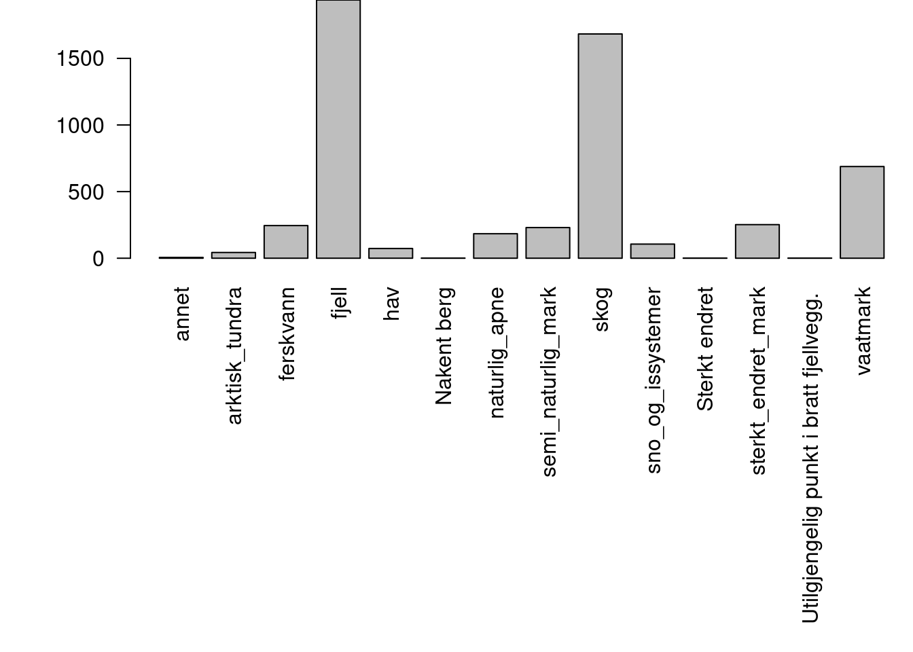
<p class="caption">(\#fig:unnamed-chunk-6)The distribution of ANO points that fall within different main ecosystems.</p>
</div>

Sub-setting the data to only consider seni natural areas.

```r
snat <- ano[ano$hovedoekosystem_punkt == "semi_naturlig_mark",]
snat2 <- snat[!is.na(snat$GlobalID),]
```
230 points are semi-natural.


```r
table(snat$hovedtype_1m2)
#> 
#>       Åpen jordvannsmyr              Boreal hei 
#>                       4                     107 
#>               Kaldkilde             Kystlynghei 
#>                       1                      49 
#>             Nakent berg              Nedbørsmyr 
#>                       2                       1 
#>       Semi-naturlig eng       Semi-naturlig myr 
#>                      51                       6 
#> Semi-naturlig strandeng    Semi-naturlig våteng 
#>                       1                       1 
#>               Skogsmark 
#>                       4
```
Only 49 1m2 samples are kystlynghei. 


```r
table(ano$hovedtype_250m2)
#> 
#>                                      Åker 
#>                                        62 
#>                         Åpen flomfastmark 
#>                                         1 
#>                      Åpen grunnlendt mark 
#>                                        92 
#>                         Åpen jordvannsmyr 
#>                                       427 
#>                                 Blokkmark 
#>                                       204 
#>                                Boreal hei 
#>                                        94 
#>        Breforland og snøavsmeltingsområde 
#>                                        33 
#>               Eng-liknende oppdyrket mark 
#>                                        19 
#>       Eng-liknende sterkt endret fastmark 
#>                                         2 
#>                Fjellgrashei og grastundra 
#>                                        32 
#>                 Fjellhei leside og tundra 
#>                                       853 
#>                             Flomskogsmark 
#>                                         1 
#>                          Grøftet torvmark 
#>                                         6 
#>                        Grotte og overheng 
#>                                         1 
#>               Hard sterkt endret fastmark 
#>                                         2 
#>                   Helofytt-ferskvannssump 
#>                                         4 
#>                       Historisk skredmark 
#>                                         3 
#>                         Isinnfrysingsmark 
#>                                         2 
#>                                 Kaldkilde 
#>                                         3 
#>                               Kystlynghei 
#>                                        26 
#>                Løs sterkt endret fastmark 
#>                                        43 
#>                     Myr- og sumpskogsmark 
#>                                        53 
#>                               Nakent berg 
#>                                       193 
#>                                Nedbørsmyr 
#>                                        53 
#>                       Oppdyrket varig eng 
#>                                        45 
#>                           Oppfrysingsmark 
#>                                         3 
#>                 Plener parker og liknende 
#>                                        19 
#>                                     Rabbe 
#>                                        83 
#>                                   Rasmark 
#>                                        58 
#>                        Rasmarkhei og -eng 
#>                                         8 
#>                         Semi-naturlig eng 
#>                                        45 
#>                         Semi-naturlig myr 
#>                                        14 
#>                      Semi-naturlig våteng 
#>                                         2 
#>                                 Skogsmark 
#>                                      1288 
#>                   Snø- og isdekt fastmark 
#>                                       105 
#>                                   Snøleie 
#>                                       160 
#>                                Strandberg 
#>                                         5 
#>                                 Strandeng 
#>                                         2 
#>                       Strandsumpskogsmark 
#>                                         2 
#> Tørrlagte våtmarks- og ferskvannssystemer 
#>                                         7 
#>                                   Torvtak 
#>                                         1 
#>                              Treplantasje 
#>                                        13 
#>                Våtsnøleie og snøleiekilde 
#>                                        13
```
Only 26 of the 250m2 circles are kystlynghei. The variable of interest is called _Dekning av død/skadet røsslyng_ and is only recorded on these 26 circles.


## Conclusion
Because of the random allocation of sampling points, not enough points fall in coastal heathlands to allow us to create a trustworthy indicator for this nature type. With a few more years of data we might end up with about 100 points, which is borderline what we need in order to calculate condition values at a regional level with some level of precision. 


<!--chapter:end:rosslyng.Rmd-->

# (PART\*) GENERAL TOPICS {.unnumbered}

# Nature types {#naturtype}

**On the application of the nature type data set**

*Data exploration and an analyses of thematic coverage*

<br />


Author: 

Anders L. Kolstad

March 2023


<br />

Here I will investigate a specific data set, [Naturtyper - Miljødirektoratets instruks](https://kartkatalog.geonorge.no/metadata/naturtyper-miljoedirektoratets-instruks/eb48dd19-03da-41e1-afd9-7ebc3079265c) and try to evaluate its usability for designing indicators for ecosystem condition. This involves assessing both the spatial and temporal representation, as well as conceptual alignment with the [Norwegian system for ecosystem condition assessments](https://www.regjeringen.no/no/dokumenter/fagsystem-for-fastsetting-av-god-okologisk-tilstand/id2558481/).

The precision in field mapping will not be assess in itself. We assume some, or even considerable, sampling error, but this is inherent to all field data.

The first part of this analysis is simply to get an overview of the data, making it ready for part 2 where we look at the thematic coverage of nature types and how the NiN variables are used.


## Import data and general summary statistics

```r
dir <- substr(getwd(), 1,2)

# local path
#path <- "data/R:/GeoSpatialData/Habitats_biotopes/Norway_Miljodirektoratet_Naturtyper_nin/Original/Natur_Naturtyper_NiN_norge_med_svalbard_25833.gdb"
# temporary path 
#path <- "/data/Egenutvikling/41001581_egenutvikling_anders_kolstad/data/Natur_Naturtyper_NiN_norge_med_svalbard_25833.g#db"

# server path pre 2022 data
#path <- "/data/P-Prosjekter2/41201785_okologisk_tilstand_2022_2023/data/Natur_Naturtyper_NiN_norge_med_svalbard_25833.gdb"
path <- ifelse(dir == "C:", 
               "R:/GeoSpatialData/Habitats_biotopes/Norway_Miljodirektoratet_Naturtyper_nin/Original/Naturtyper_nin_0000_norge_25833_FILEGDB/Naturtyper_nin_0000_norge_25833_FILEGDB.gdb",
               "/data/R/GeoSpatialData/Habitats_biotopes/Norway_Miljodirektoratet_Naturtyper_nin/Original/Naturtyper_nin_0000_norge_25833_FILEGDB/Naturtyper_nin_0000_norge_25833_FILEGDB.gdb")

dat <- sf::st_read(dsn = path)
```

Fix non-valid polygons:

```r
dat <- sf::st_make_valid(dat)
```

The data set has 117k polygons, each with 37 variables:

```r
dim(dat)
#> [1] 117427     37
```

It therefore takes a little minute to render a plot, but this is the code to do it:

```r
nor <- sf::read_sf("data/outlineOfNorway_EPSG25833.shp")
tmap_mode("view")
tm_shape(dat) + 
  tm_polygons(col="tilstand")+
  tm_shape(nor)+
  tm_polygons(alpha = 0,border.col = "black")
```


## Area
Calculating the area for each polygon/locality

```r
dat$area <- sf::st_area(dat)
summary(dat$area)
#>     Min.  1st Qu.   Median     Mean  3rd Qu.     Max. 
#>       20      700     2810    17153     8674 15794178
```
The smallest polygons are 20 m2, and the biggest is 15.8 km2.

The largest polygon is a Kalkfattig og intermediær fjellhei, leside og tundra , and the smallest polygon is a Sørlig kaldkilde.


Sum of mapped area divided by Norwegian mainland area:

```r
#Import outline of mainland Norway
nor <- sf::read_sf("data/outlineOfNorway_EPSG25833.shp")
sum(dat$area)/sf::st_area(nor)
#> 0.006184274 [1]
```
About 0.6% of Norway has been mapped (note that a bigger area than this has been surveyed, but only a small fraction is delineated). It is therefore essential that these 0.5% are representative.

## Temporal trend

```r
dat$kartleggingsår <- as.numeric(dat$kartleggingsår)
```


```r
area_year <- as.data.frame(tapply(dat$area, dat$kartleggingsår, sum))
names(area_year) <- "area"
area_year$year <- row.names(area_year)
area_year$area_km2 <- area_year$area/10^6
```


```r
ggplot(area_year)+
  geom_bar(aes(x = year, y = area_km2),
           stat = "identity",
           fill = "grey",
           colour="black",
           size = 1.2)+
  theme_bw(base_size = 12)+
  labs(x = "Year", y = "Total mapped area (km/2)")
#> Warning: Using `size` aesthetic for lines was deprecated in ggplot2
#> 3.4.0.
#> ℹ Please use `linewidth` instead.
#> This warning is displayed once every 8 hours.
#> Call `lifecycle::last_lifecycle_warnings()` to see where
#> this warning was generated.
```

<div class="figure">

<p class="caption">(\#fig:unnamed-chunk-9)Temproal trend in nature type mapping using Miljødirektoratets Instruks</p>
</div>

There are some differences in the field mapping instructions between the years. I will need to decide whether to include all years, or to perhaps exclude the first year.


## Condition
A quick overview of the condition scores 

```r
dat <- dat %>%
  mutate(tilstand =  recode(tilstand, 
                            "sværtRedusert" = "1 - Svært redusert",
                            "dårlig" = "2 - Dårlig",
                            "moderat" = "3 - Moderat",
                            "god" = "4 - God"))

barplot(tapply(dat$area/10^6, factor(dat$tilstand), sum))
```

<div class="figure">

<p class="caption">(\#fig:unnamed-chunk-10)The overal distribution of condition scores</p>
</div>

Most sites/polygons are in either good or moderately good condition. I'm not sure what the first class represents. It seems like some polygons don't have a condition score. Looking at just the data set, and also the online *faktaark* for some of these localities, does not give the answer:

```r
View(dat[dat$tilstand=="",])
```

This figure show that these cases are not restricted to just one field season.

```r
barplot(table(dat$kartleggingsår[dat$tilstand==""]), 
        ylab="Number of localities without condition scores",
        xlab="Year")
```

<div class="figure">
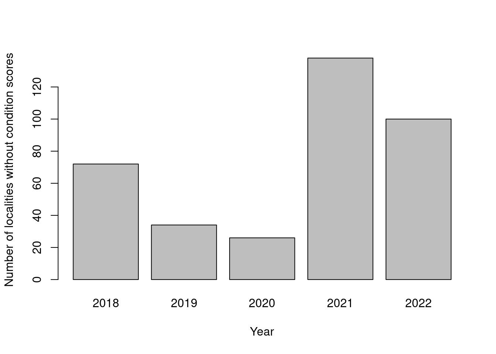
<p class="caption">(\#fig:unnamed-chunk-12)Temporal trend in localities without condition scores.</p>
</div>


```r
par(mar=c(5,20,1,1))
barplot(table(dat$hovedøkosystem[dat$tilstand==""]),
        horiz = T, las=2,
        xlab="Number of localities without condition scores")
```

<div class="figure">

<p class="caption">(\#fig:unnamed-chunk-13)Main ecosystems with localities missing condition scores.</p>
</div>

These cases are restricted to two main ecosystems, and one class where the main ecosystem is not recorded. Looking at some of those cases it is clear that they are not relevant for our work here, I and I don't know why they are in the data set to begin with.

```r
par(mar=c(5,20,1,1))
barplot(table(dat$naturtype[dat$tilstand==""]),
        horiz = T, las=2,
        xlab="Number of localities without condition scores")
```

<div class="figure">

<p class="caption">(\#fig:unnamed-chunk-14)Nature types with localities missing condition scores.</p>
</div>

There are only seven nature types (if you exclude those that are not mapped) that don't have a condition score.

`Snøleieblokkmark` and `rabbeblokkmark` do not have a protocol for assessing condition status. `Leirskredgrop`, `leirravine` and `grotte` were nature types in 2018 (not mapped in 2021), and was similarly not assessed for condition scores. `Isinnfrysingsmark` is assessed for condition now, but not in 2018. `Snøleieberg` is new in 2022 and is only mapped for area. We can therefore exclude these localities from our data set:

```r
dat_rm <- dat
dat <- dat_rm[dat_rm$tilstand!="",]
```

This resulted in the deletion of 370 rows, or 0.32 % of the data.


## Mosaic types
The field mapping instruction include and option for delineating mosaic types. Let's investigate these cases.

When an area displays a repeating pattern of mixed nature types that each are smaller than the minimum mapping unit MMU, these are grouped into as many overlapping polygons as there are unique nature types. Within the nature type polygons, these will have the same distribution of NiN-grunntyper (online you can see the percentage distribution, but our data set only has the presence/absence data) but be assigned different nature types (nature types is the Environmental agencies classification). The condition scoring can be unique to each overlapping nature type in the mosaic. But we don't know the precise location of the NiN-grunntyper that are part of mosaic nature types.


```r
barplot(table(dat$mosaikk),
        xlab = "Mosaic", ylab="Number of localities")
```

<div class="figure">

<p class="caption">(\#fig:unnamed-chunk-17)The number of mosaic localities is relatively small.</p>
</div>
Mosaic localities occur in many main ecosystems (and many nature types therein). 

```r
# Fix duplicated `hovedøkosystem`
#unique(dat$hovedøkosystem)
dat$hovedøkosystem[dat$hovedøkosystem=="naturligÅpneOmråderILavlandet"] <- "naturligÅpneOmråderUnderSkoggrensa"
```


```r
par(mar=c(5,20,1,1))
barplot(table(dat$hovedøkosystem[dat$mosaikk=="ja"]),
        horiz = T, las=2,
        xlab="Number of mosaic localities")
```

<div class="figure">

<p class="caption">(\#fig:unnamed-chunk-19)Distribution of mosaic nature types across hovedøkosystem</p>
</div>

Some conclusion here could be that

1. Mosaic localities CANNOT be used to pin-point NiN grunntyper (e.g. for remote sensing purposes).
1. Mosaic localities CAN be used to extract condition scores for nature types, but these should not be tied to all the *NiN grunntype* listed in that polygon, because that will include some that belong to the other part(s) of the mosaic.


## NiN types across main ecosystems
The NiN main types can be extracted from the column `ninKartleggingsenheter`. These are NiN mapping units recorded in the field. The NiN main type makes up the first part of this mapping unit code. The variable is oddly concatenated. Let's tease it apart.


```r
#dat$ninKartleggingsenheter  [1:10]
# remove NA prefix:
dat$ninKartleggingsenheter2 <- gsub("NA_", dat$ninKartleggingsenheter, replacement = "")
#dat$ninKartleggingsenheter2[1:30]

dat$ninKartleggingsenheter2 <- str_replace_all(dat$ninKartleggingsenheter2, ".[CE].[\\d]{1,}", replacement = "")
#dat$ninKartleggingsenheter2[1:30]
dat$ninKartleggingsenheter2 <- str_replace_all(dat$ninKartleggingsenheter2, "-.", replacement = "")
uni <- function(x){paste(unique(unlist(strsplit(x, ","))), collapse = ",")}
dat$ninKartleggingsenheter3 <- lapply(dat$ninKartleggingsenheter2, uni)
n_uni <- function(x){length(unique(unlist(strsplit(x, ","))))}
dat$n_ninKartleggingsenheter <- lapply(dat$ninKartleggingsenheter2, n_uni)
dat$n_ninKartleggingsenheter <- as.numeric(dat$n_ninKartleggingsenheter) 

par(mfrow=c(1,3))
barplot(table(dat$n_ninKartleggingsenheter),
        xlab = "Number of NiN main types",
        ylab = "Number of localities")
barplot(table(dat$n_ninKartleggingsenheter[dat$mosaikk=="nei"]),
        xlab = "Number of NiN main types\n(Mosaic localities excluded)")
barplot(table(dat$n_ninKartleggingsenheter[dat$mosaikk=="ja"]),
        xlab = "Number of NiN main types\n(Mosaic localities only)")
```

<div class="figure">

<p class="caption">(\#fig:unnamed-chunk-20)The number of NiN main types within one locality should normally be one, except for mosaic localities.</p>
</div>

Mosaic localities (right pane) have a much higher likelihood of including multiple NiN main types, but it also occurs in non-mosaic localities (over 10 000 cases). Most, if not all, nature types are defined within a single NiN main type, so we need to see whats going on there.

First I need to melt the data frame in order to tally the number of NiN min types within each `hovedøkosystem`.

```r
dat_melt <- tidyr::separate_rows(dat, ninKartleggingsenheter3)
```


```r
ggplot(dat_melt[dat_melt$mosaikk!="ja",])+
  geom_bar(aes(x = ninKartleggingsenheter3))+
  coord_flip()+
  theme_bw(base_size = 12)+
  facet_wrap("hovedøkosystem",
             scales = "free")
```

<div class="figure">
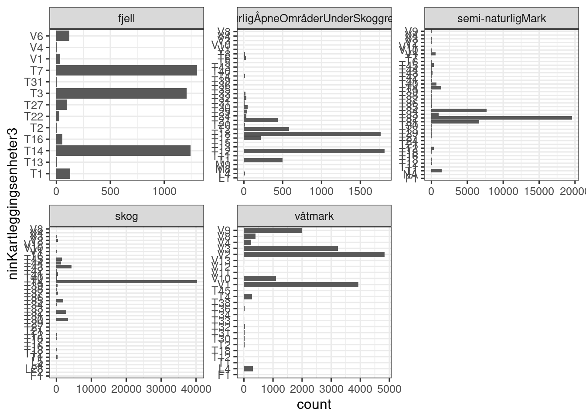
<p class="caption">(\#fig:unnamed-chunk-22)Figure showing the number of localities for each NiN main type. One locality can have more than one NiN main type. Mosaic localities are excluded in this figure.</p>
</div>

This is a messy figure, but the point is, there is a lot of miss-match between NiN main types and *hovedøkosystem*. Taking one example: T2 (åpen grunnledt mark) is not found in mountains, but there is one case where this occurs. If I view that case


```r
View(dat_melt[dat_melt$mosaikk!="Ja" & dat_melt$hovedøkosystem=="Fjell" & dat_melt$ninKartleggingsenheter3=="T2",])
```

.. and find the online fact sheet for that locality, I see that it is actually NOT a mosaic. It is a nature type called *Kalkfattig og intermediær fjellhei, leside og tundra* which is defined as strictly T3, but the field surveyor has recorded lots of NiN mapping units (and hence, main NiN types) in addition. This is a mistake. Online I can see that the locality is 50% T3, but this information is not in the data set that we have available. Miljødirektoratet could consider adding this information to the downloadable dataset. The order of the NiN types in the `ninKartleggingsenheter` column is not reflecting the commonness of the types ether. 

If there was a way to extract the defining NiN type from the `naturtype` column, that would be nice. Miljødirektoratet may consider adding this as well. If we exclude all localities that are not mosaics, but that have multiple NiN main types (no, we're not going to do that, here at least), we first need to know if there are not any `naturtype` which allow for multiple NiN main types.

As this next figure show, these cases are not restricted to mapping year, and hence to any changes in the field protocol.

```r
par(mar=c(2,6,2,2))
temp <- dat[dat$n_ninKartleggingsenheter>1 & dat$mosaikk!="ja",]
barplot(table(temp$kartleggingsår), ylab="Number of localities with more than one NiN main type\n(mosaic localitie excluded) ")
```

<div class="figure">
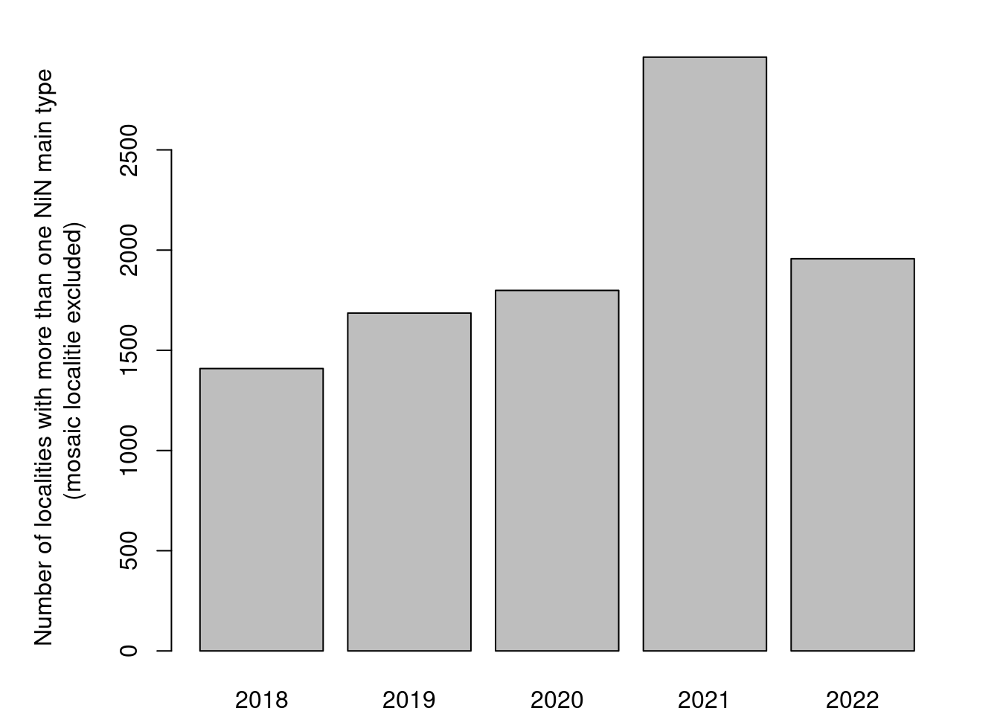
<p class="caption">(\#fig:unnamed-chunk-24)Temporal trend in the recording of non-mosaic localities that are recorded as consisting of multiple NiN mapping units from different NiN main types.</p>
</div>

Lets look at the most common nature types that are recorded this way.

```r
temp2 <- as.data.frame(table(temp$naturtype, temp$n_ninKartleggingsenheter))
temp2 <- temp2[base::order(temp2$Freq, decreasing = T),][1:10,]
par(mar=c(8,20,1,1))
barplot(temp2$Freq, names.arg = temp2$Var1, las=2,
        horiz = T, xlab = "Number of localities with >1 NiN main type")
```

<div class="figure">
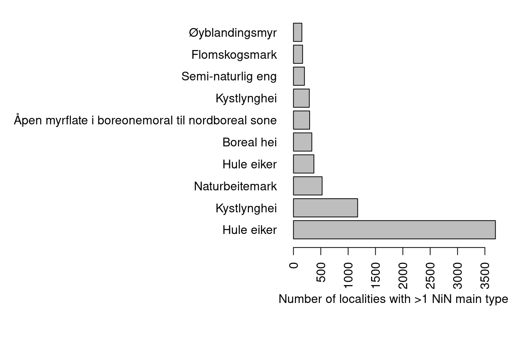
<p class="caption">(\#fig:multipleNiN)The ten most common nature types and the number of localities with with multiple NiN main types</p>
</div>

'Hule eiker' is a special case because these are recorded as points and not polygons, and they can be found in any NiN main type and any *hovedøkosystem*.


```r
DT::datatable(
  dat[dat$naturtype=="Hule eiker",][1:5,c("naturtype", "hovedøkosystem", "ninKartleggingsenheter")])
```

```{=html}
<div class="datatables html-widget html-fill-item-overflow-hidden html-fill-item" id="htmlwidget-b94022993666994c1dba" style="width:100%;height:auto;"></div>
<script type="application/json" data-for="htmlwidget-b94022993666994c1dba">{"x":{"filter":"none","vertical":false,"data":[["30","35","108","109","110"],["Hule eiker","Hule eiker","Hule eiker","Hule eiker","Hule eiker"],["semi-naturligMark","skog","skog","skog","skog"],["NA_T4-C-2","NA_T37-C-2,NA_T35-C-1","NA_T4-C-6,NA_T44-C-1","NA_T4-C-10,NA_T44-C-1","NA_T4-C-6"],[{"type":"Polygon","coordinates":[[[293447.5702,6554104.6838],[293447.5382,6554103.7075],[293447.4425,6554102.7354],[293447.2833,6554101.7717],[293447.0615,6554100.8204],[293446.778,6554099.8857],[293446.4339,6554098.9715],[293446.0308,6554098.0817],[293445.5703,6554097.2203],[293445.0545,6554096.3908],[293444.4855,6554095.5968],[293443.8659,6554094.8417],[293443.1981,6554094.1288],[293442.4852,6554093.461],[293441.7301,6554092.8414],[293440.9361,6554092.2724],[293440.1066,6554091.7566],[293439.2452,6554091.2961],[293438.3554,6554090.893],[293437.4413,6554090.5489],[293436.5065,6554090.2654],[293435.5552,6554090.0436],[293434.5915,6554089.8845],[293433.6194,6554089.7887],[293432.6431,6554089.7567],[293431.6668,6554089.7887],[293430.6947,6554089.8845],[293429.731,6554090.0436],[293428.7797,6554090.2654],[293427.845,6554090.5489],[293426.9308,6554090.893],[293426.041,6554091.2961],[293425.1796,6554091.7566],[293424.3501,6554092.2724],[293423.5561,6554092.8414],[293422.801,6554093.461],[293422.0881,6554094.1288],[293421.4204,6554094.8417],[293420.8007,6554095.5968],[293420.2317,6554096.3908],[293419.7159,6554097.2203],[293419.2554,6554098.0817],[293418.8523,6554098.9715],[293418.5082,6554099.8857],[293418.2247,6554100.8204],[293418.0029,6554101.7717],[293417.8438,6554102.7354],[293417.748,6554103.7075],[293417.7161,6554104.6838],[293417.748,6554105.6601],[293417.8438,6554106.6322],[293418.0029,6554107.5959],[293418.2247,6554108.5472],[293418.5082,6554109.4819],[293418.8523,6554110.3961],[293419.2554,6554111.2859],[293419.7159,6554112.1473],[293420.2317,6554112.9768],[293420.8007,6554113.7708],[293421.4204,6554114.5259],[293422.0881,6554115.2388],[293422.801,6554115.9066],[293423.5561,6554116.5262],[293424.3501,6554117.0952],[293425.1796,6554117.611],[293426.041,6554118.0715],[293426.9308,6554118.4746],[293427.845,6554118.8187],[293428.7797,6554119.1022],[293429.731,6554119.324],[293430.6947,6554119.4832],[293431.6668,6554119.5789],[293432.6431,6554119.6109],[293433.6194,6554119.5789],[293434.5915,6554119.4832],[293435.5552,6554119.324],[293436.5065,6554119.1022],[293437.4413,6554118.8187],[293438.3554,6554118.4746],[293439.2452,6554118.0715],[293440.1066,6554117.611],[293440.9361,6554117.0952],[293441.7301,6554116.5262],[293442.4852,6554115.9066],[293443.1981,6554115.2388],[293443.8659,6554114.5259],[293443.9651,6554114.405],[293444.0363,6554114.329],[293444.6559,6554113.5739],[293445.2249,6554112.7799],[293445.7407,6554111.9504],[293446.2012,6554111.089],[293446.3077,6554110.8539],[293446.2244,6554110.8585],[293446.4339,6554110.3961],[293446.778,6554109.4819],[293447.0615,6554108.5472],[293447.2833,6554107.5959],[293447.4425,6554106.6322],[293447.5382,6554105.6601],[293447.5702,6554104.6838]]]},{"type":"Polygon","coordinates":[[[54460.4755999995,6457415.3689],[54460.4436999997,6457414.3926],[54460.3479000004,6457413.4205],[54460.1887999997,6457412.4568],[54459.9670000002,6457411.5055],[54459.6835000003,6457410.5707],[54459.3393999999,6457409.6566],[54458.9362000003,6457408.7668],[54458.4758000001,6457407.9054],[54457.96,6457407.0759],[54457.3909999998,6457406.2819],[54456.7713000001,6457405.5268],[54456.1036,6457404.8139],[54455.3907000003,6457404.1461],[54454.6355999997,6457403.5265],[54453.8415999999,6457402.9575],[54453.0120999999,6457402.4417],[54452.1506000003,6457401.9812],[54451.2609000001,6457401.5781],[54450.3466999996,6457401.234],[54449.4119999995,6457400.9505],[54448.4606999997,6457400.7287],[54447.4968999997,6457400.5695],[54446.5248999996,6457400.4738],[54445.5486000003,6457400.4418],[54444.5723000001,6457400.4738],[54443.6002000002,6457400.5695],[54442.6365,6457400.7287],[54441.6852000002,6457400.9505],[54440.7504000003,6457401.234],[54439.8361999998,6457401.5781],[54438.9464999996,6457401.9812],[54438.0850999998,6457402.4417],[54437.2555999998,6457402.9575],[54436.4616,6457403.5265],[54435.7065000003,6457404.1461],[54434.9935999997,6457404.8139],[54434.3257999998,6457405.5268],[54433.7061000001,6457406.2819],[54433.1371999998,6457407.0759],[54432.6213999996,6457407.9054],[54432.1608999996,6457408.7668],[54431.7577999998,6457409.6566],[54431.4137000004,6457410.5707],[54431.1301999995,6457411.5055],[54430.9083000002,6457412.4568],[54430.7492000004,6457413.4205],[54430.6535,6457414.3926],[54430.6215000004,6457415.3689],[54430.6535,6457416.3452],[54430.7492000004,6457417.3173],[54430.9083000002,6457418.281],[54431.1301999995,6457419.2323],[54431.4137000004,6457420.167],[54431.7577999998,6457421.0812],[54432.1608999996,6457421.971],[54432.6213999996,6457422.8324],[54433.1371999998,6457423.6619],[54433.7061000001,6457424.4559],[54434.3257999998,6457425.211],[54434.9935999997,6457425.9239],[54435.7065000003,6457426.5916],[54436.4616,6457427.2113],[54437.2555999998,6457427.7803],[54438.0850999998,6457428.2961],[54438.9464999996,6457428.7566],[54439.8361999998,6457429.1597],[54440.7504000003,6457429.5038],[54441.6852000002,6457429.7873],[54442.6365,6457430.0091],[54443.6002000002,6457430.1682],[54444.5723000001,6457430.264],[54445.5486000003,6457430.2959],[54446.5248999996,6457430.264],[54447.4968999997,6457430.1682],[54448.4606999997,6457430.0091],[54449.4119999995,6457429.7873],[54450.3466999996,6457429.5038],[54451.2609000001,6457429.1597],[54452.1506000003,6457428.7566],[54453.0120999999,6457428.2961],[54453.8415999999,6457427.7803],[54454.6355999997,6457427.2113],[54455.3907000003,6457426.5916],[54456.1036,6457425.9239],[54456.7713000001,6457425.211],[54457.3909999998,6457424.4559],[54457.96,6457423.6619],[54458.4758000001,6457422.8324],[54458.9362000003,6457421.971],[54459.3393999999,6457421.0812],[54459.6835000003,6457420.167],[54459.9670000002,6457419.2323],[54460.1887999997,6457418.281],[54460.3479000004,6457417.3173],[54460.4436999997,6457416.3452],[54460.4755999995,6457415.3689]]]},{"type":"Polygon","coordinates":[[[279113.4302,6564090.2734],[279113.3982,6564089.2971],[279113.3025,6564088.3251],[279113.1434,6564087.3613],[279112.9216,6564086.41],[279112.638,6564085.4753],[279112.294,6564084.5611],[279111.8908,6564083.6714],[279111.4304,6564082.8099],[279110.9145,6564081.9804],[279110.3456,6564081.1864],[279109.7259,6564080.4313],[279109.0582,6564079.7184],[279108.3452,6564079.0507],[279107.5902,6564078.431],[279106.7962,6564077.862],[279105.9667,6564077.3462],[279105.1052,6564076.8858],[279104.2155,6564076.4826],[279103.3013,6564076.1385],[279102.3666,6564075.855],[279101.4153,6564075.6332],[279100.4515,6564075.4741],[279099.4794,6564075.3783],[279098.5032,6564075.3464],[279097.5269,6564075.3783],[279096.5548,6564075.4741],[279095.591,6564075.6332],[279094.6397,6564075.855],[279093.705,6564076.1385],[279092.7908,6564076.4826],[279091.9011,6564076.8858],[279091.0396,6564077.3462],[279090.2101,6564077.862],[279089.4161,6564078.431],[279088.6611,6564079.0507],[279087.9481,6564079.7184],[279087.2804,6564080.4313],[279086.6607,6564081.1864],[279086.0918,6564081.9804],[279085.5759,6564082.8099],[279085.1155,6564083.6714],[279084.7124,6564084.5611],[279084.3683,6564085.4753],[279084.0847,6564086.41],[279083.8629,6564087.3613],[279083.7038,6564088.3251],[279083.6081,6564089.2971],[279083.5761,6564090.2734],[279083.6081,6564091.2497],[279083.7038,6564092.2218],[279083.8629,6564093.1855],[279084.0847,6564094.1368],[279084.3683,6564095.0716],[279084.7124,6564095.9858],[279085.1155,6564096.8755],[279085.5759,6564097.7369],[279086.0918,6564098.5664],[279086.6607,6564099.3604],[279087.2804,6564100.1155],[279087.9481,6564100.8284],[279088.6611,6564101.4962],[279089.4161,6564102.1158],[279090.2101,6564102.6848],[279091.0396,6564103.2006],[279091.9011,6564103.6611],[279092.7908,6564104.0642],[279093.705,6564104.4083],[279094.6397,6564104.6918],[279095.591,6564104.9137],[279096.5548,6564105.0728],[279097.5269,6564105.1685],[279098.5032,6564105.2005],[279099.4794,6564105.1685],[279100.4515,6564105.0728],[279101.4153,6564104.9137],[279102.3666,6564104.6918],[279103.3013,6564104.4083],[279104.2155,6564104.0642],[279105.1052,6564103.6611],[279105.9667,6564103.2006],[279106.7962,6564102.6848],[279107.5902,6564102.1158],[279108.3452,6564101.4962],[279109.0582,6564100.8284],[279109.7259,6564100.1155],[279110.3456,6564099.3604],[279110.9145,6564098.5664],[279111.4304,6564097.7369],[279111.8908,6564096.8755],[279112.294,6564095.9858],[279112.638,6564095.0716],[279112.9216,6564094.1368],[279113.1434,6564093.1855],[279113.3025,6564092.2218],[279113.3982,6564091.2497],[279113.4302,6564090.2734]]]},{"type":"Polygon","coordinates":[[[279073.1685,6564122.7994],[279073.1365,6564121.8231],[279073.0408,6564120.851],[279072.8816,6564119.8873],[279072.6598,6564118.936],[279072.3763,6564118.0013],[279072.0322,6564117.0871],[279071.6291,6564116.1973],[279071.1686,6564115.3359],[279070.6528,6564114.5064],[279070.0838,6564113.7124],[279069.4642,6564112.9573],[279068.7964,6564112.2444],[279068.0835,6564111.5766],[279067.3284,6564110.957],[279066.5344,6564110.388],[279065.7049,6564109.8722],[279064.8435,6564109.4117],[279063.9537,6564109.0086],[279063.0396,6564108.6645],[279062.1048,6564108.381],[279061.1535,6564108.1592],[279060.1898,6564108],[279059.2177,6564107.9043],[279058.2414,6564107.8723],[279057.2651,6564107.9043],[279056.293,6564108],[279055.3293,6564108.1592],[279054.378,6564108.381],[279053.4433,6564108.6645],[279052.5291,6564109.0086],[279051.6393,6564109.4117],[279050.7779,6564109.8722],[279049.9484,6564110.388],[279049.1544,6564110.957],[279048.3993,6564111.5766],[279047.6864,6564112.2444],[279047.0187,6564112.9573],[279046.399,6564113.7124],[279045.83,6564114.5064],[279045.3142,6564115.3359],[279044.8537,6564116.1973],[279044.4506,6564117.0871],[279044.1065,6564118.0013],[279043.823,6564118.936],[279043.6012,6564119.8873],[279043.4421,6564120.851],[279043.3463,6564121.8231],[279043.3144,6564122.7994],[279043.3463,6564123.7757],[279043.4421,6564124.7478],[279043.6012,6564125.7115],[279043.823,6564126.6628],[279044.1065,6564127.5975],[279044.4506,6564128.5117],[279044.8537,6564129.4015],[279045.3142,6564130.2629],[279045.83,6564131.0924],[279046.399,6564131.8864],[279047.0187,6564132.6415],[279047.6864,6564133.3544],[279048.3993,6564134.0221],[279049.1544,6564134.6418],[279049.9484,6564135.2108],[279050.7779,6564135.7266],[279051.6393,6564136.1871],[279052.5291,6564136.5902],[279053.4433,6564136.9343],[279054.378,6564137.2178],[279055.3293,6564137.4396],[279056.293,6564137.5987],[279057.2651,6564137.6945],[279058.2414,6564137.7264],[279059.2177,6564137.6945],[279060.1898,6564137.5987],[279061.1535,6564137.4396],[279062.1048,6564137.2178],[279063.0396,6564136.9343],[279063.9537,6564136.5902],[279064.8435,6564136.1871],[279065.7049,6564135.7266],[279066.5344,6564135.2108],[279067.3284,6564134.6418],[279068.0835,6564134.0221],[279068.7964,6564133.3544],[279069.4642,6564132.6415],[279070.0838,6564131.8864],[279070.6528,6564131.0924],[279071.1686,6564130.2629],[279071.6291,6564129.4015],[279072.0322,6564128.5117],[279072.3763,6564127.5975],[279072.6598,6564126.6628],[279072.8816,6564125.7115],[279073.0408,6564124.7478],[279073.1365,6564123.7757],[279073.1685,6564122.7994]]]},{"type":"Polygon","coordinates":[[[282601.5632,6566337.7197],[282601.5313,6566336.7434],[282601.4355,6566335.7713],[282601.2764,6566334.8076],[282601.0546,6566333.8563],[282600.7711,6566332.9215],[282600.427,6566332.0073],[282600.0238,6566331.1176],[282599.5634,6566330.2562],[282599.0476,6566329.4267],[282598.4786,6566328.6327],[282597.8589,6566327.8776],[282597.1912,6566327.1647],[282596.4783,6566326.4969],[282595.7232,6566325.8773],[282594.9292,6566325.3083],[282594.0997,6566324.7925],[282593.2382,6566324.332],[282592.3485,6566323.9289],[282591.4343,6566323.5848],[282590.4996,6566323.3013],[282589.5483,6566323.0794],[282588.5845,6566322.9203],[282587.6125,6566322.8246],[282586.6362,6566322.7926],[282585.6599,6566322.8246],[282584.6878,6566322.9203],[282583.7241,6566323.0794],[282582.7728,6566323.3013],[282581.838,6566323.5848],[282580.9238,6566323.9289],[282580.0341,6566324.332],[282579.1726,6566324.7925],[282578.3431,6566325.3083],[282577.5492,6566325.8773],[282576.7941,6566326.4969],[282576.0812,6566327.1647],[282575.4134,6566327.8776],[282574.7937,6566328.6327],[282574.2248,6566329.4267],[282573.709,6566330.2562],[282573.2485,6566331.1176],[282572.8454,6566332.0073],[282572.5013,6566332.9215],[282572.2177,6566333.8563],[282571.9959,6566334.8076],[282571.8368,6566335.7713],[282571.7411,6566336.7434],[282571.7091,6566337.7197],[282571.7411,6566338.696],[282571.8368,6566339.6681],[282571.9959,6566340.6318],[282572.2177,6566341.5831],[282572.5013,6566342.5178],[282572.8454,6566343.432],[282573.2485,6566344.3217],[282573.709,6566345.1832],[282574.2248,6566346.0127],[282574.7937,6566346.8067],[282575.4134,6566347.5618],[282576.0812,6566348.2747],[282576.7941,6566348.9424],[282577.5492,6566349.5621],[282578.3431,6566350.1311],[282579.1726,6566350.6469],[282580.0341,6566351.1073],[282580.9238,6566351.5105],[282581.838,6566351.8546],[282582.7728,6566352.1381],[282583.7241,6566352.3599],[282584.6878,6566352.519],[282585.6599,6566352.6148],[282586.6362,6566352.6467],[282587.6125,6566352.6148],[282588.5845,6566352.519],[282589.5483,6566352.3599],[282590.4996,6566352.1381],[282591.4343,6566351.8546],[282592.3485,6566351.5105],[282593.2382,6566351.1073],[282594.0997,6566350.6469],[282594.9292,6566350.1311],[282595.7232,6566349.5621],[282596.4783,6566348.9424],[282597.1912,6566348.2747],[282597.8589,6566347.5618],[282598.4786,6566346.8067],[282599.0476,6566346.0127],[282599.5634,6566345.1832],[282600.0238,6566344.3217],[282600.427,6566343.432],[282600.7711,6566342.5178],[282601.0546,6566341.5831],[282601.2764,6566340.6318],[282601.4355,6566339.6681],[282601.5313,6566338.696],[282601.5632,6566337.7197]]]}]],"container":"<table class=\"display\">\n  <thead>\n    <tr>\n      <th> <\/th>\n      <th>naturtype<\/th>\n      <th>hovedøkosystem<\/th>\n      <th>ninKartleggingsenheter<\/th>\n      <th>SHAPE<\/th>\n    <\/tr>\n  <\/thead>\n<\/table>","options":{"columnDefs":[{"orderable":false,"targets":0}],"order":[],"autoWidth":false,"orderClasses":false}},"evals":[],"jsHooks":[]}</script>
```

*Kystlynghei* often occurs as a mosaic, but figure \@ref(fig:multipleNiN) has excluded the mosaic localities, and then *kystlynghei* is strictly defined to T34.
The same is true for *naturbeitemark* which is restricted to T32.
Maybe these localities should all have been recorded as mosaic localities. In any case, we cannot automatically extract the main NiN type from these rows now. 

The remaining option is to manually assign the defining NiN main type to each nature type. This data is not included in the data set, and would need to be sourced from the mapping protocols for all the different field seasons.

For a deeper analyses into the causes for localities being mapped to NiN main types outside the definition of the nature type, see [Appendix 1].

## Assigning NiN main types to Nature types
The NiN main types need to be added manually to the nature types, as the field recorded data is error prone, and the defining NiN units for each nature type is not included in the data set.

I will start by excluding all but the three target ecosystems.

```r
target <- c("semi-naturligMark",
            "våtmark",
            "naturligÅpneOmråderUnderSkoggrensa")
dat <- dat[dat$hovedøkosystem %in% target,]
```

I will also exclude `Hule eiker`, as this nature type is not easy to tie to a single main ecosystem. _In some other scenarios, one might wish to keep hule eiker depending on the main ecosystem that it was recorded to in the field._


```r
dat <- dat[dat$naturtype != "Hule eiker",]
```

Get the unique nature types

```r
ntyp <- unique(dat$naturtype)
```

Extract the year when these were mapped

```r
years <- NULL
for(i in 1:length(ntyp)){
years[i] <- paste(sort(unique(dat$kartleggingsår[dat$naturtype == ntyp[i]])), collapse = ", ")
}
```

Extract the associated ecosystem

```r
eco <- NULL
for(i in 1:length(ntyp)){
eco[i] <- paste(unique(dat$hovedøkosystem[dat$naturtype == ntyp[i]]), collapse = ", ")
}
```

Combine into one data frame

```r
ntypDF <- data.frame(
  "Nature_type" = ntyp,
  "Year"        = years,
  "Ecosystem"   = eco
)
```

We have 69 nature types to consider. 

Some of the wetland types can actually be excluded because of the way we limited this ecosystem to mean *open* wetland:


```r
excl_nt <- c("Kalkrik myr- og sumpskogsmark",
             #"Flommyr, myrkant og myrskogsmark",  # Only V9 is relevant. This type also includes V2 and V8
             "Gammel fattig sumpskog",
             "Rik gransumpskog",
             "Grankildeskog",
             "Rik svartorsumpskog",
             "Rik gråorsumpskog",
             "Rik svartorstrandskog",
             "Saltpåvirket svartorstrandskog",
             "Kilde-edellauvskog",
             "Saltpåvirket strand- og sumpskogsmark",
             "Svak kilde og kildeskogsmark",
             "Rik vierstrandskog",
             "Varmekjær kildelauvskog"
             )
ntypDF$Nature_type <- trimws(ntypDF$Nature_type)
ntypDF <- ntypDF[!ntypDF$Nature_type %in% excl_nt,]
```


```r
DT::datatable(ntypDF)
```

<div class="figure">

```{=html}
<div class="datatables html-widget html-fill-item-overflow-hidden html-fill-item" id="htmlwidget-004e9fdc0203d6e545c8" style="width:100%;height:auto;"></div>
<script type="application/json" data-for="htmlwidget-004e9fdc0203d6e545c8">{"x":{"filter":"none","vertical":false,"data":[["1","3","4","5","7","8","9","10","11","12","13","14","15","16","17","18","19","20","21","22","23","24","25","27","28","30","31","32","33","36","37","38","39","40","41","43","44","46","47","49","50","52","53","55","56","57","58","59","60","61","63","64","65","66","68","69"],["Flommyr, myrkant og myrskogsmark","Slåttemyr","Hagemark","Naturbeitemark","Semi-naturlig eng","Eng-aktig sterkt endret fastmark","Sørlig kaldkilde","Åpen flomfastmark","Høgereligende og nordlig nedbørsmyr","Øyblandingsmyr","Strandeng","Nakent tørkeutsatt kalkberg","Kystlynghei","Sørlig slåttemyr","Konsentrisk høymyr","Boreal hei","Semi-naturlig våteng","Slåttemark","Sanddynemark","Semi-naturlig strandeng","Kalkrik åpen jordvannsmyr i boreonemoral til nordboreal sone","Åpen myrflate i boreonemoral til nordboreal sone","Kaldkilde under skoggrensa","Sentrisk høgmyr","Rik åpen jordvannsmyr i mellomboreal sone","Sørlig nedbørsmyr","Atlantisk høymyr","Terrengdekkende myr","Åpen grunnlendt kalkrik mark i boreonemoral sone","Rik åpen sørlig jordvannsmyr","Aktiv skredmark","Semi-naturlig myr","Kystnedbørsmyr","Silt og leirskred","Eksentrisk høymyr","Øvre sandstrand uten pionervegetasjon","Kalkrik helofyttsump","Fuglefjell-eng og fugletopp","Isinnfrysingsmark","Sørlig strandeng","Åpen grunnlendt kalkrik mark i sørboreal sone","Sørlig etablert sanddynemark","Rik åpen jordvannsmyr i nordboreal og lavalpin sone","Rik åpen jordvannsmyr i nordboreal og lavalpin sone","Fossepåvirket berg","Fosse-eng","Svært tørkeutsatt sørlig kalkberg","Lauveng","Kanthøymyr","Platåhøymyr","Rik åpen sørlig jordvannsmyr","Palsmyr","Nakent tørkeutsatt kalkberg","Tørt kalkrikt berg i kontinentale områder","Åpen myrflate i lavalpin sone","Fosseberg"],["2018","2018, 2019, 2020, 2021, 2022","2018, 2019, 2020, 2021, 2022","2018, 2019, 2020, 2021, 2022","2018, 2019, 2020, 2021, 2022","2018, 2019, 2020, 2021, 2022","2018, 2019, 2020, 2021, 2022","2018, 2019, 2020, 2021, 2022","2019, 2020, 2021, 2022","2019, 2020, 2021, 2022","2018, 2019, 2020, 2021, 2022","2019, 2020, 2021, 2022","2018, 2019, 2020, 2021, 2022","2019, 2020, 2021, 2022","2019, 2020, 2022","2018, 2019, 2020, 2021, 2022","2018, 2019, 2020, 2021, 2022","2018, 2019, 2020, 2021, 2022","2018, 2019, 2020, 2021, 2022","2018, 2019, 2020, 2021, 2022","2018","2018","2018","2018","2019, 2020, 2021, 2022","2019, 2020, 2021, 2022","2019, 2020, 2021, 2022","2019, 2020, 2021, 2022","2018, 2019, 2020, 2021, 2022","2018, 2019, 2020, 2021, 2022","2019, 2020, 2021, 2022","2019, 2020, 2021, 2022","2018","2019, 2020, 2021, 2022","2019, 2020, 2021, 2022","2019, 2020, 2021, 2022","2019, 2020, 2021, 2022","2019, 2020, 2021, 2022","2018, 2019, 2020, 2021, 2022","2018","2019, 2020, 2021","2018, 2019, 2020, 2021, 2022","2018","2019, 2020, 2021, 2022","2019, 2020, 2021, 2022","2019, 2020, 2022","2019, 2020, 2021, 2022","2019, 2020, 2022","2019, 2020, 2021, 2022","2019, 2020, 2021, 2022","2018","2021, 2022","2018","2019","2018","2021, 2022"],["våtmark","våtmark","semi-naturligMark","semi-naturligMark","semi-naturligMark","semi-naturligMark","våtmark","naturligÅpneOmråderUnderSkoggrensa","våtmark","våtmark","naturligÅpneOmråderUnderSkoggrensa","naturligÅpneOmråderUnderSkoggrensa","semi-naturligMark","våtmark","våtmark","semi-naturligMark","våtmark","semi-naturligMark","naturligÅpneOmråderUnderSkoggrensa","semi-naturligMark","våtmark","våtmark","våtmark","våtmark","våtmark","våtmark","våtmark","våtmark","naturligÅpneOmråderUnderSkoggrensa","våtmark","naturligÅpneOmråderUnderSkoggrensa","våtmark","våtmark","naturligÅpneOmråderUnderSkoggrensa","våtmark","naturligÅpneOmråderUnderSkoggrensa","våtmark","naturligÅpneOmråderUnderSkoggrensa","naturligÅpneOmråderUnderSkoggrensa","naturligÅpneOmråderUnderSkoggrensa","naturligÅpneOmråderUnderSkoggrensa","naturligÅpneOmråderUnderSkoggrensa","våtmark","våtmark","naturligÅpneOmråderUnderSkoggrensa","naturligÅpneOmråderUnderSkoggrensa","naturligÅpneOmråderUnderSkoggrensa","semi-naturligMark","våtmark","våtmark","våtmark","våtmark","naturligÅpneOmråderUnderSkoggrensa","naturligÅpneOmråderUnderSkoggrensa","våtmark","naturligÅpneOmråderUnderSkoggrensa"]],"container":"<table class=\"display\">\n  <thead>\n    <tr>\n      <th> <\/th>\n      <th>Nature_type<\/th>\n      <th>Year<\/th>\n      <th>Ecosystem<\/th>\n    <\/tr>\n  <\/thead>\n<\/table>","options":{"columnDefs":[{"orderable":false,"targets":0}],"order":[],"autoWidth":false,"orderClasses":false}},"evals":[],"jsHooks":[]}</script>
```

<p class="caption">(\#fig:unnamed-chunk-32)List of nature types showing the years when that nature type was mapped.</p>
</div>

I will also now exclude nature types that were only mapped in 2018 and/or 2019 and not after that. These nature types will not only not get more data in the future, but also they were mapped in a time when the methodology was quite unstable. 


```r
ntypDF2 <- ntypDF[ntypDF$Year != "2018" &
                  ntypDF$Year != "2019" & 
                  ntypDF$Year != "2018, 2019"# no types were mappend in 2018 & 2019 only
                  ,]
```

This removed 12 nature types.

Next I want to add the NiN main types. I need to look at the definition of each nature type and get the NiN code from there. I could also extract the NiN sub types (grunntyper), but it would become too messy. Therefor I will create a second column with a textual/categorical description of the degree of thematic coverage.

I will look at the definitions of the nature type in the first and last year when that type was mapped, but not for the years in between.

### Add NiN main type and degree of representativity

```r
#remove trailing white spaces
ntypDF2$Nature_type <- trimws(ntypDF2$Nature_type)
```


```r
ntypDF2$hovedgruppe[ntypDF2$Nature_type == "Aktiv skredmark"                                    ] <- "T17 | all (if including sub-types)"
ntypDF2$hovedgruppe[ntypDF2$Nature_type == "Åpen flomfastmark"                                  ] <- "T18 | all"
ntypDF2$hovedgruppe[ntypDF2$Nature_type == "Åpen grunnlendt kalkrik mark i boreonemoral sone"   ] <- "T2  | calcareous"
ntypDF2$hovedgruppe[ntypDF2$Nature_type == "Åpen grunnlendt kalkrik mark i sørboreal sone"      ] <- "T2  | calcareous"
ntypDF2$hovedgruppe[ntypDF2$Nature_type == "Atlantisk høymyr"                                   ] <- "V3  | all (if including sub-types)" # can also include smaller areas of V1
ntypDF2$hovedgruppe[ntypDF2$Nature_type == "Boreal hei"                                         ] <- "T31 | all"
ntypDF2$hovedgruppe[ntypDF2$Nature_type == "Eksentrisk høymyr"                                  ] <- "V3  | all (if including sub-types)" # can also include smaller areas of V1
ntypDF2$hovedgruppe[ntypDF2$Nature_type == "Eng-aktig sterkt endret fastmark"                   ] <- "T41 | all"
ntypDF2$hovedgruppe[ntypDF2$Nature_type == "Fosse-eng"                                          ] <- "T15 | all"
ntypDF2$hovedgruppe[ntypDF2$Nature_type == "Fosseberg"                                          ] <- "T1  | extra wet"
ntypDF2$hovedgruppe[ntypDF2$Nature_type == "Fossepåvirket berg"                                 ] <- "T1  | extra wet"
ntypDF2$hovedgruppe[ntypDF2$Nature_type == "Fuglefjell-eng og fugletopp"                        ] <- "T8  | all"
ntypDF2$hovedgruppe[ntypDF2$Nature_type == "Hagemark"                                           ] <- "T32 | all (if including sub-types)"
ntypDF2$hovedgruppe[ntypDF2$Nature_type == "Høgereligende og nordlig nedbørsmyr"                ] <- "V3  | all (if including sub-types)" # torvmarksformene are excluded
ntypDF2$hovedgruppe[ntypDF2$Nature_type == "Isinnfrysingsmark"                                  ] <- "T20 | all"
ntypDF2$hovedgruppe[ntypDF2$Nature_type == "Kalkrik helofyttsump"                               ] <- "L4 | calcareous"
ntypDF2$hovedgruppe[ntypDF2$Nature_type == "Kanthøymyr"                                         ] <- "V3  | all (if including sub-types)" # can also include smaller areas of V1
ntypDF2$hovedgruppe[ntypDF2$Nature_type == "Konsentrisk høymyr"                                 ] <- "V3  | all (if including sub-types)" # can also include smaller areas of V1
ntypDF2$hovedgruppe[ntypDF2$Nature_type == "Kystlynghei"                                        ] <- "T34 | all"
ntypDF2$hovedgruppe[ntypDF2$Nature_type == "Lauveng"                                            ] <- "T32 | all (if including sub-types)"
ntypDF2$hovedgruppe[ntypDF2$Nature_type == "Nakent tørkeutsatt kalkberg"                        ] <- "T1  | calcareous and dry"
ntypDF2$hovedgruppe[ntypDF2$Nature_type == "Naturbeitemark"                                     ] <- "T32 | all (if including sub-types)"
ntypDF2$hovedgruppe[ntypDF2$Nature_type == "Øvre sandstrand uten pionervegetasjon"              ] <- "T29 | sandy and vegetated"
ntypDF2$hovedgruppe[ntypDF2$Nature_type == "Øyblandingsmyr"                                     ] <- "V1  | partial" # also includes V3
ntypDF2$hovedgruppe[ntypDF2$Nature_type == "Palsmyr"                                            ] <- "V3  | all (if including sub-types)"
ntypDF2$hovedgruppe[ntypDF2$Nature_type == "Platåhøymyr"                                        ] <- "V3  | all (if including sub-types)" # can also include smaller areas of V1
ntypDF2$hovedgruppe[ntypDF2$Nature_type == "Rik åpen jordvannsmyr i mellomboreal sone"          ] <- "V1  | calcareous"
ntypDF2$hovedgruppe[ntypDF2$Nature_type == "Rik åpen jordvannsmyr i nordboreal og lavalpin sone"] <- "V1  | calcareous"
ntypDF2$hovedgruppe[ntypDF2$Nature_type == "Rik åpen sørlig jordvannsmyr"                       ] <- "V1  | calcareous"
ntypDF2$hovedgruppe[ntypDF2$Nature_type == "Sanddynemark"                                       ] <- "T21 | all (if including sub-types)"
ntypDF2$hovedgruppe[ntypDF2$Nature_type == "Semi-naturlig eng"                                  ] <- "T32 | all (if including sub-types)"
# This might be called Kulturmarkseng in the 2018 protocol, but Semi-naturlig eng in the data set. 
# Kulturmarkseng also includes V10
ntypDF2$hovedgruppe[ntypDF2$Nature_type == "Semi-naturlig myr"                                  ] <- "V9  | all (if including sub-types)"
ntypDF2$hovedgruppe[ntypDF2$Nature_type == "Semi-naturlig strandeng"                            ] <- "T33 | all (-2018)" # could perhaps be used in 2018, but it's defined awkwardly
ntypDF2$hovedgruppe[ntypDF2$Nature_type == "Semi-naturlig våteng"                               ] <- "V10 | all (-2018)"
ntypDF2$hovedgruppe[ntypDF2$Nature_type == "Silt og leirskred"                                  ] <- "T17 | all (if including sub-types)"
ntypDF2$hovedgruppe[ntypDF2$Nature_type == "Slåttemark"                                         ] <- "T32 | all (if including sub-types)"
ntypDF2$hovedgruppe[ntypDF2$Nature_type == "Slåttemyr"                                          ] <- "V9  | all (if including sub-types)"
ntypDF2$hovedgruppe[ntypDF2$Nature_type == "Sørlig etablert sanddynemark"                       ] <- "T21 | all (if including sub-types)"
ntypDF2$hovedgruppe[ntypDF2$Nature_type == "Sørlig kaldkilde"                                   ] <- "V4  | southern"
ntypDF2$hovedgruppe[ntypDF2$Nature_type == "Sørlig nedbørsmyr"                                  ] <- "V3  | all (if including sub-types)"
ntypDF2$hovedgruppe[ntypDF2$Nature_type == "Sørlig slåttemyr"                                   ] <- "V9  | all (if including sub-types)"
ntypDF2$hovedgruppe[ntypDF2$Nature_type == "Strandeng"                                          ] <- "T12 | all (-2018)"
ntypDF2$hovedgruppe[ntypDF2$Nature_type == "Svært tørkeutsatt sørlig kalkberg"                  ] <- "T1  | calcareous and dry"
ntypDF2$hovedgruppe[ntypDF2$Nature_type == "Terrengdekkende myr"                                ] <- "V3  | all (if including sub-types)"
```

Split this new column in two.

```r
ntypDF2 <- ntypDF2 %>%
  tidyr::separate(col = hovedgruppe,
                  into = c("NiN_mainType", "NiN_mainTypeCoverage"),
                  #sep = "|",
                  remove=T,
                  extra = "merge"
              )
```

## Add NiN variables

Preparing the data:

```r
#Exclude non-relevant forest wetland types
dat2 <- dat[!dat$naturtype %in% excl_nt,]

# Melt data
dat2L <- tidyr::separate_rows(dat2, ninBeskrivelsesvariable, sep=",")

# Split the code and the value into separate columns
dat2L <- tidyr::separate(dat2L, 
                              col = ninBeskrivelsesvariable,
                              into = c("NiN_variable_code", "NiN_variable_value"),
                              sep = "_",
                              remove=F
                              )
#> Warning: Expected 2 pieces. Missing pieces filled with `NA` in 1
#> rows [189800].
# One NA produced here, but I check it, and it's fine.

# Convert values to numeric. This causes some NA's which I will go through below
dat2L$NiN_variable_value <- as.numeric(dat2L$NiN_variable_value)
#> Warning: NAs introduced by coercion
```

Here are all the NiN variable codes:

```r
unique(sort(dat2L$NiN_variable_code))
#>  [1] "1AG-A-0"   "1AG-A-E"   "1AG-A-G"   "1AG-B"    
#>  [5] "1AG-C"     "1AR-A-E"   "1AR-C-L"   "3TO-BØ"   
#>  [9] "3TO-HA"    "3TO-HE"    "3TO-HK"    "3TO-HN"   
#> [13] "3TO-HP"    "3TO-PA"    "3TO-TE"    "4DL-S-0"  
#> [17] "4DL-SS-0"  "4TG-BL"    "4TG-EL"    "4TG-GF"   
#> [21] "4TL-BS"    "4TL-HE"    "4TL-HL"    "4TL-RB"   
#> [25] "4TL-SB"    "4TS-TS"    "5AB-0"     "5AB-DO-TT"
#> [29] "5BY-0"     "6SE"       "6SO"       "7FA"      
#> [33] "7GR-GI"    "7JB-BA"    "7JB-BT"    "7JB-GJ"   
#> [37] "7JB-HT-SL" "7JB-HT-ST" "7JB-KU-BY" "7JB-KU-DE"
#> [41] "7JB-KU-MO" "7JB-KU-PI" "7RA-BH"    "7RA-SJ"   
#> [45] "7SD-0"     "7SD-NS"    "7SE"       "7SN-BE"   
#> [49] "7TK"       "7VR-RE"    "7VR-RI"    "LKMKI"    
#> [53] "LKMSP"     "PRAK"      "PRAM"      "PRH"      
#> [57] "PRHA"      "PRHT"      "PRKA"      "PRKU"     
#> [61] "PRMY"      "PRRL-CR"   "PRRL-DD"   "PRRL-EN"  
#> [65] "PRRL-NT"   "PRRL-VU"   "PRSE-KA"   "PRSE-PA"  
#> [69] "PRSE-SH"   "PRSL"      "PRTK"      "PRTO"     
#> [73] "PRVS"
```

Converting NiN_variable_value to numeric also introduced NA's for these categories: 

```r
sort(unique(dat2L$NiN_variable_code[is.na(dat2L$NiN_variable_value)]))
#>  [1] "4DL-S-0"   "4DL-SS-0"  "4TL-HL"    "5AB-0"    
#>  [5] "5BY-0"     "7FA"       "7GR-GI"    "7JB-BA"   
#>  [9] "7JB-BT"    "7JB-GJ"    "7JB-KU-BY" "7JB-KU-DE"
#> [13] "7JB-KU-MO" "7JB-KU-PI" "7RA-SJ"    "7SD-0"    
#> [17] "7SD-NS"    "7SE"       "7SN-BE"    "7TK"      
#> [21] "7VR-RE"    "7VR-RI"    "LKMKI"     "LKMSP"    
#> [25] "PRH"       "PRVS"
```
When I now go through the variable codes separately I will also judge if these NA's are real, or if they for example should be coded as zeros or something. I will exclude variables that are part of the biodiversity assessment of the localities, since these are not assessed for localities that have a very poor condition (this bias is not possible to correct).

### 1AG-A (sjiktdekningsvariabler)
These are different variables describing the cover in different vegetation strata and/or species

* 1AG-A-0 = Total tre canopy cover
* 1AG-B = Total shrub cover
* 1AG-C = Total field layer cover
* 1AG-A-E = 'Overstandere'
* 1AG-A-G = 'gjenveksttrær'


### 1AR-C-L (Andel vedvekster i fletsjiktet)
A condition variable in some mire nature types

### 3TO (Torvmarksformer)
These are defining variables, and not part of the condition assessment.

```r
exclude <- c("3TO-BØ",
             "3TO-HA",
             "3TO-HE",
             "3TO-HK",
             "3TO-HN",
             "3TO-HP",
             "3TO-PA",
             "3TO-TE")
```


### 4DL (Coarse dead wood)
4DL-SS-0 and 4DL-S-0 has to do with the total amount of coarse woody debris/logs. It was only recorded for one nature type in 2018, and then as a a *biodiversity variable*, and not a state variable. 


```r
exclude <- c(exclude,
             "4DL-SS-0",
             "4DL-S-0")
```


### 4TG (old trees)
These three variables are used as *biodiversity variables* in  2018.

```r
exclude <- c(exclude,
             "4TG-BL",
             "4TG-EL",
             "4TG-GF")
```


### 4TL (trees with fire scars)
These five variables are used together with 4TG as *biodiversity variables* in 2018.

```r
exclude <- c(exclude,
             "4TL-BS",
             "4TL-HE",
             "4TL-HL",
             "4TL-RB",
             "4TL-SB")
```

### 5AB and 5BY (arealbruksklasser og byggningstyper)
These area land use types and building types, respectively, and the values are not numeric, but categorical, and represents presence or absence of these land uses or objects. These are not suited for automatically determining ecosystem condition as this is done subjectively in the field.

```r
exclude <- c(exclude,
             "5AB-0",
             "5AB-DO-TT",
             "5BY-0"
             )
```

### 6SE and 6SO (Bioclimatical sections and sones)
Not relevant here as condition variables.

```r
exclude <- c(exclude,
             "6SE",
             "6SO")
```

### 7FA (fremmedartsinnslag)
Should not have been allowed the value X, so Ok to keep these as NA.

### 7GR-GI
7GR-GI (grøftingsintensitet) should not have the value X either, so OK to exclude these NA's. But we keep the variable, even though its clearly a pressure indicator, we might want to use it as a surrogate for mire hydrology.


### 7JB-BA (Aktuell bruksintensitet)
A common condition/pressure variable in semi-natural nature types.

Overview of cases where the value is set as *X*.

```r
temp <- dat2L[dat2L$ninBeskrivelsesvariable == "7JB-BA_X",]
table(temp$kartleggingsår, temp$naturtype)
#>       
#>        Eng-aktig sterkt endret fastmark Hagemark
#>   2018                                0        0
#>   2020                                1        0
#>   2021                                0        1
#>       
#>        Semi-naturlig eng Semi-naturlig strandeng Slåttemark
#>   2018                 0                       0          0
#>   2020                 0                       0          0
#>   2021                 1                       1          1
#>       
#>        Strandeng
#>   2018        27
#>   2020         0
#>   2021         0
```
These are just a few cases, mostly from 2018. OK to treat as NA.

### 7JB-BT (Beitetrykk)
Similar variable to the above.

```r
temp <- dat2L[dat2L$ninBeskrivelsesvariable == "7JB-BT_X",]
table(temp$kartleggingsår, temp$naturtype)
#>       
#>        Åpen flomfastmark Kystlynghei Sanddynemark
#>   2019                 3           0            0
#>   2020                 1           1            2
#>   2021                 3           0            0
```
OK to treat X's as NA's.

### 7JB-GJ (Gjødsling)
Similar variable to the two above.

```r
temp <- dat2L[dat2L$ninBeskrivelsesvariable == "7JB-BT_X",]
table(temp$kartleggingsår, temp$naturtype)
#>       
#>        Åpen flomfastmark Kystlynghei Sanddynemark
#>   2019                 3           0            0
#>   2020                 1           1            2
#>   2021                 3           0            0
```
OK to treat as X's NA's.

This variable is used as a condition indicator, but it is perhaps strictly speaking a pressure indicator. Secondly, many semi-natural areas were fertilized, also in the reference condition. The people that made the meadows would probably not agree that a productive field/meadow has poor condition. This condition variable is therefor more directly tuned towards the maintenance of biodiversity.


### 7JB-HT (Høsting av tresjiktet)
Used for *Lauveng* in 2019 and 2020.

```r
temp <- dat2L[dat2L$NiN_variable_code == "7JB-HT-ST" | 
               dat2L$NiN_variable_code == "7JB-HT-SL" ,]
table(temp$kartleggingsår, temp$naturtype)
#>       
#>        Lauveng
#>   2019      14
#>   2020       8
#>   2022       2
```
This is so marginal that I will exclude these already now.

```r
exclude <- c(exclude,
             "7JB-HT-SL",
             "7JB-HT-ST")
```

### 7JB-KU (Kystlyngheias utviklingsfaser)

* BY = byggefase
* DE = degenereringsfase
* MO = moden fase
* PI = pionerfase

This variable is used as in the *biodiversity assessment*, and can therefore not be used in the condition assessment because localities with *very poor* conditions have not been mapped/assessed.

```r
exclude <- c(exclude, 
             "7JB-KU-BY", 
             "7JB-KU-DE", 
             "7JB-KU-MO", 
             "7JB-KU-PI")
```

I will nonetheless explore this variable a bit more since this variable has been suggested previously as a condition variable.
NiN defines the possible values for these as numeric between 0 and 4 (shifted to become 1-5 in the data set), but there are 998 cases where it has been given then value *X*.

```r
temp <- dat2L[dat2L$ninBeskrivelsesvariable == "7JB-KU-BY_X" |
                     dat2L$ninBeskrivelsesvariable == "7JB-KU-DE_X" |
                dat2L$ninBeskrivelsesvariable == "7JB-KU-MO_X" |
                     dat2L$ninBeskrivelsesvariable == "7JB-KU-PI_X",]
table(temp$kartleggingsår, temp$naturtype)
#>       
#>        Kystlynghei
#>   2018         510
#>   2019         132
#>   2020          21
#>   2021         326
#>   2022           7
```

The reason could be that this variable is used in the biodiversity assessment, which is not performed if the condition is *very poor*, but the following table shows that the localities where this variable has been given the value X is spread across all condition scores: 

```r
table(temp$tilstand)
#> 
#> 1 - Svært redusert         2 - Dårlig        3 - Moderat 
#>                  9                181                733 
#>            4 - God 
#>                 73
```

We can also make a note that a big proportion of the total number of localities of *Kystlynghei* had very poor (svært redusert) condition, and therefore this variable 7JB-KU was not recorded in a large proportion of the localities.

```r
KU <- dat2[dat2$naturtype=="Kystlynghei",]
barplot(table(KU$tilstand))
```

<div class="figure">

<p class="caption">(\#fig:unnamed-chunk-54)The distribution of condition scores for Kystlynghei.</p>
</div>

The percentage of localities with very poor condition is 0%.

Each *kystlynghei* locality should have values for all four parameters (7BA-BY/DE/MO/PI), but if we look at some cases in more detail, to understand why some of these values have been set as X (probably means they were left blank), for example like this:

```r
#View(dat2L[dat2L$NiN_variable_code == "7JB-KU-BY" & is.na(dat2L$NiN_variable_value),])
#View(dat2L[dat2L$identifikasjon_lokalid =="NINFP1810002975",]) # None of the 7JB-KU variables have values
#View(dat2L[dat2L$identifikasjon_lokalid =="NINFP2110057689",]) # Two of the 7JB-KU variables have values
```
 ... we can see that sometimes <4 but >0 of the variables/phases has been given a score, but sometimes none have. This makes it problematic to set these NA's to be zeros. 
 
For this variable to be used in as an indicator for Ecological Condition in the future, the variable needs to be assessed for all localities, and the field protocol and/or field app needs to be revised to that it is not possible to record blank or NA values.


### 7RA-BH and 7RA-SJ (rask suksesjon i boreal hei og i i semi-naturlig og sterkt endret jordbruksmark inkludert våteng)
Condition variables.
There are some very few cases where 7RA-SJ has the value X. It should be numeric 1-4, so the value X is a mistake here I think. We can exclude these (i.e. allow them to be NA's).

### 7SD-0 and 7SD- NS (Natur- og normalskogsdynamikk)
7SD-NS and 7SD-0 was also only used for only one nature type (which is not forest), and then only for wooded localities of *Flommyr, myrkant og myrskogsmark*. *X* therefore means *not relevant*, and we can also exclude the parameters from the dataset all together.


```r
exclude <- c(exclude, 
             "7SD-0",     
             "7SD-NS")
```

### 7TK and 7SE (kjørespor & slitasje)
7TK (kjørespor) and 7SE (slitasje) are not allowed the value X, but it happened on some rare occasions (24) anyhow. It's fine to treat these as NA's.

### 7VR-RI (Reguleringsintensitet)
This variable is defined as numeric between 1-5. There are, however, quite a few cases where it is X.

```r
temp <- dat2L[dat2L$ninBeskrivelsesvariable == "7VR-RI_X",]
table(temp$kartleggingsår, temp$naturtype)
#>       
#>        Åpen flomfastmark
#>   2019                96
#>   2020                 1
#>   2021                11
#>   2022                 1
```
I cannot explain these, but in any case, this variable is not a good indicator for condition as it rather represents a pressure/driver. So OK to treat as NA's.

*LKMs*  
LKM's (lokal kompleks miljøvariabel) are not relevant to us here.

### LKMKI
    + Kalk (lime)
    + Exclude

### LKMSP
    + Slåttemarkspreg
    + Exclude
    
*MdirPR-variables*
These are Miljødirektoratets own variables (usually variations on existing NiN-variables)

### PRAK
    + Antall NiN-kartleggingsenheter
    + Used in the biodiversity assessment
    + Exclude

### PRAM
    + Menneskeskapte objekter
    + Related to 5BY and 5AB
    + Exclude (see 5BY and 5AB)

### PRH
    + This is perhaps a mistake and should be PRHA or PRHT
    + Exclude

### PRHA
    + Habitat spesifikke arter
    + Used in the biodiversity assessment
    + Exclude

### PRHT
    + Høsting av tresjiktet

### PRKA
    + Kalkindikatorer
    + Used in the biodiversity assessment
    + Exclude

### PRKU
    + Kystlyngheias utviklingsfaser
    + Related to 7JB-KU
    + Used in the biodiversity assessment
    + Exclude

### PRMY
    + Myrstruktur
    + Used in the biodiversity assessment
    + Exclude

### PRRL-CR/DD/EN/NT/VU
    + Red list categories
    + Used in the biodiversity assessment
    + Exclude

### PRSE-KA
    + Strukturer, elementer og torvmarksformer (in 2018)
    + See PRSE-PA

### PRSE-PA
    + Strukturer, elementer og torvmarksformer
    + Used in the biodiversity assessment
    + Exclude

### PRSE-SH
    + Strukturer, elementer og torvmarksformer (in 2018)
    + See PRSE-PA

### PRSL
    + Slitasje
    + Related to 7SE
    
### PRTK
    + Spor av tunge kjøretøyer
    + Related to 7TK
    
### PRTO
    + Torvuttak
    + Strictly speaking a pressure variable

### PRVS
    + Variasjon i vannsprutintensitet
    + Used in the biodiversity assessment
    + Exclude


```r
exclude <- c(exclude,
             "LKMKI",     
          "LKMSP",
          "PRAK",
          "PRAM",
          "PRH",
          "PRHA",
          "PRKA",
          "PRKU",
          "PRMY",
          "PRRL-DD",   "PRRL-VU",   "PRRL-NT",   "PRRL-EN",   "PRRL-CR",  
          "PRSE-KA",
          "PRSE-PA",
          "PRSE-SH",
          "PRVS"
          )
```


## Subset

```r
# Exclude NAs
dat2L2 <- dat2L[!is.na(dat2L$NiN_variable_value),]

# Exclude selected NiN variables 
dat2L2 <- dat2L2[!dat2L2$NiN_variable_code %in% exclude,]
```
Now we are now down to 24 possible condition variables.

`dat2L2` includes only the three target ecosystems. Hule eiker are excluded. Mosaics are included. Several non-relevant NiN variables are excluded (forested wetlands). The localities are duplicated in as many rows as there are NiN variables for that locality.

## Combine Naturetypes, NiN variables and  NiN main types


```r
ntyp_vars <- as.data.frame(table(dat2L2$naturtype, dat2L2$NiN_variable_code))
names(ntyp_vars) <- c("Nature_type", "NiN_variable_code", "NiN_variable_count")
ntyp_vars <- ntyp_vars[ntyp_vars$NiN_variable_count >0,]
head(ntyp_vars)
#>                                          Nature_type
#> 3   Åpen grunnlendt kalkrik mark i boreonemoral sone
#> 16                                          Hagemark
#> 29                                    Naturbeitemark
#> 73                                          Hagemark
#> 83                                           Lauveng
#> 156                                Semi-naturlig myr
#>     NiN_variable_code NiN_variable_count
#> 3             1AG-A-0                 41
#> 16            1AG-A-0                348
#> 29            1AG-A-0                  1
#> 73            1AG-A-E               1706
#> 83            1AG-A-E                 12
#> 156           1AG-A-G                792
```

Add a column for the total number of localities for each nature type and get the percentage of localities where each NiN main type has been recorded.

```r
#options(scipen=999) # suppress exp notation
count <- as.data.frame(table(dat2$naturtype))
names(count) <- c("Nature_type", "totalLocations")
ntyp_vars$totalLocations <- count$totalLocations[match(ntyp_vars$Nature_type, count$Nature_type)]
ntyp_vars$percentageUse <- round((ntyp_vars$NiN_variable_count/ntyp_vars$totalLocations)*100, 1)
```

Cast to get NiN codes as columns

```r
# should switch to pivot_wider
ntyp_vars_wide <- data.table::dcast(setDT(ntyp_vars),
                                    Nature_type~NiN_variable_code,
                                    value.var = "percentageUse")
```

This data set contains the nature types that were only mapped in 2018 or 2019, and which we removed from ntypDF2. Let's exclude these nature types now

```r
ntyp_vars_wide <- ntyp_vars_wide[ntyp_vars_wide$Nature_type %in% ntypDF2$Nature_type]
```

Combine data sets

```r
ntyp_fill <- cbind(ntypDF2, ntyp_vars_wide[,-1][match(ntypDF2$Nature_type, ntyp_vars_wide$Nature_type)])
```


### Add number of location and total area mapped

```r
dat2$km2 <- units::drop_units(dat2$area/10^6)

num <- as.data.frame(dat2) %>%
  group_by(naturtype)%>%
  summarise(km2 = sum(km2),
            numberOfLocalities = n())

ntyp_fill <- cbind(ntyp_fill, num[,-1][match(ntyp_fill$Nature_type, num$naturtype),])
```


## Plots

### The total mapped area

```r

mySize <- 8
gg_area <- ntyp_fill %>%
  arrange(km2) %>%
  mutate(Nature_type=factor(Nature_type, levels=Nature_type)) %>%   # This trick update the factor levels
  ggplot( aes(x = Nature_type,
                   y = km2)) +
        geom_segment( aes(xend=Nature_type, yend=0)) +
        geom_point( size=4, aes(group = Ecosystem,
                                colour= Ecosystem)) +
        coord_flip() +
        theme_bw(base_size = mySize) +
        xlab("")+
        ylab(expression(km^2))+
      theme(legend.position = "top",
        legend.key.size =  unit(.05, 'cm'),
            legend.background = element_rect(fill = "white", color = "black")
            )

gg_locs <- ntyp_fill %>%
  arrange(km2) %>%
  mutate(Nature_type=factor(Nature_type, levels=Nature_type)) %>%    # also sorted after km2
  ggplot( aes(x = Nature_type,
                   y = numberOfLocalities)) +
        geom_segment( aes(xend=Nature_type, yend=0)) +
        geom_point( size=4, aes(group = Ecosystem,
                                colour= Ecosystem)) +
        coord_flip() +
        theme_bw(base_size = mySize) +
        xlab("")+
        ylab("Number of localities")+
  theme(legend.position = "none",
        axis.text.y = element_blank())


egg::ggarrange(gg_area, gg_locs, 
                        ncol = 2)
```

<div class="figure">
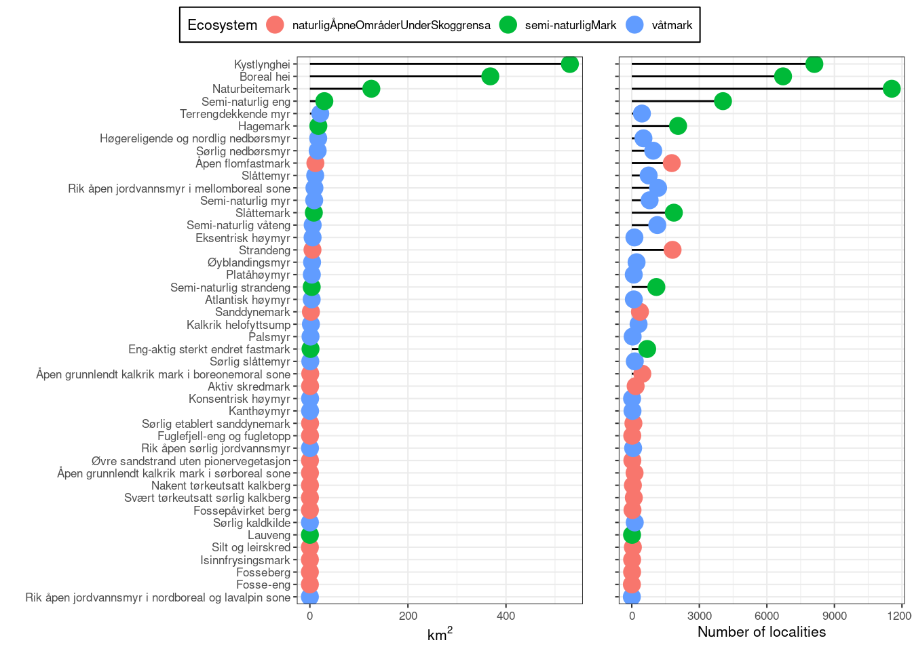
<p class="caption">(\#fig:unnamed-chunk-66)The total mapped area for nature types associated with three selected main ecosystems</p>
</div>

### Area of localities per NiN main type
First I will add the NiN main types that are not covered by any nature types.


```r
open <- c(
  "T1",
  "T2",
  "T6",
  "T8",
  "T11",
  "T12",
  "T13",
  "T15",
  "T16",
  "T17",
  "T18",
  "T20",
  "T21",
  "T23",
  "T24",
  "T25",
  "T26",
  "T27",
  "T29"
)

semi <- c(
  "T31",
  "T32",
  "T33",
  "T34",
  "T40",  # are these included
  "T41"   # are these included
)

wetland <- c(
  "V1",
  "V3",
  "V4",
  "V6",
  "V9",
  "V10",
  "L4"    # this will probably not be part of the assessments
  
)
```

Adding these non-mapped open types

```r
open[!open %in% ntyp_fill$NiN_mainType]
#> [1] "T6"  "T11" "T13" "T16" "T23" "T24" "T25" "T26" "T27"
```


```r
ntyp_fill2 <- ntyp_fill %>%
  add_row(NiN_mainType = "T6",  Ecosystem = "naturligÅpneOmråderUnderSkoggrensa", NiN_mainTypeCoverage = "Not mapped", km2 = 0) %>%
  add_row(NiN_mainType = "T11", Ecosystem = "naturligÅpneOmråderUnderSkoggrensa", NiN_mainTypeCoverage = "Not mapped", km2 = 0) %>%
  add_row(NiN_mainType = "T13", Ecosystem = "naturligÅpneOmråderUnderSkoggrensa", NiN_mainTypeCoverage = "Not mapped", km2 = 0) %>%
  add_row(NiN_mainType = "T16", Ecosystem = "naturligÅpneOmråderUnderSkoggrensa", NiN_mainTypeCoverage = "Not mapped", km2 = 0) %>%
  add_row(NiN_mainType = "T23", Ecosystem = "naturligÅpneOmråderUnderSkoggrensa", NiN_mainTypeCoverage = "Not mapped", km2 = 0) %>%
  add_row(NiN_mainType = "T24", Ecosystem = "naturligÅpneOmråderUnderSkoggrensa", NiN_mainTypeCoverage = "Not mapped", km2 = 0) %>%
  add_row(NiN_mainType = "T25", Ecosystem = "naturligÅpneOmråderUnderSkoggrensa", NiN_mainTypeCoverage = "Not mapped", km2 = 0) %>%
  add_row(NiN_mainType = "T26", Ecosystem = "naturligÅpneOmråderUnderSkoggrensa", NiN_mainTypeCoverage = "Not mapped", km2 = 0) %>%
  add_row(NiN_mainType = "T27", Ecosystem = "naturligÅpneOmråderUnderSkoggrensa", NiN_mainTypeCoverage = "Not mapped", km2 = 0) 
```


Adding the non-mapped semi-natural types

```r
semi[!semi %in% ntyp_fill$NiN_mainType]
#> [1] "T40"
```

```r
ntyp_fill2 <- ntyp_fill2 %>%
  add_row(NiN_mainType = "T40", Ecosystem = "semi-naturligMark", NiN_mainTypeCoverage = "Not mapped", km2 = 0)
```


Adding the non-mapped wetland types

```r
wetland[!wetland %in% ntyp_fill$NiN_mainType]
#> [1] "V6"
```
V6 is *Våtsnøleie*, and my guess is that it *is* mapped, but grouped with the alpine ecosystem. I'll therefore not add it in here, but mention it in the figure caption below.


```r
mySize <- 10
ntyp_fill2 %>%
  # combining two classes to get a better colour palette
  mutate(NiN_mainTypeCoverage = 
           replace(NiN_mainTypeCoverage, NiN_mainTypeCoverage == "southern", "partial"),
         NiN_mainTypeCoverage = 
           replace(NiN_mainTypeCoverage, NiN_mainTypeCoverage == "calcareous and dry", "calcareous")) %>%
  
  group_by(NiN_mainType, NiN_mainTypeCoverage) %>%
  mutate(km2 = sum(km2)) %>%
  slice_head()%>%
  select(Ecosystem,
         NiN_mainType,
         NiN_mainTypeCoverage,
         km2)%>%
  ungroup() %>%
  mutate(NiN_mainType = forcats::fct_reorder(NiN_mainType, km2)) %>%
  ggplot(aes(x = NiN_mainType,
             y = km2,
             fill = NiN_mainTypeCoverage))+
    geom_bar(stat = "identity",
             colour = "grey40",
             position = "stack")+
    theme_bw(base_size = mySize)+
    coord_flip()+
  labs(x = "NiN main type",
       y = expression(km^2),
       fill = "Spatial coverage")+
  scale_fill_brewer(palette = "Set1")+
  facet_wrap(vars(Ecosystem),
             scales = "free",
             labeller = label_wrap_gen(width=25))
```

<div class="figure">

<p class="caption">(\#fig:unnamed-chunk-73)The areas mapped for each NiN main type, and the degree of spatial representativity (or coverage) of the mapping units (nature types). V6 Våtsnøleie og snøleiekilde is not included.</p>
</div>

### Number of localities per NiN main type


```r
mySize <- 10
ntyp_fill2 %>%
  # combining two classes to get a better colour palette
  mutate(NiN_mainTypeCoverage = 
           replace(NiN_mainTypeCoverage, NiN_mainTypeCoverage == "southern", "partial"),
         NiN_mainTypeCoverage = 
           replace(NiN_mainTypeCoverage, NiN_mainTypeCoverage == "calcareous and dry", "calcareous")) %>%
  
  group_by(NiN_mainType, NiN_mainTypeCoverage) %>%
  mutate(count = sum(numberOfLocalities)) %>%
  slice_head()%>%
  select(Ecosystem,
         NiN_mainType,
         NiN_mainTypeCoverage,
         count)%>%
  ungroup() %>%
  mutate(count = replace_na(count, 0)) %>%
  mutate(NiN_mainType = fct_reorder(NiN_mainType, count)) %>%
  ggplot(aes(x = NiN_mainType,
             y = count,
             fill = NiN_mainTypeCoverage))+
    geom_bar(stat = "identity",
             colour = "grey40",
             position = "stack")+
    theme_bw(base_size = mySize)+
    coord_flip()+
  labs(x = "NiN main type",
       y = "Number of localities",
       fill = "Spatial coverage")+
  scale_fill_brewer(palette = "Set1")+
  facet_wrap(vars(Ecosystem),
             scales = "free",
             labeller = label_wrap_gen(width=25))
```

<div class="figure">

<p class="caption">(\#fig:unnamed-chunk-74)The number of localities mapped for each NiN main type, and the degree of spatial representativity (or coverage) of the mapping units (nature types). V6 Våtsnøleie og snøleiekilde is not included. NiN main types are arranged rougly by decreasing order, except for types that are not mapped at all, which are arranged on top.</p>
</div>


From the figure above I take that *Naturlig åpne områder* is very poorly represented in general as there are many NiN main types that are completely missing from the data set. The three most common types by area, however, have complete thematic coverage (if excluding the year 2018 and including all sub-types). I will need to investigate especially if there are some NiN variables for the nature types mapping T18 Åpen flomfastmark, T12 Strandeng and T21 Sanddynemark which we can use. 

For *Semi-naturlig mark* we have quite good thematic coverage for the three main types (by area). The other three types probably makes up a considerably smaller area, but note that T33 has some coverage, and is classes as *all (-2018)*. Of the three main ecosystems, semi-naturlig mark dominates clearly in terms of area and in terms of number of localities. 

For *Våtmark* we have good thematic coverage for V3 nedbørsmyr and _V9 semi-naturlig myr_, but for _V1 åpen jordvassmyr_ only calcareous localities are mapped and assessed. A question is then whether, for a given NiN variable, that calcareous localities can be representative for all mires (poor and rich) or if this will introduce too much bias in one way or another. Another important bias for this main ecosystem is related to the lower size limit for mapping units (MMU), which is quite big for V3. We need to think about whether small bogs are more or less prone to different pressures compared to big bogs.

### Commonness of NiN variables

I want to see how common the different NiN variables are, and if we can use this to select core variables \(_kjernevariabler_\).

First I will get the total area mapped per main ecosystem

```r
areaSum <- ntyp_fill2 %>%
  group_by(Ecosystem) %>%
  summarise(km2 = sum(km2)) %>%
  tibble::add_column(.before=1,
                     NiN_code = rep("Combined", 3))
```


```r
ntyp_fill2 %>%
  pivot_longer(cols = unique(ntyp_vars$NiN_variable_code)) %>%
  drop_na(value) %>%
  rename(NiN_code = name,
         useFrequency = value) %>%
  filter(useFrequency > 0) %>%
  group_by(NiN_code, Ecosystem, NiN_mainType) %>%  # NiN main type could be replaced with Nature_type
  summarise(km2 = sum(km2)) %>%
  
  # create a truncated fill variable 
  group_by(Ecosystem) %>%
  mutate(myFill = fct_lump(NiN_mainType, 3, w = km2)) %>%
  
  # qick fix to sort variable across facets (dont work after adding 'Nature_type' in the first group_by)
  #mutate(lab = paste(NiN_code, substr(Ecosystem, start = 1, stop = 1), sep = " ")) %>%
  #ungroup()%>%
  #mutate(lab = forcats::fct_reorder(lab, km2)) %>%
  
  
  # plot
  ggplot(aes(x = NiN_code,
              y = km2,
             fill = myFill
                ))+
  geom_bar(stat = "identity",
           colour = "grey40",
           #fill = "grey80",
           position = "stack")+
  geom_hline(data = areaSum,
             aes(yintercept = km2),
             colour = "red",
             linetype = "dashed")+
  facet_wrap(vars(Ecosystem),
             scales = "free",
             labeller = label_wrap_gen(width=25))+
  labs(x = "",
       y = expression(km^2),
       fill = "")+
  coord_flip()+
  scale_fill_brewer(palette = "Set1")+
  theme_bw(base_size = mySize)
#> `summarise()` has grouped output by 'NiN_code',
#> 'Ecosystem'. You can override using the `.groups` argument.
#> Warning in RColorBrewer::brewer.pal(n, pal): n too large, allowed maximum for palette Set1 is 9
#> Returning the palette you asked for with that many colors
```

<div class="figure">
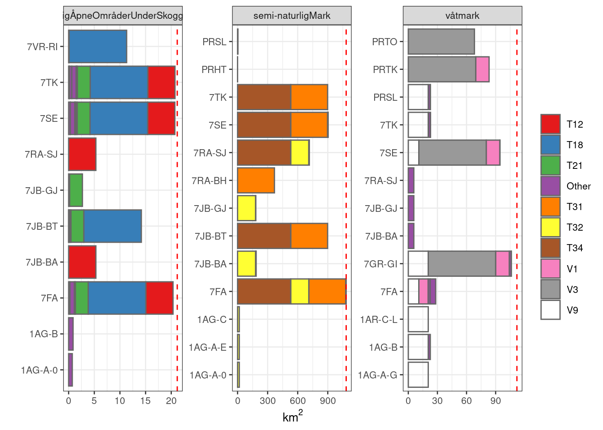
<p class="caption">(\#fig:unnamed-chunk-76)Barplot showing the proportion area for which each NiN variable is recorded. The total mapped area for each main ecosystem (the facets) is shown as a dashed red line. The three most dominant NiN main types for each ecosystem is given a uniqe colour, and all the remaining are grouped as 'other'.</p>
</div>

This figure, in combination with the above, points to he most obvious NiN variable candidates. 

7SE and 7TK are good candidates for *Naturlig åpne områder*. 7JA-BT is probably more appropriately classed as a pressure indicator. Same with 7VR-RI with is recorded for all T18 localities. 

The same two variables (7SE and 7TK) are the best candidates also for *Semi-natural areas*. 7JB-BT is a pressure variable (*beitetrykk*). 7RA-SJ/BH are related to *gjengoing* which will be covered by another indicator informed from remote sensing (LiDAR), and we therefor don't need to describe this with a field-based indicator as well.

For *Våtmark*, 7GR-Gi is the most common variables, but this is a pressure variable (*grøfting*). But, perhaps it could be used as a surrogate indicator. I think this is justifiable, especially since the relationship between the pressure (grøfting) and the condition (hydrology) is so well known. 7SE+PRSL and 7TK+PRTK are other good candidates. PRTO is only relevant for V3, but covers a relatively large area. It is, however,, more like a pressure indicator.


## Tables
Here are some output tables with the numbers underlying the above figures. 


```r
DT::datatable(ntyp_fill2,
              #extensions = "FixedColumns",
  options = list(
    scrollX = T,
    scrollY=T,
    pageLength = 10))
```

<div class="figure">

```{=html}
<div class="datatables html-widget html-fill-item-overflow-hidden html-fill-item" id="htmlwidget-d95bc31c4057dbb72f6b" style="width:100%;height:auto;"></div>
<script type="application/json" data-for="htmlwidget-d95bc31c4057dbb72f6b">{"x":{"filter":"none","vertical":false,"data":[["1","2","3","4","5","6","7","8","9","10","11","12","13","14","15","16","17","18","19","20","21","22","23","24","25","26","27","28","29","30","31","32","33","34","35","36","37","38","39","40","41","42","43","44","45","46","47","48","49","50","51","52","53","54"],["Slåttemyr","Hagemark","Naturbeitemark","Semi-naturlig eng","Eng-aktig sterkt endret fastmark","Sørlig kaldkilde","Åpen flomfastmark","Høgereligende og nordlig nedbørsmyr","Øyblandingsmyr","Strandeng","Nakent tørkeutsatt kalkberg","Kystlynghei","Sørlig slåttemyr","Konsentrisk høymyr","Boreal hei","Semi-naturlig våteng","Slåttemark","Sanddynemark","Semi-naturlig strandeng","Rik åpen jordvannsmyr i mellomboreal sone","Sørlig nedbørsmyr","Atlantisk høymyr","Terrengdekkende myr","Åpen grunnlendt kalkrik mark i boreonemoral sone","Rik åpen sørlig jordvannsmyr","Aktiv skredmark","Semi-naturlig myr","Silt og leirskred","Eksentrisk høymyr","Øvre sandstrand uten pionervegetasjon","Kalkrik helofyttsump","Fuglefjell-eng og fugletopp","Isinnfrysingsmark","Åpen grunnlendt kalkrik mark i sørboreal sone","Sørlig etablert sanddynemark","Rik åpen jordvannsmyr i nordboreal og lavalpin sone","Fossepåvirket berg","Fosse-eng","Svært tørkeutsatt sørlig kalkberg","Lauveng","Kanthøymyr","Platåhøymyr","Palsmyr","Fosseberg",null,null,null,null,null,null,null,null,null,null],["2018, 2019, 2020, 2021, 2022","2018, 2019, 2020, 2021, 2022","2018, 2019, 2020, 2021, 2022","2018, 2019, 2020, 2021, 2022","2018, 2019, 2020, 2021, 2022","2018, 2019, 2020, 2021, 2022","2018, 2019, 2020, 2021, 2022","2019, 2020, 2021, 2022","2019, 2020, 2021, 2022","2018, 2019, 2020, 2021, 2022","2019, 2020, 2021, 2022","2018, 2019, 2020, 2021, 2022","2019, 2020, 2021, 2022","2019, 2020, 2022","2018, 2019, 2020, 2021, 2022","2018, 2019, 2020, 2021, 2022","2018, 2019, 2020, 2021, 2022","2018, 2019, 2020, 2021, 2022","2018, 2019, 2020, 2021, 2022","2019, 2020, 2021, 2022","2019, 2020, 2021, 2022","2019, 2020, 2021, 2022","2019, 2020, 2021, 2022","2018, 2019, 2020, 2021, 2022","2018, 2019, 2020, 2021, 2022","2019, 2020, 2021, 2022","2019, 2020, 2021, 2022","2019, 2020, 2021, 2022","2019, 2020, 2021, 2022","2019, 2020, 2021, 2022","2019, 2020, 2021, 2022","2019, 2020, 2021, 2022","2018, 2019, 2020, 2021, 2022","2019, 2020, 2021","2018, 2019, 2020, 2021, 2022","2019, 2020, 2021, 2022","2019, 2020, 2021, 2022","2019, 2020, 2022","2019, 2020, 2021, 2022","2019, 2020, 2022","2019, 2020, 2021, 2022","2019, 2020, 2021, 2022","2021, 2022","2021, 2022",null,null,null,null,null,null,null,null,null,null],["våtmark","semi-naturligMark","semi-naturligMark","semi-naturligMark","semi-naturligMark","våtmark","naturligÅpneOmråderUnderSkoggrensa","våtmark","våtmark","naturligÅpneOmråderUnderSkoggrensa","naturligÅpneOmråderUnderSkoggrensa","semi-naturligMark","våtmark","våtmark","semi-naturligMark","våtmark","semi-naturligMark","naturligÅpneOmråderUnderSkoggrensa","semi-naturligMark","våtmark","våtmark","våtmark","våtmark","naturligÅpneOmråderUnderSkoggrensa","våtmark","naturligÅpneOmråderUnderSkoggrensa","våtmark","naturligÅpneOmråderUnderSkoggrensa","våtmark","naturligÅpneOmråderUnderSkoggrensa","våtmark","naturligÅpneOmråderUnderSkoggrensa","naturligÅpneOmråderUnderSkoggrensa","naturligÅpneOmråderUnderSkoggrensa","naturligÅpneOmråderUnderSkoggrensa","våtmark","naturligÅpneOmråderUnderSkoggrensa","naturligÅpneOmråderUnderSkoggrensa","naturligÅpneOmråderUnderSkoggrensa","semi-naturligMark","våtmark","våtmark","våtmark","naturligÅpneOmråderUnderSkoggrensa","naturligÅpneOmråderUnderSkoggrensa","naturligÅpneOmråderUnderSkoggrensa","naturligÅpneOmråderUnderSkoggrensa","naturligÅpneOmråderUnderSkoggrensa","naturligÅpneOmråderUnderSkoggrensa","naturligÅpneOmråderUnderSkoggrensa","naturligÅpneOmråderUnderSkoggrensa","naturligÅpneOmråderUnderSkoggrensa","naturligÅpneOmråderUnderSkoggrensa","semi-naturligMark"],["V9","T32","T32","T32","T41","V4","T18","V3","V1","T12","T1","T34","V9","V3","T31","V10","T32","T21","T33","V1","V3","V3","V3","T2","V1","T17","V9","T17","V3","T29","L4","T8","T20","T2","T21","V1","T1","T15","T1","T32","V3","V3","V3","T1","T6","T11","T13","T16","T23","T24","T25","T26","T27","T40"],["all (if including sub-types)","all (if including sub-types)","all (if including sub-types)","all (if including sub-types)","all","southern","all","all (if including sub-types)","partial","all (-2018)","calcareous and dry","all","all (if including sub-types)","all (if including sub-types)","all","all (-2018)","all (if including sub-types)","all (if including sub-types)","all (-2018)","calcareous","all (if including sub-types)","all (if including sub-types)","all (if including sub-types)","calcareous","calcareous","all (if including sub-types)","all (if including sub-types)","all (if including sub-types)","all (if including sub-types)","sandy and vegetated","calcareous","all","all","calcareous","all (if including sub-types)","calcareous","extra wet","all","calcareous and dry","all (if including sub-types)","all (if including sub-types)","all (if including sub-types)","all (if including sub-types)","extra wet","Not mapped","Not mapped","Not mapped","Not mapped","Not mapped","Not mapped","Not mapped","Not mapped","Not mapped","Not mapped"],[null,16.9,0,null,null,null,null,null,null,null,null,null,null,null,null,null,null,null,null,null,null,null,null,8.7,null,null,null,null,null,null,null,null,null,null,null,null,null,null,null,null,null,null,null,null,null,null,null,null,null,null,null,null,null,null],[null,82.9,null,null,null,null,null,null,null,null,null,null,null,null,null,null,null,null,null,null,null,null,null,null,null,null,null,null,null,null,null,null,null,null,null,null,null,null,null,100,null,null,null,null,null,null,null,null,null,null,null,null,null,null],[100,null,null,null,null,null,null,null,null,null,null,null,100,null,null,null,null,null,null,null,null,null,null,null,null,null,100,null,null,null,null,null,null,null,null,null,null,null,null,null,null,null,null,null,null,null,null,null,null,null,null,null,null,null],[100,null,null,null,null,null,null,null,null,null,null,null,100,null,null,null,null,null,null,null,null,null,null,99.6,null,null,100,null,null,null,100,null,null,100,null,null,null,null,null,null,null,null,null,null,null,null,null,null,null,null,null,null,null,null],[null,16.9,0,null,null,null,null,null,null,null,null,null,null,null,null,null,null,null,null,null,null,null,null,null,null,null,null,null,null,null,null,null,null,null,null,null,null,null,null,null,null,null,null,null,null,null,null,null,null,null,null,null,null,null],[null,null,null,null,null,null,null,null,null,null,null,null,null,null,null,null,null,null,null,null,null,null,null,null,null,null,null,null,null,null,null,null,null,null,null,null,null,null,null,null,null,null,null,null,null,null,null,null,null,null,null,null,null,null],[57.6,null,null,null,null,null,null,null,null,null,null,null,39.6,null,null,null,null,null,null,null,null,null,null,null,null,null,44.4,null,null,null,null,null,null,null,null,null,null,null,null,null,null,null,null,null,null,null,null,null,null,null,null,null,null,null],[null,null,null,null,null,null,null,null,null,null,null,null,null,null,null,null,null,null,null,null,null,null,null,null,null,null,null,null,null,null,null,null,null,null,null,null,null,null,null,null,null,null,null,null,null,null,null,null,null,null,null,null,null,null],[5.5,99.9,99.9,99.9,100,null,70.7,null,null,99.9,100,99.9,null,null,100,99.8,99.8,100,99.1,100,null,null,null,99.8,100,null,null,null,null,100,100,null,null,100,100,100,null,null,100,100,null,null,null,null,null,null,null,null,null,null,null,null,null,null],[99.6,null,null,null,null,98.5,null,99.8,100,null,null,null,100,100,null,null,null,null,null,100,100,100,100,null,100,null,100,null,100,null,100,null,null,null,null,null,null,null,null,null,100,100,100,null,null,null,null,null,null,null,null,null,null,null],[null,100,100,99.9,99.9,null,null,null,null,1.9,null,null,null,null,null,100,99.9,null,98.9,null,null,null,null,null,null,null,null,null,null,null,null,null,null,null,null,null,null,null,null,100,null,null,null,null,null,null,null,null,null,null,null,null,null,null],[null,null,null,null,null,null,88.2,null,null,null,null,100,null,null,100,null,null,99.2,null,null,null,null,null,null,null,null,null,null,null,100,null,100,null,null,100,null,null,100,null,null,null,null,null,null,null,null,null,null,null,null,null,null,null,null],[null,99.8,99.7,99.4,99.4,null,null,null,null,null,null,null,null,null,null,99.7,98.8,99.2,null,null,null,null,null,null,null,null,null,null,null,100,null,null,null,null,100,null,null,null,null,100,null,null,null,null,null,null,null,null,null,null,null,null,null,null],[null,null,null,null,null,null,null,null,null,null,null,0,null,null,100,null,null,null,null,null,null,null,null,null,null,null,null,null,null,null,null,null,null,null,null,null,null,null,null,null,null,null,null,null,null,null,null,null,null,null,null,null,null,null],[null,99.9,100,99.9,99.4,null,null,null,null,1.4,null,100,null,null,null,100,99.9,null,98.8,null,null,null,null,null,null,null,null,null,null,null,null,null,null,null,null,null,null,null,null,100,null,null,null,null,null,null,null,null,null,null,null,null,null,null],[5.5,null,null,null,99.6,9.1,88.4,99.8,100,99.9,100,41.5,null,100,23.6,null,null,100,13.6,100,100,100,100,99.6,100,null,null,null,100,100,null,100,93.3,100,100,100,100,100,100,null,100,100,100,null,null,null,null,null,null,null,null,null,null,null],[null,null,null,null,null,null,null,null,null,null,null,null,null,null,null,null,null,null,null,null,null,null,null,null,null,null,null,null,null,null,null,null,null,null,null,null,null,null,null,null,null,null,null,null,null,null,null,null,null,null,null,null,null,null],[99.9,null,null,null,null,null,88.3,null,null,99.9,100,58,100,null,76.3,null,null,100,null,null,null,null,null,99.6,100,100,100,100,null,100,100,null,93.3,100,100,100,null,100,null,null,null,null,null,null,null,null,null,null,null,null,null,null,null,null],[null,null,null,null,null,null,null,null,null,null,null,null,null,null,null,null,null,null,null,null,null,null,null,null,null,null,null,null,null,null,null,null,null,null,null,null,null,null,null,null,null,null,null,null,null,null,null,null,null,null,null,null,null,null],[null,null,null,null,null,null,93.8,null,null,null,null,null,null,null,null,null,null,null,null,null,null,null,null,null,null,null,null,null,null,null,null,null,null,null,null,null,100,100,null,null,null,null,null,100,null,null,null,null,null,null,null,null,null,null],[null,null,null,null,null,null,null,null,null,null,null,null,null,null,null,null,null,null,null,null,null,null,null,null,null,null,null,null,null,null,null,null,null,null,null,null,null,null,null,100,null,null,null,null,null,null,null,null,null,null,null,null,null,null],[94.5,null,null,null,null,90.9,null,null,null,null,null,null,100,null,null,null,null,null,85.6,null,null,null,null,null,null,null,100,null,null,null,100,null,null,null,null,null,null,null,null,null,null,null,null,null,null,null,null,null,null,null,null,null,null,null],[null,null,null,null,null,null,null,99.8,100,null,null,null,null,100,null,null,null,null,null,100,100,100,100,null,null,null,null,null,100,null,null,null,null,null,null,null,null,null,null,null,100,100,100,null,null,null,null,null,null,null,null,null,null,null],[null,null,null,null,null,null,null,99.8,null,null,null,null,null,100,null,null,null,null,null,null,100,100,100,null,null,null,null,null,100,null,null,null,null,null,null,null,null,null,null,null,100,100,null,null,null,null,null,null,null,null,null,null,null,null],[10.8599681769678,17.2892756436555,125.395454959427,29.5273133834903,1.30060426791085,0.054693214794524,11.2210640471648,17.0161039645494,4.47342889033033,5.31240419413453,0.153160113321643,530.333666293998,0.859130020342248,0.409299904933389,368.076228072285,5.70309815289171,8.08730162096645,2.12492117847008,3.74860715696163,9.30242158937103,15.8891449971379,3.71004777569769,21.1853317928982,0.711262375853877,0.232630287231787,0.429869567548852,8.82716234570841,0.0281316995894742,5.54454125198943,0.173325803167218,2.12141082941421,0.256328309129139,0.0229694300823598,0.156271240033641,0.391864908667946,0.00540369751175468,0.0691880614123939,0.00615737757466229,0.105362181789421,0.0291096401727506,0.396661041366587,3.97834096015764,1.31405172299685,0.00941745752789786,0,0,0,0,0,0,0,0,0,0],[750,2057,11548,4051,684,132,1777,518,213,1812,50,8110,134,13,6719,1134,1869,364,1092,1169,953,92,451,469,60,172,792,49,117,25,302,21,15,124,73,3,32,5,91,12,32,88,39,14,null,null,null,null,null,null,null,null,null,null]],"container":"<table class=\"display\">\n  <thead>\n    <tr>\n      <th> <\/th>\n      <th>Nature_type<\/th>\n      <th>Year<\/th>\n      <th>Ecosystem<\/th>\n      <th>NiN_mainType<\/th>\n      <th>NiN_mainTypeCoverage<\/th>\n      <th>1AG-A-0<\/th>\n      <th>1AG-A-E<\/th>\n      <th>1AG-A-G<\/th>\n      <th>1AG-B<\/th>\n      <th>1AG-C<\/th>\n      <th>1AR-A-E<\/th>\n      <th>1AR-C-L<\/th>\n      <th>4TS-TS<\/th>\n      <th>7FA<\/th>\n      <th>7GR-GI<\/th>\n      <th>7JB-BA<\/th>\n      <th>7JB-BT<\/th>\n      <th>7JB-GJ<\/th>\n      <th>7RA-BH<\/th>\n      <th>7RA-SJ<\/th>\n      <th>7SE<\/th>\n      <th>7SN-BE<\/th>\n      <th>7TK<\/th>\n      <th>7VR-RE<\/th>\n      <th>7VR-RI<\/th>\n      <th>PRHT<\/th>\n      <th>PRSL<\/th>\n      <th>PRTK<\/th>\n      <th>PRTO<\/th>\n      <th>km2<\/th>\n      <th>numberOfLocalities<\/th>\n    <\/tr>\n  <\/thead>\n<\/table>","options":{"scrollX":true,"scrollY":true,"pageLength":10,"columnDefs":[{"className":"dt-right","targets":[6,7,8,9,10,11,12,13,14,15,16,17,18,19,20,21,22,23,24,25,26,27,28,29,30,31]},{"orderable":false,"targets":0}],"order":[],"autoWidth":false,"orderClasses":false}},"evals":[],"jsHooks":[]}</script>
```

<p class="caption">(\#fig:unnamed-chunk-77)List of 45 nature types additionam data, including the proportion of localities for which there is data for each of the NiN variables.</p>
</div>


```r
DT::datatable(
  ntyp_fill2 %>%
  pivot_longer(cols = unique(ntyp_vars$NiN_variable_code)) %>%
  drop_na(value) %>%
  rename(NiN_code = name,
         useFrequency = value) %>%
  filter(useFrequency > 0) %>%
  group_by(NiN_code, Ecosystem, NiN_mainType) %>%  # NiN main type could be replaced with Nature_type
  summarise(km2 = sum(km2)),
  options = list(
    scrollX = T,
    scrollY=T,
    pageLength = 10))
#> `summarise()` has grouped output by 'NiN_code',
#> 'Ecosystem'. You can override using the `.groups` argument.
```

<div class="figure">

```{=html}
<div class="datatables html-widget html-fill-item-overflow-hidden html-fill-item" id="htmlwidget-5014a842f06a923436b0" style="width:100%;height:auto;"></div>
<script type="application/json" data-for="htmlwidget-5014a842f06a923436b0">{"x":{"filter":"none","vertical":false,"data":[["1","2","3","4","5","6","7","8","9","10","11","12","13","14","15","16","17","18","19","20","21","22","23","24","25","26","27","28","29","30","31","32","33","34","35","36","37","38","39","40","41","42","43","44","45","46","47","48","49","50","51","52","53","54","55","56","57","58","59","60","61","62","63","64","65","66","67","68","69","70","71","72","73","74","75","76","77","78","79","80","81","82","83","84","85","86","87","88","89","90","91","92","93","94","95"],["1AG-A-0","1AG-A-0","1AG-A-E","1AG-A-G","1AG-B","1AG-B","1AG-B","1AG-C","1AR-C-L","7FA","7FA","7FA","7FA","7FA","7FA","7FA","7FA","7FA","7FA","7FA","7FA","7FA","7FA","7FA","7GR-GI","7GR-GI","7GR-GI","7GR-GI","7GR-GI","7JB-BA","7JB-BA","7JB-BA","7JB-BA","7JB-BA","7JB-BT","7JB-BT","7JB-BT","7JB-BT","7JB-BT","7JB-BT","7JB-BT","7JB-GJ","7JB-GJ","7JB-GJ","7JB-GJ","7JB-GJ","7RA-BH","7RA-SJ","7RA-SJ","7RA-SJ","7RA-SJ","7RA-SJ","7RA-SJ","7SE","7SE","7SE","7SE","7SE","7SE","7SE","7SE","7SE","7SE","7SE","7SE","7SE","7SE","7SE","7SE","7SE","7TK","7TK","7TK","7TK","7TK","7TK","7TK","7TK","7TK","7TK","7TK","7TK","7TK","7TK","7VR-RI","7VR-RI","7VR-RI","PRHT","PRSL","PRSL","PRSL","PRSL","PRTK","PRTK","PRTO"],["naturligÅpneOmråderUnderSkoggrensa","semi-naturligMark","semi-naturligMark","våtmark","naturligÅpneOmråderUnderSkoggrensa","våtmark","våtmark","semi-naturligMark","våtmark","naturligÅpneOmråderUnderSkoggrensa","naturligÅpneOmråderUnderSkoggrensa","naturligÅpneOmråderUnderSkoggrensa","naturligÅpneOmråderUnderSkoggrensa","naturligÅpneOmråderUnderSkoggrensa","naturligÅpneOmråderUnderSkoggrensa","semi-naturligMark","semi-naturligMark","semi-naturligMark","semi-naturligMark","semi-naturligMark","våtmark","våtmark","våtmark","våtmark","våtmark","våtmark","våtmark","våtmark","våtmark","naturligÅpneOmråderUnderSkoggrensa","semi-naturligMark","semi-naturligMark","semi-naturligMark","våtmark","naturligÅpneOmråderUnderSkoggrensa","naturligÅpneOmråderUnderSkoggrensa","naturligÅpneOmråderUnderSkoggrensa","naturligÅpneOmråderUnderSkoggrensa","naturligÅpneOmråderUnderSkoggrensa","semi-naturligMark","semi-naturligMark","naturligÅpneOmråderUnderSkoggrensa","naturligÅpneOmråderUnderSkoggrensa","semi-naturligMark","semi-naturligMark","våtmark","semi-naturligMark","naturligÅpneOmråderUnderSkoggrensa","semi-naturligMark","semi-naturligMark","semi-naturligMark","semi-naturligMark","våtmark","naturligÅpneOmråderUnderSkoggrensa","naturligÅpneOmråderUnderSkoggrensa","naturligÅpneOmråderUnderSkoggrensa","naturligÅpneOmråderUnderSkoggrensa","naturligÅpneOmråderUnderSkoggrensa","naturligÅpneOmråderUnderSkoggrensa","naturligÅpneOmråderUnderSkoggrensa","naturligÅpneOmråderUnderSkoggrensa","naturligÅpneOmråderUnderSkoggrensa","semi-naturligMark","semi-naturligMark","semi-naturligMark","semi-naturligMark","våtmark","våtmark","våtmark","våtmark","naturligÅpneOmråderUnderSkoggrensa","naturligÅpneOmråderUnderSkoggrensa","naturligÅpneOmråderUnderSkoggrensa","naturligÅpneOmråderUnderSkoggrensa","naturligÅpneOmråderUnderSkoggrensa","naturligÅpneOmråderUnderSkoggrensa","naturligÅpneOmråderUnderSkoggrensa","naturligÅpneOmråderUnderSkoggrensa","naturligÅpneOmråderUnderSkoggrensa","semi-naturligMark","semi-naturligMark","våtmark","våtmark","våtmark","naturligÅpneOmråderUnderSkoggrensa","naturligÅpneOmråderUnderSkoggrensa","naturligÅpneOmråderUnderSkoggrensa","semi-naturligMark","semi-naturligMark","våtmark","våtmark","våtmark","våtmark","våtmark","våtmark"],["T2","T32","T32","V9","T2","L4","V9","T32","V9","T1","T12","T18","T2","T21","T29","T31","T32","T33","T34","T41","L4","V1","V10","V9","L4","V1","V3","V4","V9","T12","T32","T33","T41","V10","T15","T18","T21","T29","T8","T31","T34","T21","T29","T32","T41","V10","T31","T12","T32","T33","T34","T41","V10","T1","T12","T15","T18","T2","T20","T21","T29","T8","T31","T33","T34","T41","V1","V3","V4","V9","T1","T12","T15","T17","T18","T2","T20","T21","T29","T31","T34","L4","V1","V9","T1","T15","T18","T32","T33","L4","V4","V9","V1","V3","V3"],[0.711262375853877,17.2892756436555,17.3183852838282,20.5462605430184,0.867533615887518,2.12141082941421,20.5462605430184,17.2892756436555,20.5462605430184,0.258522295111064,5.31240419413453,11.2210640471648,0.867533615887518,2.51678608713803,0.173325803167218,368.076228072285,180.328455247712,3.74860715696163,530.333666293998,1.30060426791085,2.12141082941421,9.54045557411458,5.70309815289171,10.8599681769678,2.12141082941421,14.0084807669331,69.4435234117271,0.054693214794524,20.5462605430184,5.31240419413453,180.328455247712,3.74860715696163,1.30060426791085,5.70309815289171,0.00615737757466229,11.2210640471648,2.51678608713803,0.173325803167218,0.256328309129139,368.076228072285,530.333666293998,2.51678608713803,0.173325803167218,180.328455247712,1.30060426791085,5.70309815289171,368.076228072285,5.31240419413453,180.328455247712,3.74860715696163,530.333666293998,1.30060426791085,5.70309815289171,0.327710356523457,5.31240419413453,0.00615737757466229,11.2210640471648,0.867533615887518,0.0229694300823598,2.51678608713803,0.173325803167218,0.256328309129139,368.076228072285,3.74860715696163,530.333666293998,1.30060426791085,14.0138844644449,69.4435234117271,0.054693214794524,10.8599681769678,0.153160113321643,5.31240419413453,0.00615737757466229,0.458001267138326,11.2210640471648,0.867533615887518,0.0229694300823598,2.51678608713803,0.173325803167218,368.076228072285,530.333666293998,2.12141082941421,0.238033984743542,20.5462605430184,0.0786055189402917,0.00615737757466229,11.2210640471648,0.0291096401727506,3.74860715696163,2.12141082941421,0.054693214794524,20.5462605430184,13.7758504797014,69.4435234117271,68.1294716887303]],"container":"<table class=\"display\">\n  <thead>\n    <tr>\n      <th> <\/th>\n      <th>NiN_code<\/th>\n      <th>Ecosystem<\/th>\n      <th>NiN_mainType<\/th>\n      <th>km2<\/th>\n    <\/tr>\n  <\/thead>\n<\/table>","options":{"scrollX":true,"scrollY":true,"pageLength":10,"columnDefs":[{"className":"dt-right","targets":4},{"orderable":false,"targets":0}],"order":[],"autoWidth":false,"orderClasses":false}},"evals":[],"jsHooks":[]}</script>
```

<p class="caption">(\#fig:unnamed-chunk-78)List of unique combinatios of NiN variable codes and naturetypes with the summed area for which we have this data.</p>
</div>

## Export data {#exp-natureType-summary}
Exporting the table with the summary statistics and other information that I compiled for each nature type in the three main ecosystems. This can be merged with the main data set in order to subset according to a specific research question. 


```r
saveRDS(ntyp_fill2, "data/naturetypes/natureType_summary.rds")
```


Note also that the main data set still contains some localities where there is a mis-match between the nature type definition and the NiN mapping uits recorded in the field. Each researcher should decide to include or exclude these. 

The main data set also includes mosaic localities, that are less suitable to use as ground truth data for remote sensing methods.


## Appendix 1
Here is a deeper look into the causes for why some localities are recorded with seemingly erroneous NiN mapping units (and hence NiN main types)

Lets have a look at how the NiN main types (recorded in the field) cover the different *hovedøkosystem* when we exclude *Hule eiker* and all localities that have more than one NiN main type.

```r
dat_red <- dat_melt[dat_melt$n_ninKartleggingsenheter==1 & 
                      dat_melt$naturtype != "Hule eiker" &
                      dat_melt$mosaikk == "nei",]
```


Let's focus in on our three targeted ecosystems.

```r
dat_red_tally <- stats::aggregate(data = dat_red,
                                  area~hovedøkosystem+ninKartleggingsenheter3, FUN = length)
names(dat_red_tally)[3] <- "count"
```


```r
ggplot(dat_red_tally[dat_red_tally$hovedøkosystem %in% target,],
       aes(x = ninKartleggingsenheter3,
               y = count))+
  geom_bar(
           fill="grey",
           colour="black",
           stat="identity")+
  coord_flip()+
  theme_bw(base_size = 12)+
  labs(y = "Number of localities",
       x = "NiN main types")+
  scale_y_continuous(position = "left",
                   expand = expansion(mult=c(.0,.3)))+
  geom_text(aes(label=count), hjust=-0.25)+
    facet_wrap("hovedøkosystem",
             scales = "free",
             ncol = 3)
```

<div class="figure">
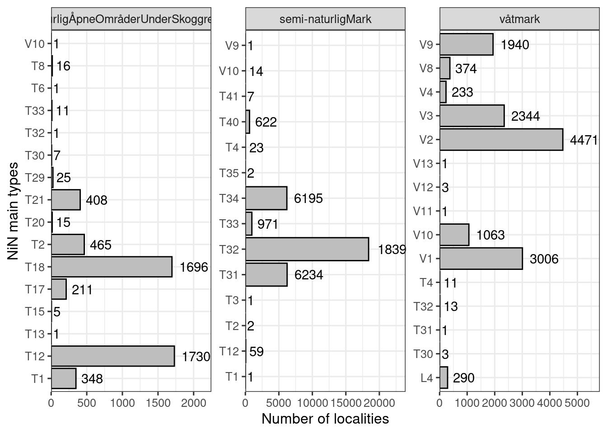
<p class="caption">(\#fig:unnamed-chunk-82)Number of localities for each combination of main ecosystem and NiN main type</p>
</div>

Still some weird cases which I will look at in turn below, trying to understand how they came to be recorded in this way.

#### naturligÅpneOmråderUnderSkoggrensa
Listing the NiN main types recorded for nature types belonging to *naturligÅpneOmråderUnderSkoggrensa*, but which clearly don't belong there:

* V10 (semi-naturlig våteng)
    + One case of Åpen flomfastmark wrongly associated with V10 whan it should be T18.
* T33 (Semi naturlig strandeng)
    + These are cases where either the `naturtype` should have been `semi-naturlig strandeng` (and hence the hovedøkosystem would be Semi-nat), or the `naturtype` is correctly recorded as `Strandeng` but then the NiN type should be `T12`.
* T32 (Semi-naturlig eng)
    + Obvious error
* T30 (Flomskogsmark)
    + Obvious error

Listing the remaining NiN main types:
* T8 (fulglefjelleng og fugltopp)
* T6 (Standberg)
* T29 (Grus og steindominert strand og strandlinje)
* T21 (Sanddynemark)
* T20 (Isinnfrysingsmark)
* T2 (Åpen grunlendt mark)
* T18 (Åpne flomfastmark)
* T17 (Aktiv skredmark)
* T15 (Fosse-eng)
* T13 (Rasmark)
* T12 (Strandeng)
* T1 (Nakent berg)


```r
`%!in%` <- Negate(`%in%`)
dat_red2 <- dat_red[
  dat_red$hovedøkosystem!="naturligÅpneOmråderUnderSkoggrensa" |
  dat_red$hovedøkosystem=="naturligÅpneOmråderUnderSkoggrensa" & 
    dat_red$ninKartleggingsenheter3 %!in% c("T30", "T32", "T33", "V10"),]
```

This resulted in deleting 20m localities.

#### Semi-naturlig mark
Listing the NiN main types recorded for nature types belonging to *Semi-naturlig mark*, but which clearly don't belong there:

* V9 (Semi-naturlig myr)
   + Kystlynghei recorded as mire
* T4 (Fastmarksskogsmark)
   + These should all be T32 (naturbeitemark, lauveng, hagemark, +++)
* T35 (Sterkt endret fastmark med løsmassedekke)
   + Wrong NiN type given to eng-aktig sterkt endret fastmark (it should be T40)
* T3 (Fjellhei, leside og tundra)
   + Boreal hei (should've been T31)
* T12 (Strandeng)
   + Should probably have been T33
* T1 (Nakent berg)
   + Obvious mistake
  
Listing the remaining NiN-main types:
* V10 (semi-nat våteng)
* T41 (Oppdyrket mark med preg av semi-naturlig eng)
* T40 (Sterkt endret fastmark med preg av semi-naturlig eng)
* T31-34

  


```r
dat_red3 <- dat_red2[
  dat_red2$hovedøkosystem!="semi-naturligMark" |
  dat_red2$hovedøkosystem=="semi-naturligMark" & dat_red2$ninKartleggingsenheter3 %!in% c("V9", "T4", "T35", "T3", "T12", "T1"),]
```

This resulted in the deletion of 87 localities.

#### Våtmark
Listing the NiN main types recorded for nature types belonging to *Våtmark*, but which clearly don't belong there.

Våtmark doesn't distinguish between semi-natural and natural, so all V-types are correct, except the strongly modified V11-V13.

* V11 (Torvtak)
  + Obvious mistake
* V12 (Grøftet åpne torvmark)
  + Obvious mistake
* V13 (Ny våtmark)
  + Obvious mistake
* T4 (skog)
  +   some that should've been T2 and some other strange things
* T30-T32
  + Someone switching the semi-natural and natural equivalents


```r
dat_red4 <- dat_red3[
  dat_red3$hovedøkosystem!="våtmark" |
  dat_red3$hovedøkosystem=="våtmark" & dat_red3$ninKartleggingsenheter3 %!in% c("T4", "T30", "T31", "T32", "V11", "V12", "V13"),]
```
This resulted in the deletion of 33 localities.

In total 140 localities, or 0.2% of localities, have a field-recorded NiN main that don't match the definition of the nature type. I see this as a symptom of a bigger problem with data validation.

<!--chapter:end:naturtype.Rmd-->

# Scaling functions


Author. Anders L. Kolstad

Date: 2023-03-24

**Superseeded :** *The functionality explained here is moved over to the [eaTools](https://github.com/NINAnor/eaTools) package. Please see the documentation there for updated examples.*

Indicator for ecological condition may be scaled against a reference value to become normalised and hence comparable. In SEEA EA, un-scaled or raw indicators are not called indicators at all, but simply referred to as variables, and I will use this distinction here. Scaling variables against reference conditions can be done in many ways. Here are some examples, for inspiration.


```r
set.seed(123)
```

Define plotting aesthetics


```r
low <- "red"
high <- "green"
ridge <- geom_density_ridges_gradient(scale = 3, size = .3)
myColour <- "black"
mySize <- 10
myAlpha <- .7
myShape <- 21
```

Create random raw data for two variables


```r
dat <- data.frame(variable1 = rnorm(50, 10, 4), 
                  variable2 = rnorm(50, 30, 3))

temp <- data.table::melt(setDT(dat))
#> Warning in melt.data.table(setDT(dat)): id.vars and
#> measure.vars are internally guessed when both are 'NULL'.
#> All non-numeric/integer/logical type columns are considered
#> id.vars, which in this case are columns []. Consider
#> providing at least one of 'id' or 'measure' vars in future.

ggplot(temp,
       aes(x = value,
           y = variable,
           fill = stat(x)))+
  ridge+
  scale_fill_gradient(low = low, high = high)
#> Warning: `stat(x)` was deprecated in ggplot2 3.4.0.
#> ℹ Please use `after_stat(x)` instead.
#> This warning is displayed once every 8 hours.
#> Call `lifecycle::last_lifecycle_warnings()` to see where
#> this warning was generated.
#> Picking joint bandwidth of 1.22
```


Lets say that the reference condition for `variable1` to equal 16, and for variable 2 its 35


```r
dat$referenceHigh1 <- 16
dat$referenceHigh2 <- 35
```

## Linear, with a natural zero

We can scale our variable linearly, saying that all values above 12 represents 'perfect' condition. We also assume that the value zero is the worst possible condition for this variable. To do this we divide by the reference value, and truncate values above it.


```r
dat$indicator1 <- dat$variable1/dat$referenceHigh1
dat$indicator1[dat$indicator1>1] <- 1

dat$indicator2 <- dat$variable2/dat$referenceHigh2
dat$indicator2[dat$indicator2>1] <- 1
```


```r
temp <- melt(setDT(dat),
             measure.vars = c("indicator1", "indicator2"))
```


```r
ggplot(dat)+
  geom_point(
    aes(x = variable1, y = indicator1, fill = indicator1),
             colour = myColour,
             size   = mySize,
             alpha  = myAlpha,
             shape  = myShape)+
  geom_vline(xintercept = dat$referenceHigh1[1],
             linetype = "dashed",
             size =2)+
  
  geom_point(aes(x = variable2, y = indicator2, fill = indicator2),
             colour = myColour,
             size   = mySize,
             alpha  = myAlpha,
             shape  = myShape)+
  geom_vline(xintercept = dat$referenceHigh2,
             linetype = "dashed",
             size =2)+
  ylab("Indicator values")+
  xlab("Variable values")+
  
  scale_fill_gradient("Indicator values", low = low, high = high)
#> Warning: Using `size` aesthetic for lines was deprecated in ggplot2
#> 3.4.0.
#> ℹ Please use `linewidth` instead.
#> This warning is displayed once every 8 hours.
#> Call `lifecycle::last_lifecycle_warnings()` to see where
#> this warning was generated.
```

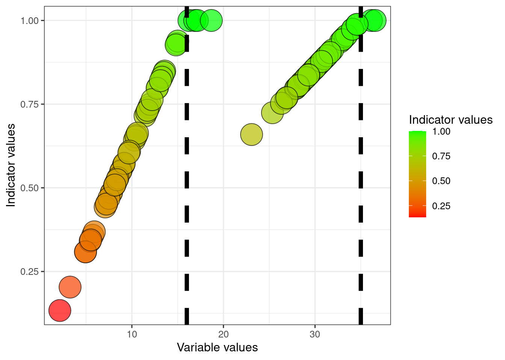

To reverse what is good and what is bad condition: change the sign and add one.


```r
ggplot(dat)+
  geom_point(
    aes(x = variable1, y = indicator1*(-1)+1, fill = indicator1*(-1)+1),
             colour = myColour,
             size   = mySize,
             alpha  = myAlpha,
             shape  = myShape)+
  geom_vline(xintercept = dat$referenceHigh1[1],
             linetype = "dashed",
             size =2)+
  
  ylab("Indicator values")+
  xlab("Variable values")+
  
  scale_fill_gradient("Indicator values", low = low, high = high)
```


The two indicators become more comparable now that they are normalised. At least this is true around the reference value. But perhaps a variable value around 25 for `variable2` is actually quite bad. In the above example I have assumed that the value zero is the worst possible value, but that may not always be the case.

## Linear, with defined lower limit

We can also say that the worst possible condition for these variables is not zero, but for example say that it is 5 for `variable1` and 28 for `variable2`.


```r
dat$referenceLow1 <- 5
dat$referenceLow2 <- 28
```

We can then normalise the data between these two reference values.


```r
dat$indicator1_LowHigh <- (dat$variable1-dat$referenceLow1)/(dat$referenceHigh1 - dat$referenceLow1)
dat$indicator1_LowHigh[dat$indicator1_LowHigh <0] <- 0
dat$indicator1_LowHigh[dat$indicator1_LowHigh >1] <- 1

dat$indicator2_LowHigh <- (dat$variable2-dat$referenceLow2)/(dat$referenceHigh2 - dat$referenceLow2)
dat$indicator2_LowHigh[dat$indicator2_LowHigh <0] <- 0
dat$indicator2_LowHigh[dat$indicator2_LowHigh >1] <- 1
```


```r
ggplot(dat)+
  geom_point(
    aes(x = variable1, y = indicator1_LowHigh, fill = indicator1_LowHigh),
             colour = myColour,
             size   = mySize,
             alpha  = myAlpha,
             shape  = myShape)+
  geom_vline(xintercept = 16,
             linetype = "dashed",
             size =2)+
  geom_vline(xintercept = 5,
             linetype = "dashed",
             size =2)+
  
  geom_point(aes(x = variable2, y = indicator2_LowHigh, fill = indicator2_LowHigh),
             colour = myColour,
             size   = mySize,
             alpha  = myAlpha,
             shape  = myShape)+
  geom_vline(xintercept = 35,
             linetype = "dashed",
             size =2)+
  geom_vline(xintercept = 28,
             linetype = "dashed",
             size =2)+
  ylab("Indicator values")+
  xlab("Variable values")+
  
  scale_fill_gradient("Indicator values", low = low, high = high)
```


## Break point scaling

We can also define a threshold for good ecological condition. Lets for example say that for `variable1`, ecosystem function really declines when the variable shows values below 9.


```r
dat$thr1 <- 9
```

Then we can normalise again, using what I refer to as break point normalisation. For the maths, see [here](https://stats.stackexchange.com/questions/281162/scale-a-number-between-a-range).


```r
dat$indicator1_breakPoint <- ifelse(
  dat$variable1 < dat$thr1,
    ((dat$variable1-dat$referenceLow1)/(dat$thr1 - dat$referenceLow1))*(0.6-0)+0,
    ((dat$variable1-dat$thr1)/(dat$referenceHigh1 - dat$thr1))*(1-0.6)+0.6
  )

dat$indicator1_breakPoint[dat$indicator1_breakPoint<0] <- 0
dat$indicator1_breakPoint[dat$indicator1_breakPoint>1] <- 1
```


```r
ggplot(dat)+
  geom_point(
    aes(x = variable1, y = indicator1_breakPoint, fill = indicator1_breakPoint),
             colour = myColour,
             size   = mySize,
             alpha  = myAlpha,
             shape  = myShape)+
  geom_vline(xintercept = dat$referenceHigh1[1],
             linetype = "dashed",
             size =2)+
  geom_vline(xintercept = dat$referenceLow1,
             linetype = "dashed",
             size =2)+
  geom_segment(aes(x = thr1, y = 0, xend = thr1, yend = 0.6),
               linetype="solid",
               size=1.5)+
  geom_segment(aes(x = 0, y = 0.6, xend = thr1, yend = 0.6),
               linetype="solid",
               size=1.5)+
  
  ylab("Indicator values")+
  xlab("Variable values")+
  
  scale_fill_gradient("Indicator values", low = low, high = high)
```


The solid lines point to the indicator value where the variable equals the threshold value.

## Two-sided indicator

An indicator may have an optimum value somewhere in the middle of its range, rather than a max or min value. You can then define a two-sided indicator. Lets say that `variable2` is optimal when its at a level of 30, and values either lower or high are both bad.


```r
dat$referenceMid2 <- 30
```


```r
dat$indicator2_twoSided <- ifelse(
  dat$variable2<dat$referenceMid2,
    (dat$variable2-dat$referenceLow2)/(dat$referenceMid2-dat$referenceLow2),
    ((dat$variable2-dat$referenceMid2)/(dat$referenceHigh2-dat$referenceMid2))*(-1)+1
  )

# truncating
dat$indicator2_twoSided[dat$indicator2_twoSided<0] <- 0
dat$indicator2_twoSided[dat$indicator2_twoSided>1] <- 1
```


```r
ggplot(dat)+
  geom_point(
    aes(x = variable2, y = indicator2_twoSided, fill = indicator2_twoSided),
             colour = myColour,
             size   = mySize,
             alpha  = myAlpha,
             shape  = myShape)+
  geom_vline(xintercept = dat$referenceMid2[1],
             linetype = "dashed",
             size =2)+
  geom_vline(xintercept = dat$referenceLow2[1],
             linetype = "dashed",
             size =2)+
  geom_vline(xintercept = dat$referenceHigh2[1],
             linetype = "dashed",
             size =2)+
 
  ylab("Indicator values")+
  xlab("Variable values")+
  
  scale_fill_gradient("Indicator values", low = low, high = high)
```


## Sigmoid transformation

There are many other, non-linear ways to normalise an indicator. The correct choice for scaling function varies between indicators and depends on the nature of the indicator and what it represents, but also on the uncertainty around the reference values. Personally, I think the sigmoid function often makes a lot a sense. It is less sensitive to changes around the min and max reference values. A slight deviation from the reference condition should perhaps not often not be described as a true reduction in condition. This is true for example when reference communities (ecosystems defined as having, or representing, good condition) themselves show variation in the variable values, yet the reference value is fixed. A linear scaling will in these cases lead to what is referred to as underestimation biaz (making thing look worse than they really are).

The equation for the sigmoid transformation that I use here comes from [Oliver at al. (2021)](https://www.sciencedirect.com/science/article/pii/S1470160X21000066); Eq. 1, Supplemetary Information S2.


```r
dat$indicator1_sigmoid <- 100.68*(1-exp(-5*(dat$indicator1_LowHigh)^2.5))/100
```

Finding the transformed indicator value when the variable equals the threshold


```r
sigmoid_thr <- 100.68*(1-exp(-5*((dat$thr1[1]-dat$referenceLow1[1])/(dat$referenceHigh1[1]-dat$referenceLow1[1]))^2.5))/100
```


```r
ggplot(dat)+
  geom_point(
    aes(x = variable1, y = indicator1_sigmoid, fill = indicator1_sigmoid),
             colour = myColour,
             size   = mySize,
             alpha  = myAlpha,
             shape  = myShape)+
  
  geom_vline(xintercept = dat$referenceLow1[1],
             linetype = "dashed",
             size =2)+
  geom_vline(xintercept = dat$referenceHigh1[1],
             linetype = "dashed",
             size =2)+
  
  geom_segment(aes(x = thr1, y = 0, xend = thr1, yend = sigmoid_thr),
               linetype="solid",
               size=1)+
  geom_segment(aes(x = 0, y = sigmoid_thr, xend = thr1, yend = sigmoid_thr),
               linetype="solid",
               size=1)+
  
  
  ylab("Indicator values")+
  xlab("Variable values")+
  
  scale_fill_gradient("Indicator values", low = low, high = high)
```


The solid helperlines point to the indicator value where the variable value equals the threshold. Later we will shift the values so that the indicator value becomes 0.6 at this point.

Also plotted against the linearly normalised indicator values:


```r
ggplot(dat)+
  geom_point(
    aes(x = indicator1_LowHigh, y = indicator1_sigmoid, fill = indicator1_sigmoid),
             colour = myColour,
             size   = mySize,
             alpha  = myAlpha,
             shape  = myShape)+
  
  geom_vline(xintercept = 0.6,
             linetype = "dashed",
             size =2)+
   geom_hline(yintercept = 0.6,
             linetype = "dashed",
             size =2)+
  
  ylab("Sigmoid-transformed\nIndicator values")+
  xlab("Linear indicatior values")+
  
  scale_fill_gradient("Indicator values", low = low, high = high)
```

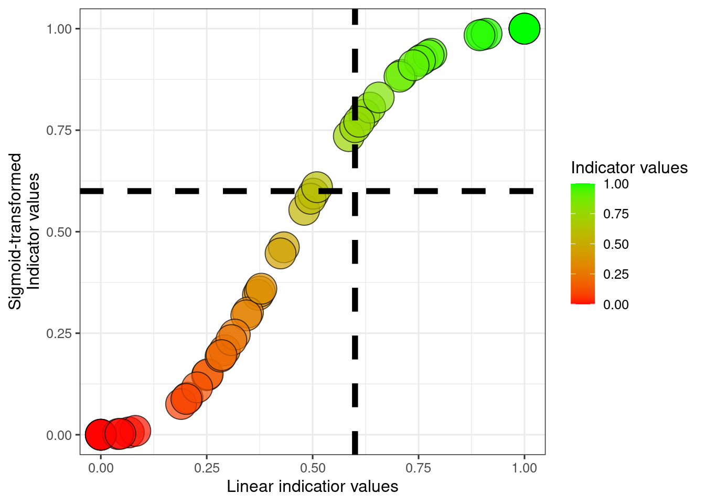

The dotted helper lines selve as visual guides to judge how different a scaled indicator value of 0.6 is for the two approaches.

### Accounting for the threshold value

We can account for the threshold for good ecological condition when applying sigmoid transformation like this


```r
dat$indicator1_sigmoid_thr <- ifelse(
  dat$variable1<dat$thr1,
    ((dat$indicator1_sigmoid-0)/(sigmoid_thr-0))*(0.6-0)+0,
    ((dat$indicator1_sigmoid-sigmoid_thr)/(1-sigmoid_thr))*(1-0.6)+0.6
  )
ggplot(dat)+
  geom_point(
    aes(x = variable1, y = indicator1_sigmoid),
             fill   = "grey", 
             colour = myColour,
             size   = 5,
             alpha  = myAlpha,
             shape  = myShape)+
  
  geom_point(
    aes(x = variable1, y = indicator1_sigmoid_thr, fill = indicator1_sigmoid_thr),
             colour = myColour,
             size   = mySize,
             alpha  = myAlpha,
             shape  = myShape)+
  
  geom_vline(xintercept = dat$referenceLow1[1],
             linetype = "dashed",
             size =1)+
  geom_vline(xintercept = dat$referenceHigh1[1],
             linetype = "dashed",
             size =1)+
  
  geom_segment(aes(x = 0, y = sigmoid_thr, xend = thr1, yend = sigmoid_thr),
               linetype="solid",
               colour = "grey",
               size=1)+
  
  geom_segment(aes(x = thr1, y = 0, xend = thr1, yend = 0.6),
               linetype="solid",
               size=1)+
  geom_segment(aes(x = 0, y = 0.6, xend = thr1, yend = 0.6),
               linetype="solid",
               size=1)+
  
  
  ylab("Indicator values")+
  xlab("Variable values")+
  
  scale_fill_gradient("Indicator values", low = low, high = high)
```

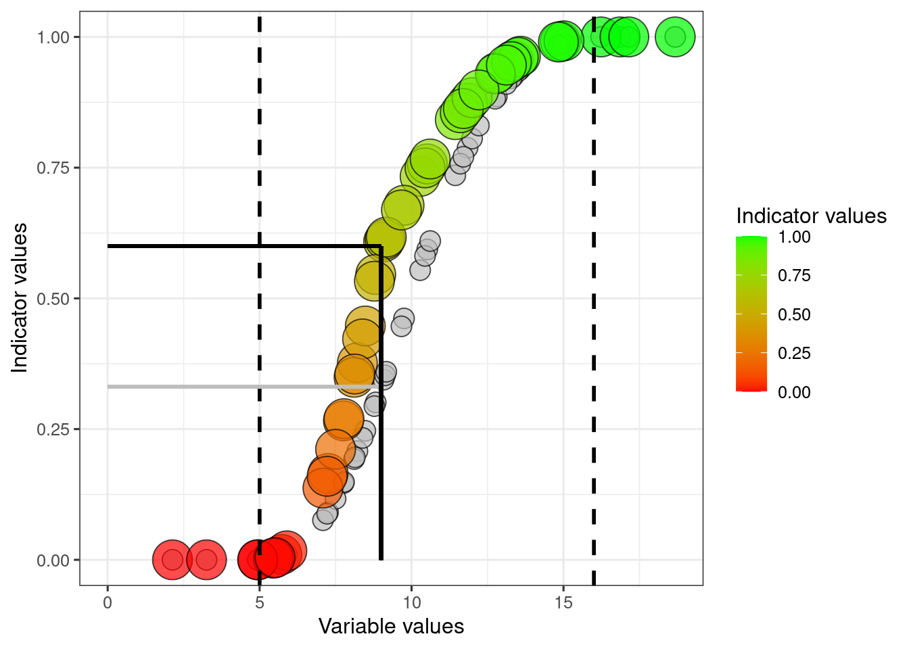

The grey circles and horizonal line correspons to the sigmoid transformation without any adjustment for the threshold value.

## Exponential functoins

Here are two examples of exponential transformation that can also be used:


```r
dat$indicator1_expConvex <- dat$indicator1_LowHigh^0.5
dat$indicator1_expConcave <- dat$indicator1_LowHigh^2
```


```r

ggplot(dat)+
  geom_point(
    aes(x = variable1, y = indicator1_expConvex, fill = indicator1_expConvex),
             colour = myColour,
             size   = mySize,
             alpha  = myAlpha,
             shape  = myShape)+
  geom_point(
    aes(x = variable1, y = indicator1_expConcave, fill = indicator1_expConcave),
             colour = myColour,
             size   = mySize,
             alpha  = myAlpha,
             shape  = myShape)+
  
  geom_vline(xintercept = dat$referenceLow1[1],
             linetype = "dashed",
             size =1)+
  geom_vline(xintercept = dat$referenceHigh1[1],
             linetype = "dashed",
             size =1)+
  ylab("Indicator values")+
  xlab("Variable values")+
  
  scale_fill_gradient("Indicator values", low = low, high = high)
```

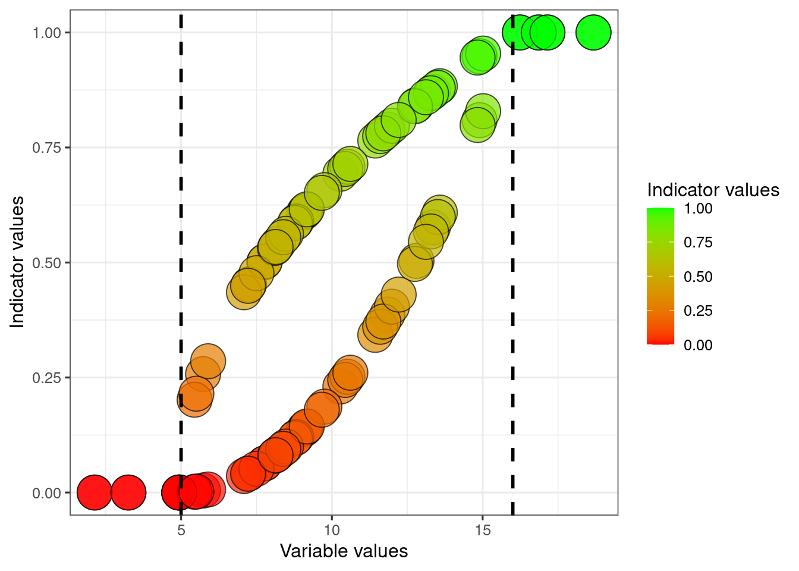

<!--chapter:end:scalingFunctions.Rmd-->

# Homogeneous Impact Areas

<br />

*Author and date:* 

Anders Kolstad

<br />

<!-- Load all your dependencies here -->


## Introduction

This chapter documents the creation of a wall-to-wall map of homogeneous impact areas in Norway.
The map is produced by binning values in the infrastructure index into four discrete categories.
It is likely to be a good predictor for some indicators, such as *slitasje* and the presence of *alien species*.

## About the underlying data

The infrastructure index is explained [here](https://brage.nina.no/nina-xmlui/handle/11250/2983607).
It is a wall-to-wall raster over Norway with 100 m resolution.
Each pixel is given a value along a continuous gradient from 0 to around 15.4, representing the frequency of surrounding cells within 500 m with human infrastructure (houses, roads, ect).

### Representativity in time and space

The infrastructure index is calculated with data that have slightly different dates, but can be said to represent year 2015.
The data covers all of mainland Norway.

### References

Bakkestuen, V., Dervo, B.K., Bærum, K.M. og Erikstad, L. 2022. 
Prediksjonsmodellering av naturtyper i ferskvann.
NINA Rapport 2079.
Norsk institutt for naturforskning.

## Analyses

### Import data

The path must be conditional:


```r
dir <- substr(getwd(), 1,2)
```


```r
path <- ifelse(dir == "C:", 
        "R:/GeoSpatialData/Utility_governmentalServices/Norway_Infrastructure_Index/Original/Infrastrukturindeks_UTM33/infra_tiff.tif",
        "/data/R/GeoSpatialData/Utility_governmentalServices/Norway_Infrastructure_Index/Original/Infrastrukturindeks_UTM33/infra_tiff.tif")
```

Import a stars proxy (no data imported yet)


```r
infra <- stars::read_stars(path)
```

Print the coordinate reference system:

```r
st_crs(infra)$input
#> [1] "WGS_1984_UTM_Zone_33N"
```

### Trondheim example

It's easier to see what's happening if we zoom in a bit.
Lets get a boundary box around Trondheim.


```r
myBB <- st_bbox(c(xmin=260520.12, xmax = 278587.56,
                ymin = 7032142.5, ymax = 7045245.27),
                crs = st_crs(infra))
```

Cropping the raster to the bbox


```r
infra_trd <- sf::st_crop(infra, myBB)
```


#### Get OSM highways

Lets download some base maps to help validate and contextualize the infrastructure index.

Transform to lat long due to osm requirements


```r
infra_trd_ll <- sf::st_transform(infra_trd, 4326)
```

Get the boundary box of the cropped raster


```r
myBB_ll <- sf::st_bbox(infra_trd_ll)
```

Download highways using the above bbox.


```r
hw <- 
  osmplotr::extract_osm_objects(
    bbox = myBB_ll,
    key = "highway",
    sf = T)
```

Transforming highway data back into utm, although not strictly necessary.


```r
hw_utm <- sf::st_transform(hw, sf::st_crs(infra_trd)) 
```

This object contains too many roads (about 30k).
I'll take out the unnamed roads.


```r
hw_utm <- hw_utm[!is.na(hw_utm$name),]
```


#### Discretize

Here I define a simplified categorical typology for the infrastructure index using four classes.


```r
names(infra_trd) <- "infrastructureIndex"
infra_trd_reclassed <-  infra_trd %>%
  mutate(infrastructureIndex = case_when(
    infrastructureIndex < 1 ~ 0,
    infrastructureIndex < 6 ~ 1,
    infrastructureIndex < 12 ~ 2,
    infrastructureIndex >= 12 ~ 3
  ))
```

Lets plot these two maps side by side


```r
map_trd_reclassed <- tm_shape(infra_trd_reclassed)+
  tm_raster(title="Infrastructure Index",
            #palette = "viridis",
            style="cat")+
  tm_layout(legend.outside = T)+
  tm_shape(hw_utm)+
  tm_lines(col="white")
```


```r
map_trd <- tm_shape(infra_trd)+
  tm_raster(title="Infrastructure Index",
            style="cont",
            palette = "viridis")+
  tm_layout(legend.outside = T)+
  tm_shape(hw_utm)+
  tm_lines(col="white")
```


```r
tmap_arrange(map_trd,
             map_trd_reclassed,
             ncol=1)
#> stars_proxy object shown at 181 by 132 cells.
#> stars_proxy object shown at 181 by 132 cells.
```

<div class="figure">

<p class="caption">(\#fig:unnamed-chunk-17)Infrastructure index over Trondheim, comparing the continous scale with the ordinal four-step scale. Major roads are in white.</p>
</div>

I tweaked the thresholds for the bins so that the categories match my knowledge about the land use intensity in Trondheim, for example that most of the forest next to Trondheim (to the left in the map) was in the second lowest class.
This looks pretty good to me.
It depicts a gradient in human presence from high within the built zone, to *no to very low* in the forests and mountains to the west.
Note that there is still considerable human activity also there in the form of outdoor recreation and even forestry.

#### Aggregate

The resolution in this map is more than we need, and the size of the data implies that the next step, the vectorization, would take too long.
We therefore aggregate, or reduce the resolution.


```r
dim <- st_dimensions(infra)
paste("Resolution is", dim$x$delta, "by", dim$x$delta, "meters")
#> [1] "Resolution is 100 by 100 meters"
```


```r
infra_trd_reclassed_agg <- st_warp(infra_trd_reclassed, cellsize = c(1000, 1000), 
                                   crs = st_crs(infra_trd_reclassed), 
                                   use_gdal = TRUE,
                                   method = "average")
```


```r
dim <- st_dimensions(infra_trd_reclassed_agg)
paste("Resolution is", dim$x$delta, "by", dim$x$delta, "meters")
#> [1] "Resolution is 1000 by 1000 meters"
```

Each cell is now the average of the aggregated cells, and hence the value is continuous again.
Let's make it discrete.


```r
names(infra_trd_reclassed_agg) <- "infrastructureIndex"
infra_trd_reclassed_agg <-  infra_trd_reclassed_agg %>%
  mutate(infrastructureIndex = case_when(
    infrastructureIndex < 1 ~ 0,
    infrastructureIndex < 6 ~ 1,
    infrastructureIndex < 12 ~ 2,
    infrastructureIndex >= 12 ~ 3
  ))
```


```r
tm_shape(infra_trd_reclassed_agg)+
  tm_raster(title="Infrastructure Index",
            style="cat")+
  tm_layout(legend.outside = T)+
  tm_shape(hw_utm)+
  tm_lines(col="white")
```

<div class="figure">
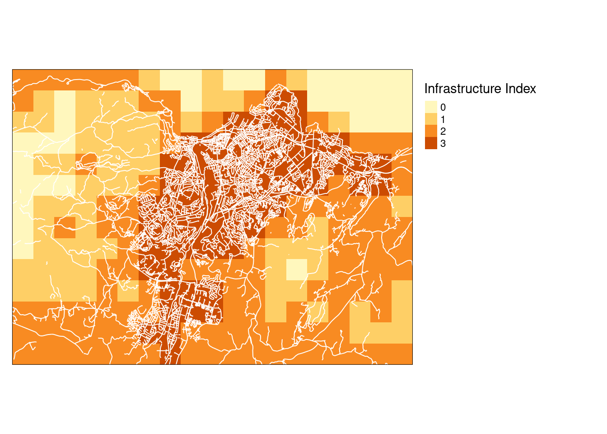
<p class="caption">(\#fig:unnamed-chunk-22)Infrastrcture index over Trondheim on a four-step discrete scale, aggregated to 1x1 km resolution using the mean function.</p>
</div>

This resolution is more than good enough for our purpose here.
I see that the map extends a bit into the fjord. We want to cut away these areas. We can use a map of the outline of Norway to do this.


```r
outline <- st_read("data/outlineOfNorway_EPSG25833.shp")
#> Reading layer `outlineOfNorway_EPSG25833' from data source 
#>   `/data/scratch/Matt_bookdown__debug/ecosystemCondition/data/outlineOfNorway_EPSG25833.shp' 
#>   using driver `ESRI Shapefile'
#> Simple feature collection with 1 feature and 2 fields
#> Geometry type: MULTIPOLYGON
#> Dimension:     XY
#> Bounding box:  xmin: -113472.7 ymin: 6448359 xmax: 1114618 ymax: 7939917
#> Projected CRS: ETRS89 / UTM zone 33N
```

The CRS needs to be identical 

```r
infra_trd_reclassed_agg <- st_transform(infra_trd_reclassed_agg, 25833)
```


```r
infra_trd_reclassed_agg_terrestrial <- st_crop(infra_trd_reclassed_agg, outline)
#> Warning in st_crop.stars(infra_trd_reclassed_agg, outline):
#> crop only crops regular grids
```


```r
tm_shape(infra_trd_reclassed_agg_terrestrial)+
  tm_raster(title="Infrastructure Index",
            style="cat")+
  tm_layout(legend.outside = T)+
  tm_shape(hw_utm)+
  tm_lines(col="white")+
  tm_shape(outline)+
  tm_borders(lwd =2,
             col = "black")
```

<div class="figure">
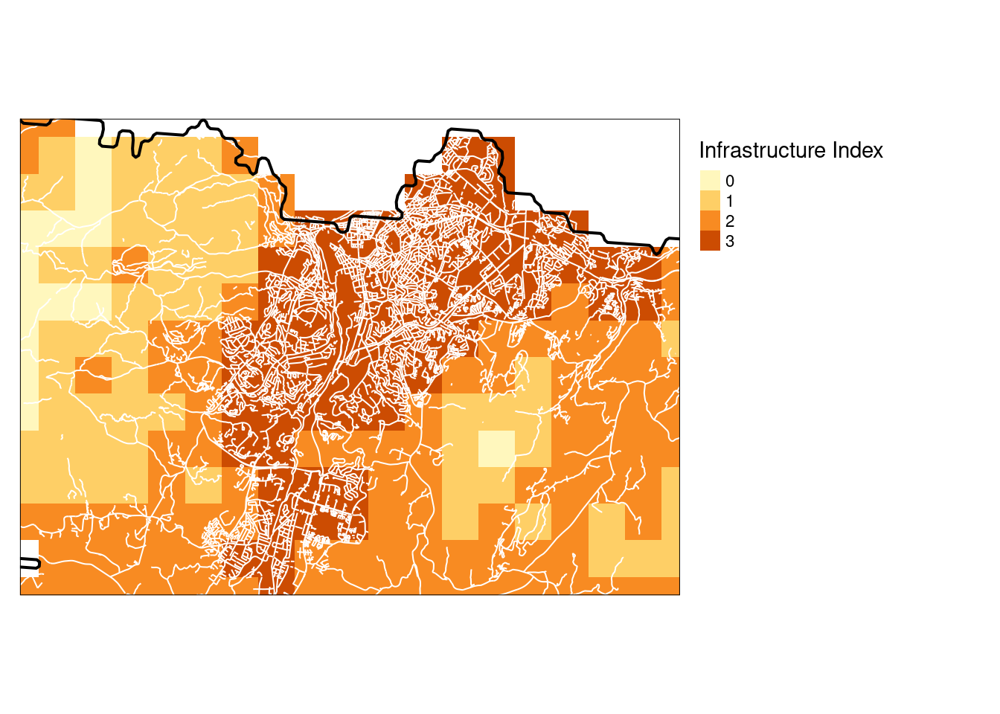
<p class="caption">(\#fig:unnamed-chunk-26)Infrastrcture index over Trondheim on a four-step discrete scale, aggregated to 1x1 km resolution using the mean function.</p>
</div>

I have treated the raster cells as points when cropping, so that cells where the center of the cell is outside the terrestrial delineation are removed. I think this makes the most sense for unbiased area statistics, but some coastal indicator data could also be excluded because of this. The errors would be smaller with a finer resolution raster, but computation time is a problem.

### Aggregate the entire map to 1x1 km


```r
# runtime about 30 sec
infra_agg <- st_warp(infra, cellsize = c(1000, 1000), 
                                   crs = st_crs(infra), 
                                   use_gdal = TRUE,
                                   method = "average")
# The CRS needs to be identical for st_crop
infra_agg <- st_transform(infra_agg, 25833)
```


### Cut out marine areas
I see that the map extends a bit into the fjord. We want to cut away these areas. We can use a map of the outline of Norway to do this.


```r
infra_agg_terrestrial <- st_crop(infra_agg, outline)
saveRDS(infra_agg_terrestrial, "P:/41201785_okologisk_tilstand_2022_2023/data/cache/infra_agg_terrestrial.rds")
```


### Discretize the entire map


```r
names(infra_agg_terrestrial) <- "infrastructureIndex"

infra_agg_discrete <- infra_agg_terrestrial %>%
  mutate(infrastructureIndex = case_when(
    infrastructureIndex < 1 ~ 0,
    infrastructureIndex < 6 ~ 1,
    infrastructureIndex < 12 ~ 2,
    infrastructureIndex >= 12 ~ 3
  ))
```

### Vectorize

This step might seem rather stupid.
We want to vectorize a rather large raster.
This makes it a quite big data object.
The reason is that there is no really good way to burn polygon data on to raster grid cells after the disuse of the `{raster}` package.
It was not straight forward then either.
But calculating intersections between polygons is very fast and easy.


```r
infra_agg_discrete_vect <- 
  eaTools::ea_homogeneous_area(infra_agg_discrete, 
                                groups = infrastructureIndex)
path <- ifelse(dir == "C:", 
        "P:/41201785_okologisk_tilstand_2022_2023/data/cache/",
        "/data/P-Prosjekter2/41201785_okologisk_tilstand_2022_2023/data/cache/")

saveRDS(infra_agg_discrete_vect, paste0(path, "infra_agg_discrete_vect.rds"))
```


Let's plot this now.
First, lets crop it to reduce computation time.


```r
myBB <- st_bbox(c(xmin=260520.12, xmax = 278587.56,
                ymin = 7032142.5, ymax = 7045245.27),
                crs = st_crs(infra_agg_discrete_vect))

infra_agg_discrete_vect_trd <- st_crop(infra_agg_discrete_vect, myBB)
#> Warning: attribute variables are assumed to be spatially
#> constant throughout all geometries
```


```r
tm_shape(infra_agg_discrete_vect_trd)+
  tm_polygons(col="infrastructureIndex",
              style = "cat")+
  tm_layout(legend.outside = T)+
  tm_shape(hw_utm)+
  tm_lines(col="white")
```

<div class="figure">

<p class="caption">(\#fig:test-2)A vectorized version of the Infrastructure index over Trondheim on a four-step discrete scale.</p>
</div>

As can be seen in the figure above, `st_warp` merges grid cells that have the same value, and the vectorized raster doesn't end up being that big in the end.

## Check national distribution


```r
regions <- sf::read_sf("data/regions.shp", options = "ENCODING=UTF8")
unique(regions$region)
#> [1] "Nord-Norge" "Midt-Norge" "Østlandet"  "Vestlandet"
#> [5] "Sørlandet"
```


```r
st_crs(infra_agg_discrete_vect) == st_crs(regions)
#> [1] TRUE
```


Since the two layers are completely overlapping, we can get the intersections

```r
infra_stats <- eaTools::ea_homogeneous_area(infra_agg_discrete_vect,
                             regions,
                             keep1 = "infrastructureIndex",
                             keep2 = "region")
saveRDS(infra_stats, "P:/41201785_okologisk_tilstand_2022_2023/data/cache/infra_stats.rds")
```


Let's calculate the areas of these polygons and compare the HIF in the five regions. 

```r
infra_stats$area_km2 <- units::drop_units(sf::st_area(infra_stats))
infra_stats$area_km2 <- infra_stats$area_km2/1000

temp <- as.data.frame(infra_stats) %>%
  group_by(region, infrastructureIndex) %>%
  summarise(area_km2 = mean(area_km2))
#> `summarise()` has grouped output by 'region'. You can
#> override using the `.groups` argument.

ggarrange(
  ggplot(temp, aes(x = region, y = area_km2, fill = factor(infrastructureIndex)))+
    geom_bar(position = "stack", stat = "identity")+
    guides(fill = "none")+
    coord_flip()+
    xlab("")
  ,
  ggplot(temp, aes(x = region, y = area_km2, fill = factor(infrastructureIndex)))+
    geom_bar(position = "fill", stat = "identity")+
    guides(fill = guide_legend("HIF"))+
    coord_flip()+
    ylab("Fraction of total area")+
    xlab("")
)
```

<div class="figure">
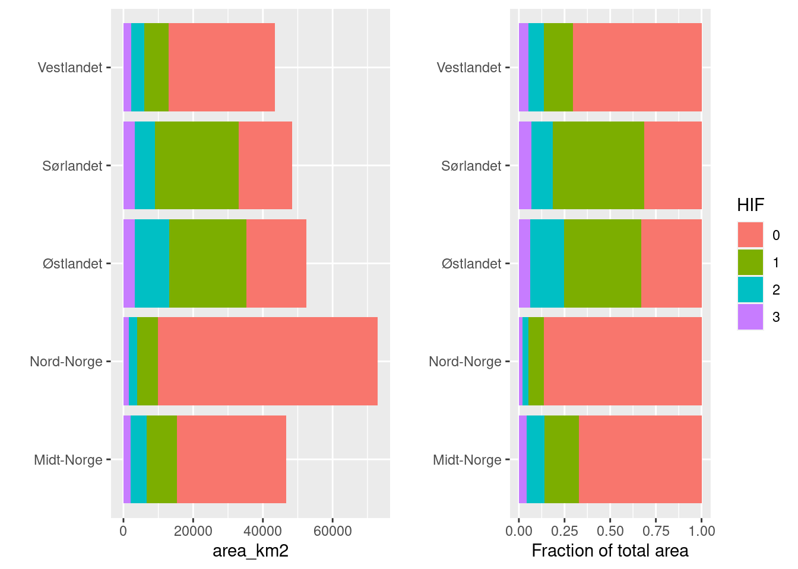
<p class="caption">(\#fig:HIF-region)Stacked barplot showing the distribution of human impact factor across five regions in Norway.</p>
</div>

This distribution looks reasonable. The relative proportions are similar in the five regions, but _Østlandet_ and _Sørlandet_ have more infrastructure in general.

Here are the numbers behind the figure above.

```r
temp$area_km2 <- round(temp$area_km2,0)
DT::datatable(temp)
```

```{=html}
<div class="datatables html-widget html-fill-item-overflow-hidden html-fill-item" id="htmlwidget-91b5ede345b426016b17" style="width:100%;height:auto;"></div>
<script type="application/json" data-for="htmlwidget-91b5ede345b426016b17">{"x":{"filter":"none","vertical":false,"data":[["1","2","3","4","5","6","7","8","9","10","11","12","13","14","15","16","17","18","19","20"],["Midt-Norge","Midt-Norge","Midt-Norge","Midt-Norge","Nord-Norge","Nord-Norge","Nord-Norge","Nord-Norge","Sørlandet","Sørlandet","Sørlandet","Sørlandet","Vestlandet","Vestlandet","Vestlandet","Vestlandet","Østlandet","Østlandet","Østlandet","Østlandet"],[0,1,2,3,0,1,2,3,0,1,2,3,0,1,2,3,0,1,2,3],[31390,8661,4604,2005,63009,5979,2417,1504,15199,24127,5731,3257,30533,6988,3683,2258,17242,22154,9760,3295]],"container":"<table class=\"display\">\n  <thead>\n    <tr>\n      <th> <\/th>\n      <th>region<\/th>\n      <th>infrastructureIndex<\/th>\n      <th>area_km2<\/th>\n    <\/tr>\n  <\/thead>\n<\/table>","options":{"columnDefs":[{"className":"dt-right","targets":[2,3]},{"orderable":false,"targets":0}],"order":[],"autoWidth":false,"orderClasses":false}},"evals":[],"jsHooks":[]}</script>
```


## Export
I will write this data to the NINA P server.


```r
saveRDS(infra_agg_discrete_vect, "P:/41201785_okologisk_tilstand_2022_2023/data/infrastrukturindeks/homogeneous_impact_areas.rds")
```


```r
HIA_returned <- readRDS("P:/41201785_okologisk_tilstand_2022_2023/data/infrastrukturindeks/homogeneous_impact_areas.rds")
```

<!--chapter:end:homogeneous_impact_areas.Rmd-->

# Master grid

<br />

*Author:* 

Anders L. Kolstad

March 2023

<br />

<!-- Load all you dependencies here -->


## Introduction

This chapter describes the making of a master raster grid for all of mainland Norway. This grid is used to align all ecosystem and indicator maps so that it becomes possible to do easy resamping, masking and aggregating.

_To do_ : I plan to add examples how to use this master grid on real data.

## About the underlying data

I will use the [statistical grid from Norway (5x5km)](https://kartkatalog.geonorge.no/metadata/statistisk-rutenett-5000m/32ac0653-d95c-446c-8558-bf9b79f4934e) and resample this to a higher resolution of 50 x 50 meters.

## Analyses


```r
# Set up conditional file paths
dir <- substr(getwd(), 1,2)

pData <- ifelse(dir == "C:", 
               "P:/41201785_okologisk_tilstand_2022_2023/data/",
               "/data/P-Prosjekter2/41201785_okologisk_tilstand_2022_2023/data/")
```

Import data

```r
#st_layers(paste0(pData, "Basisdata_0000_Norge_25833_StatistiskRutenett5km_FGDB.gdb"))
grid_5km <- sf::read_sf(paste0(pData, "Basisdata_0000_Norge_25833_StatistiskRutenett5km_FGDB.gdb")) 
```


```r
tmap_mode("view")
tm_shape(grid_5km$SHAPE)+
  tm_borders()
```

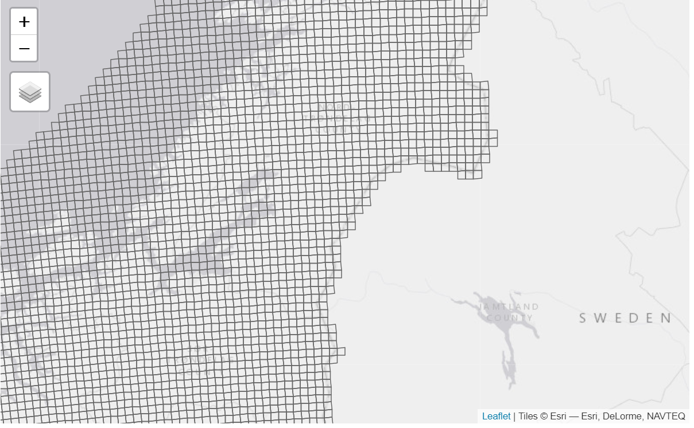{width="800"}

Confirming CRS is EPSG25833:

```r
st_crs(grid_5km)
#> Coordinate Reference System:
#>   User input: ETRS89 / UTM zone 33N 
#>   wkt:
#> PROJCRS["ETRS89 / UTM zone 33N",
#>     BASEGEOGCRS["ETRS89",
#>         ENSEMBLE["European Terrestrial Reference System 1989 ensemble",
#>             MEMBER["European Terrestrial Reference Frame 1989"],
#>             MEMBER["European Terrestrial Reference Frame 1990"],
#>             MEMBER["European Terrestrial Reference Frame 1991"],
#>             MEMBER["European Terrestrial Reference Frame 1992"],
#>             MEMBER["European Terrestrial Reference Frame 1993"],
#>             MEMBER["European Terrestrial Reference Frame 1994"],
#>             MEMBER["European Terrestrial Reference Frame 1996"],
#>             MEMBER["European Terrestrial Reference Frame 1997"],
#>             MEMBER["European Terrestrial Reference Frame 2000"],
#>             MEMBER["European Terrestrial Reference Frame 2005"],
#>             MEMBER["European Terrestrial Reference Frame 2014"],
#>             ELLIPSOID["GRS 1980",6378137,298.257222101,
#>                 LENGTHUNIT["metre",1]],
#>             ENSEMBLEACCURACY[0.1]],
#>         PRIMEM["Greenwich",0,
#>             ANGLEUNIT["degree",0.0174532925199433]],
#>         ID["EPSG",4258]],
#>     CONVERSION["UTM zone 33N",
#>         METHOD["Transverse Mercator",
#>             ID["EPSG",9807]],
#>         PARAMETER["Latitude of natural origin",0,
#>             ANGLEUNIT["degree",0.0174532925199433],
#>             ID["EPSG",8801]],
#>         PARAMETER["Longitude of natural origin",15,
#>             ANGLEUNIT["degree",0.0174532925199433],
#>             ID["EPSG",8802]],
#>         PARAMETER["Scale factor at natural origin",0.9996,
#>             SCALEUNIT["unity",1],
#>             ID["EPSG",8805]],
#>         PARAMETER["False easting",500000,
#>             LENGTHUNIT["metre",1],
#>             ID["EPSG",8806]],
#>         PARAMETER["False northing",0,
#>             LENGTHUNIT["metre",1],
#>             ID["EPSG",8807]]],
#>     CS[Cartesian,2],
#>         AXIS["(E)",east,
#>             ORDER[1],
#>             LENGTHUNIT["metre",1]],
#>         AXIS["(N)",north,
#>             ORDER[2],
#>             LENGTHUNIT["metre",1]],
#>     USAGE[
#>         SCOPE["Engineering survey, topographic mapping."],
#>         AREA["Europe between 12°E and 18°E: Austria; Denmark - offshore and offshore; Germany - onshore and offshore; Norway including Svalbard - onshore and offshore."],
#>         BBOX[46.4,12,84.42,18]],
#>     ID["EPSG",25833]]
```

### Make grid

Use the bbox and split into 50 x 50 meter cells


```r
(masterGrid_50m <- st_as_stars(st_bbox(grid_5km), dx = 50, dy = 50))
#> stars object with 2 dimensions and 1 attribute
#> attribute(s), summary of first 1e+05 cells:
#>         Min. 1st Qu. Median Mean 3rd Qu. Max.
#> values     0       0      0    0       0    0
#> dimension(s):
#>   from    to  offset delta                refsys x/y
#> x    1 24500  -1e+05    50 ETRS89 / UTM zone 33N [x]
#> y    1 30800 7965000   -50 ETRS89 / UTM zone 33N [y]
```

This file is 6GB.

Number of cells, in millions, is:

```r
(nrow(masterGrid_50m)*ncol(masterGrid_50m))/10^6
#>     x 
#> 754.6
```

So, quite a lot. For the area accounts we might consider using 10x10m.

### Eksport file (final product)


```r
stars::write_stars(masterGrid_50m, paste0(pData, "masterGrid_50m.tiff"))
```

### Test import

```r
temp <- stars::read_stars(paste0(pData, "masterGrid_50m.tiff"))
st_dimensions(temp)
#>   from    to  offset delta                refsys point x/y
#> x    1 24500  -1e+05    50 ETRS89 / UTM zone 33N FALSE [x]
#> y    1 30800 7965000   -50 ETRS89 / UTM zone 33N FALSE [y]
```


<!--chapter:end:master_grid.Rmd-->

# Climate indicators explained {#climate-indicators-explained}

<br />

*Author and date:*

Anders L. Kolstad

March 2023

<br />

<!-- Load all you dependencies here -->


|Ecosystem |Økologisk.egenskap   |ECT.class                      |
|:---------|:--------------------|:------------------------------|
|All       |Abiotiske egenskaper |Physical state characteristics |

<br /> <br />

<hr />

## Introduction

This chapters describes the development of a workflow for generating or preparing indicators based on interpolated climate data from [SeNorge](https://senorge.no/). I describe the process using dummy data and also discuss alternate approaches and dead ends that occured in the development process. For a succinct workflow example for a specific indicator, see [Median summer temperature](#median-summer-temp).

## About the underlying data

The data is in a raster format and extends back to 1957 in the form of multiple interpolated climate variables. The spatial resolution is 1 x 1 km.

### Representativity in time and space

The data includes the last normal period (1961-1990) which defines the reference condition for climate variables. Therefore the temporal resolution is very good. Also considering the daily resolution of the data.

Spatially, a 1x1 km resolution is sufficient for most climate variables, esp. in homogeneous terrain, but this needs to be evaluation for each variable and scenario specifically.

### Original units

Varied. Specified below for each parameter.

### Temporal coverage

1957 - present

### Additional comments about the data set

The data format has recently changed from .BIL to .nc (netcdf) and now a single file contains all the rasters for one year (365 days), and sometimes for multiple variables also.

## Ecosystem characteristic

### Norwegian standard

These variables typically will fall under the *abiotiske egenskaper* class.

### SEEA EA

In SEEA EA, these variables will typically fall under A1 - Physical state characteristics.

## Collinearities with other indicators

Climate variables are most likely to be correlated with each other (e.g. temperature and snow). Also, some climate variables are better classed as pressure indicators, and these might have a causal association with several condition indicators.

## Reference condition and values

### Reference condition

The reference condition for climate variables is defined as the normal period 1961-1990.

### Reference values, thresholds for defining *good ecological condition*, minimum and/or maximum values

-   Un-scaled indicator value = median value over 5 year periods (5 years being a pragmatic choice. It is long enough to smooth out a lot of inter-annual variation, and it's long enough to enable estimating errors)

-   Upper reference level (best possible condition) = median value from the reference period

-   Thresholds for good ecosystem condition = 2 standard deviation units away from the upper reference level for the climate variable during the reference period.

-   Lower reference values (two-directional) = 5 standard deviation units for the climate variable during the reference period (implies linear scaling).

The choice to use 2 SD units as the threshold values is a subjective choice in many ways, and not founded in any empirical or known relationship between the indicators and ecosystem integrity. The value comes from the common practice of calling something _extreme weather_ when it is outside 2 SD units of the current running average. So, if the indicator value today is <0.6 it implies that the mean for that variable over the last year would have been referred to as _extreme_ if it had occurred between 1961 and 1990. This is I think a conservative threshold, since one would/could call it _extreme_ if only one year is outside the 2SD range, and having the mean of 5 years being outside this range is _really_ extreme.


## Uncertainties

For the indicator map (1 x 1 km raster) there is no uncertainty associated with the indicator values. For aggregated indicator values (e.g. for regions), the uncertainty in the indicator value is calculated from the spatial variation in the indicator values via bootstrapping. This might, however, be changed later to the temporal variation between the five years of each period.

## References

<https://senorge.no/>

*rr and tm are being download from:* <https://thredds.met.no/thredds/catalog/senorge/seNorge_2018/Archive/catalog.html>

### Additional resources

[Stars package](https://r-spatial.github.io/stars/)

[R as a GIS for economists](https://tmieno2.github.io/R-as-GIS-for-Economists/stars-basics.html) chapter 7

<hl/>

## Analyses

### Data set

The data is downloaded to a local NINA server, and updated regularly.


```r
path <- ifelse(dir == "C:", 
      "R:/GeoSpatialData/Meteorology/Norway_SeNorge2018_v22.09/Original",
      "/data/R/GeoSpatialData/Meteorology/Norway_SeNorge2018_v22.09/Original")
```

This folder contains folder for the different parameters


```r
(files <- list.files(path))
#>  [1] "age"        "fsw"        "gwb_eva"    "gwb_gwtcl" 
#>  [5] "gwb_q"      "gwb_sssdev" "gwb_sssrel" "lwc"       
#>  [9] "qsw"        "rr_tm"      "sd"         "sdfsw"     
#> [13] "swe"
```

This table explains them in more detail


```r
senorgelayers <- read_delim("data/senorgelayers.txt", 
    delim = "\t", escape_double = FALSE, 
    trim_ws = TRUE)
DT::datatable(senorgelayers)
```

<div class="figure">

```{=html}
<div class="datatables html-widget html-fill-item-overflow-hidden html-fill-item" id="htmlwidget-0031da50b6e66f4f7b8f" style="width:100%;height:auto;"></div>
<script type="application/json" data-for="htmlwidget-0031da50b6e66f4f7b8f">{"x":{"filter":"none","vertical":false,"data":[["1","2","3","4","5","6","7","8","9","10","11","12","13","14","15","16"],["sdfsw","fsw","sd","age","swe","#swepr","#swepr","qsw","lwc","gwb_q","gwb_eva","gwb_gwtcl","gwb_sssdev","gwb_sssrel","tm","rr"],["16","8","16","8","16","no longer included","16","8","8","16","8","8","16","16","16","16"],[65535,255,65535,255,65535,null,65535,255,255,65535,255,255,32767,65535,65535,65535],[65534,254,null,254,null,null,null,254,254,null,null,null,null,null,null,null],["fresh snow depth","fresh snow","snow depth","snow age","snow water equivalent",null,"snow water equivalent percentage","snow melt","free water content in snow","runoff","evapotranspiration","ground water condition","water capacity of the soil","current water saturation of the soil","temperature","precipitation"],["mm","mm (water equivalent)","mm","number of days since last snowfall","1/10 mm (water equivalent)",null,"1/10 %","mm (water equivalent)","1/10 % free water in the snow layer","1/10 mm","1/10 mm","24h percentile of the normal period","mm in relation to maximum value of the normal period","% of the maximum value of the normal period","celsius","mm"],["Nysnødybde","Nysnø","Snødybde","Snøens alder","Snømengde",null,"Prosentandel swe","Snøsmelting","Snøtilstand","Avrenning","Fordamping","Grunnvannstilstand","Jordas vannkapasitet","Vannmetting i jord","Temperatur","Nedbør"],["Verdier i fil i 16bit integer verdier som angir mm snødybde.","Verdier angir mm vannekvivalent.","Verdier angir mm snødybde.","Verdiene angir antall dager siden siste snøfall.","Verdiene angir 1/10mm vannekvivalent. Altså en verdi på 102 er 10.2 mm vann.",null,"Veldig uklar beskrivelse gitt av NVE. Må sjekkes!","Verdiene angir mm vannekvivalent.","Verdien angir i prosent hvor mye fritt vann det er i snøpakka. Oppgitt i 1/10 %. En verdi på 45 er altså 4.5%.","Angir avrenning i 1/10mm vann. En verdi på 34 er altså 3.4 mm.","Angir fordampning i 1/10 mm vann.","Verdien angir hvilken døgnpercentilene i normalperioden som verdien tilhører. Verdiene er her 5, 25, 50, 75 og 95.","Verdien angir lagerkapasiteten (i mm) i forhold til maxverdien registrert i 30 årsperioden (1981-2010). Negativ verdi betyr altså at dagens vannlager verdi er over maxverdien.","Dagens vannlager verdi i prosent av den samme maksimale verdien som brukes i gwb_ssdev. En verdi over 100 angir altså at maksverdien er overskredet.","Verdien angir grader i Celsius (re-skalert fra tiendels Kelvin, der en verdi på 2811 er (2811-2731)/10 = 8.0 C.","Verdien angir nedbør i mm (re-skalert fra tiendels mm)."],["gt_Meteorology_Norway_seNorge_FreshSnowDepth_days","gt_Meteorology_Norway_seNorge_FreshSnow_days","gt_Meteorology_Norway_seNorge_SnowDepth_days","gt_Meteorology_Norway_seNorge_SnowAge_days","gt_Meteorology_Norway_seNorge_SnowAmount_days",null,"gt_Meteorology_Norway_seNorge_SnowAmountPercentage_days","gt_Meteorology_Norway_seNorge_SnowMelt_days","gt_Meteorology_Norway_seNorge_SnowFreeWaterContent_days","gt_Meteorology_Norway_seNorge_Runoff_days","gt_Meteorology_Norway_seNorge_Evapotranspiration_days","gt_Meteorology_Norway_seNorge_GroundWaterCondition_days","gt_Meteorology_Norway_seNorge_WaterCapacitySoil_days","gt_Meteorology_Norway_seNorge_WaterSaturationSoil_days","gt_Meteorology_Norway_seNorge_Temperature_days","gt_Meteorology_Norway_seNorge_Precipitation_days"],[null,null,null,null,null,null,null,null,null,null,null,null,null,null,"celsius","precipitation_daily"]],"container":"<table class=\"display\">\n  <thead>\n    <tr>\n      <th> <\/th>\n      <th>abbrev<\/th>\n      <th>bit<\/th>\n      <th>nodata<\/th>\n      <th>bare_ground<\/th>\n      <th>name<\/th>\n      <th>unit<\/th>\n      <th>navn<\/th>\n      <th>beskrivelse<\/th>\n      <th>grass_mapset<\/th>\n      <th>color_table<\/th>\n    <\/tr>\n  <\/thead>\n<\/table>","options":{"columnDefs":[{"className":"dt-right","targets":[3,4]},{"orderable":false,"targets":0}],"order":[],"autoWidth":false,"orderClasses":false}},"evals":[],"jsHooks":[]}</script>
```

<p class="caption">(\#fig:unnamed-chunk-5)Table explaining the available climate parameters in the data set.</p>
</div>

Here is the content of one of these folders (first 10 entries)


```r
(files_tm <- list.files(paste0(path, "/rr_tm")))[1:10]
#>  [1] "seNorge2018_1957.nc" "seNorge2018_1958.nc"
#>  [3] "seNorge2018_1959.nc" "seNorge2018_1960.nc"
#>  [5] "seNorge2018_1961.nc" "seNorge2018_1962.nc"
#>  [7] "seNorge2018_1963.nc" "seNorge2018_1964.nc"
#>  [9] "seNorge2018_1965.nc" "seNorge2018_1966.nc"
```

There are 67 files, i.e. 67 years of data, one file per year.

Importing (proxy) file:


```r
tg_1957 <- stars::read_ncdf(paste0(path, "/rr_tm/seNorge2018_1957.nc"),
                            var="tg")
#> Large netcdf source found, returning proxy object.
```

I know the CRS, so setting it manually. Although I cannot rule out 32633, I don't think it matters.


```r
st_crs(tg_1957) <- 25833
```

The data has three dimension


```r
dim(tg_1957)
#>    X    Y time 
#> 1195 1550  365
```

Initially the data had four attributes, but I subsettet to only include *tg*.


```r
names(tg_1957)
#> [1] "tg"
```

`tg_1957` is a stars proxy object and [most commands](https://r-spatial.github.io/stars/articles/stars8.html) will not initiate any change until later, typically I write to file and all the lazy operations are done in squeal. Therefore, I will prepare a test data set, which is smaller and which I can import to memory. Then I can perform the operations on that data set and we can see the results.

#### Dummy data

This test data is included in the {stars} package


```r
tif = system.file("tif/L7_ETMs.tif", package = "stars")
t1 = as.Date("1970-05-31")
x = read_stars(c(tif, tif, tif, tif), along = 
                  list(time = c(t1, t1+1, t1+50, t1+100)), 
               RasterIO = list(nXOff = c(1), 
                               nYOff = c(1), 
                               nXSize = 50, 
                               nYSize = 50, 
                               bands = c(1:6)))
```

A single attribute


```r
names(x)
#> [1] "L7_ETMs.tif"
```

I can rename it like this


```r
x <- setNames(x, "Attribute_A")
```

And I can add another dummy attribute.


```r
x <- x %>%
  mutate("Attribute_B" = Attribute_A/2)
```

The dummy data also has four dimensions


```r
dim(x)
#>    x    y band time 
#>   50   50    6    4
```

X and y area the coordinates. Band is an integer:


```r
st_get_dimension_values(x, "band")
#> [1] 1 2 3 4 5 6
```

I will remove the *band* dimension.


```r
x <- x %>% filter(band==1) %>% adrop()
```

Time is four dates covering four months in 1970:


```r
(oldTime <- st_get_dimension_values(x, "time"))
#> [1] "1970-05-31" "1970-06-01" "1970-07-20" "1970-09-08"
```

I'll add some extra seasonal variation between to the mix


```r
x$Attribute_A[,,2] <- x$Attribute_A[,,1]*1.2
x$Attribute_A[,,3] <- x$Attribute_A[,,1]*1.4
x$Attribute_A[,,4] <- x$Attribute_A[,,1]*1.1
```

Now I create another four copies of this data, adding some random noise and a continuous decreasing trend.


```r
# Function to add random noise
myRandom <- function(x) x*rnorm(1,1,.05)
```


```r
y1 <- x
y2 <- x %>% st_apply(1:3, myRandom) %>% st_set_dimensions("time", values = oldTime %m+% years(-1)) %>% mutate(Attribute_A = Attribute_A*0.95)
y3 <- x %>% st_apply(1:3, myRandom) %>% st_set_dimensions("time", values = oldTime %m+% years(-2)) %>% mutate(Attribute_A = Attribute_A*0.90)
y4 <- x %>% st_apply(1:3, myRandom) %>% st_set_dimensions("time", values = oldTime %m+% years(-3)) %>% mutate(Attribute_A = Attribute_A*0.85)
y5 <- x %>% st_apply(1:3, myRandom) %>% st_set_dimensions("time", values = oldTime %m+% years(-4)) %>% mutate(Attribute_A = Attribute_A*0.80)
```


```r
# We combine the data into one cube for plotting:
temp <- c(y1, y2, y3, y4, y5) 

ggplot() + 
  geom_stars(data = temp) +
  coord_equal() +
  theme_void() +
  scale_fill_viridis_c(option = "D") +  
  scale_x_discrete(expand = c(0, 0)) +
  scale_y_discrete(expand = c(0, 0))+
  facet_wrap(~time, ncol=4)
```

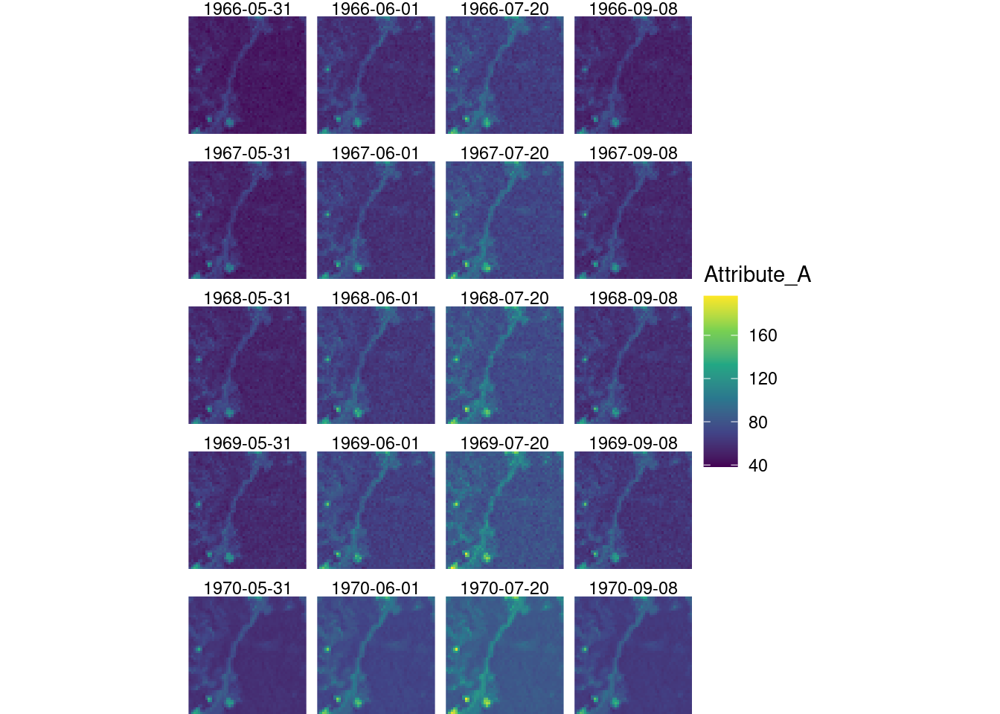

Saving these to file.


```r
path <- "P:/41201785_okologisk_tilstand_2022_2023/data/climate_indicators/dummy_data"
saveRDS(y1, paste0(path, "/y1.rds"))
saveRDS(y2, paste0(path, "/y2.rds"))
saveRDS(y3, paste0(path, "/y3.rds"))
saveRDS(y4, paste0(path, "/y4.rds"))
saveRDS(y5, paste0(path, "/y5.rds"))
```

##### Dummy regions and ET map

Here is some dummy data for accounting areas (regions) and ecosystem occurrences as well, in case I need them later.


```r
dummy_aa <- x %>%
  filter(time == oldTime[1]) %>%
  adrop() %>%
  mutate(accountingAreas = rep(c(1,2), each=length(Attribute_A)/2)) %>%
  select(accountingAreas)

tm_shape(dummy_aa) +
  tm_raster(style="cat")
```

<div class="figure">
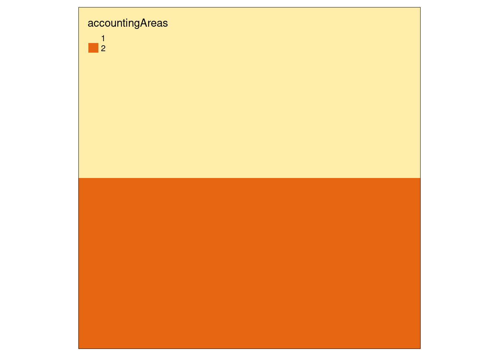
<p class="caption">(\#fig:unnamed-chunk-24)Showing the example account area delineation (raster format)</p>
</div>


```r
dummy_et <- x %>%
  filter(time == oldTime[1]) %>%
  adrop() %>%
  mutate(ecosystemType = rep(c(1,NA), length.out = length(Attribute_A))) %>%
  select(ecosystemType)

tm_shape(dummy_et) +
  tm_raster(style="cat")
```

<div class="figure">
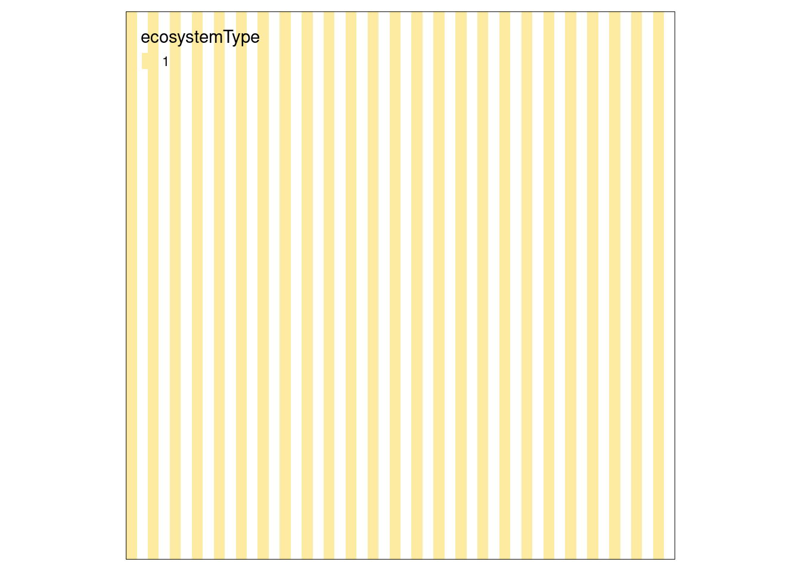
<p class="caption">(\#fig:unnamed-chunk-25)Showing the example Ecosystem type delineation data.</p>
</div>

#### Regions

Importing a shape file with the regional delineation.


```r
reg <- sf::st_read("data/regions.shp", options = "ENCODING=UTF8")
#> options:        ENCODING=UTF8 
#> Reading layer `regions' from data source 
#>   `/data/scratch/Matt_bookdown__debug/ecosystemCondition/data/regions.shp' 
#>   using driver `ESRI Shapefile'
#> Simple feature collection with 5 features and 2 fields
#> Geometry type: POLYGON
#> Dimension:     XY
#> Bounding box:  xmin: -99551.21 ymin: 6426048 xmax: 1121941 ymax: 7962744
#> Projected CRS: ETRS89 / UTM zone 33N
#st_crs(reg)
```

Outline of Norway


```r
nor <- sf::st_read("data/outlineOfNorway_EPSG25833.shp")
#> Reading layer `outlineOfNorway_EPSG25833' from data source 
#>   `/data/scratch/Matt_bookdown__debug/ecosystemCondition/data/outlineOfNorway_EPSG25833.shp' 
#>   using driver `ESRI Shapefile'
#> Simple feature collection with 1 feature and 2 fields
#> Geometry type: MULTIPOLYGON
#> Dimension:     XY
#> Bounding box:  xmin: -113472.7 ymin: 6448359 xmax: 1114618 ymax: 7939917
#> Projected CRS: ETRS89 / UTM zone 33N
```

Remove marine areas from regions


```r
reg <- st_intersection(reg, nor)
#> Warning: attribute variables are assumed to be spatially
#> constant throughout all geometries
```


```r
tm_shape(reg) +
  tm_polygons(col="region")
```

<div class="figure">

<p class="caption">(\#fig:unnamed-chunk-29)Five accounting areas (regions) in Norway.</p>
</div>

#### Ecosystem map

Coming soon ....

The climate indicators need to be masked with ecosystem type maps. This step is part of this chapter.


### Conceptual workflow

The general, the conceptual workflow is like this:

1.  Collate variable data series

    -   Import .nc files (loop though year 1961-1990) and subset to the correct attribute

    -   Filter data by dates (optional) (`dplyr::filter`). *This means reading all 365 rasters into memory, and it is much quicker to filter out the correct rasters in the importing step above (see examples later in this chapter)*

    -   Aggregate across time within a year (`stars::st_apply`). *This is the most time consuming operation in the workflow.*

    -   Join all data into one data cube (`stars:c`)

2.  Calculate reference values

    -   Aggregate (`st_apply)` across reference years (`dplyr::filter`) to get median and sd values

    -   Join with existing data cube (`stars:c`)

3.  Calculate indicator values

    -   Normalize climate variable at the individual grid cell level using the three reference values (`mutate(across()))`

4.  Mask by ecosystem type (*This could also be done in step one, but it doesn't speed things up to set some cells to NA*)

5.  Aggregate in space (to accounting areas) (*zonal statistics*)

    -   Aggregate across 5 year time steps to smooth out random inter-annual variation and leave climate signal

    -   Intersect with accounting area polygons `exactextrar::exact_extract` and get mean/median and (spatial) sd. (*Alternatively, get temporal sd at the grid cell level in the step above.*)

6.  Make trend figure and spatially aggregated maps,

### Collate variable data series

I include a for loop for importing the .nc files at the end.

### Filter data by dates

Say we want to calculate the mean summer temperature. We then want to exclude the data for the times that is not withing our definition of summer.

Let's try it on the dummy data. Remember this data had four time steps.


```r
st_get_dimension_values(x, "time")
#> [1] "1970-05-31" "1970-06-01" "1970-07-20" "1970-09-08"
```

Our real data has 365 time steps for each year.

First I define my start and end dates. I want to keep only the summer data, defined as jun - aug.


```r
start_month <-  "06"
end_month <- "08"
```

Then for each iteration I need to get the year as well


```r
(year_temp <- year(st_get_dimension_values(x, "time")[1]))
#> [1] 1970
```

Then I can create a time interval object


```r
start <- ym(paste(year_temp, start_month, sep="-"))
end <-  ym(paste(year_temp, end_month, sep="-"))
(myInterval <- interval(start, end))
#> [1] 1970-06-01 UTC--1970-08-01 UTC
```

Then I filter


```r
x_aug <- x %>%
  select(Attribute_A) %>%
  adrop() %>%
  filter(time %within% myInterval)
st_get_dimension_values(x_aug, "time")
#> [1] "1970-06-01" "1970-07-20"
```

*Later I discover that \`dplyr::filter\` work after reading the whole object to file, and therefor it is too slow for our use. I therefore filter data a different way further down.*

### Aggregate across time within a year

For this example I want to calculate the mean temperature over the summer. I therefore need to aggregate over time. Many climate indicators will need this functionality. There are two ways, either using `st_apply` or using `aggregate`.


```r
temp_names <- year(st_get_dimension_values(x_aug, "time")[1])

microOut <- microbenchmark(
st_apply =  x_aug %>%
  st_apply(1:2, mean) %>%
  setNames(paste0("v_",temp_names)),
aggregate = x_aug %>%
  aggregate(by = "year", mean),
times=30
)
```

The time dimension is now gone as we have aggregated across it.


```r
autoplot(microOut)
#> Coordinate system already present. Adding new coordinate
#> system, which will replace the existing one.
```

<div class="figure">

<p class="caption">(\#fig:unnamed-chunk-36)Comparing computation tome for two spatial aggregation functions.</p>
</div>

`st_apply` is slightly faster, but `aggregate` has the advantage of that it retains the time dimension, whereas for `st_apply` I need to set the attribute name to be the year. I will try to use `st_apply`.

But let me see if I can save time by masking to ET before doing this operation.


```r
x_masked <- x_aug
x_masked[is.na(dummy_et)] <- NA
plot(x_masked[,,,1])
```

<div class="figure">
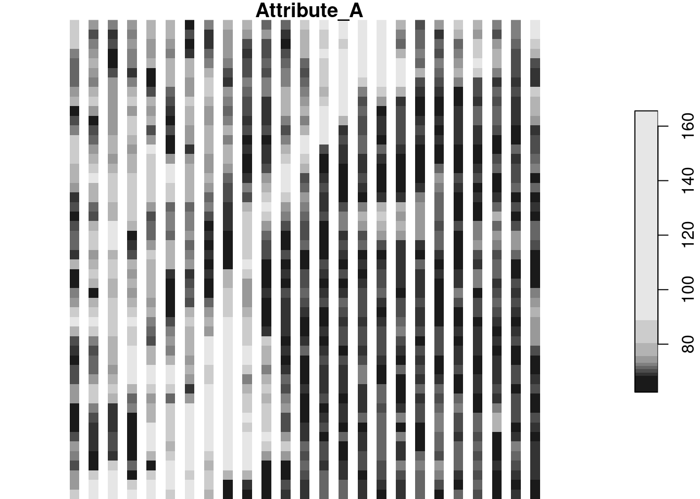
<p class="caption">(\#fig:unnamed-chunk-37)Demonstrating the effect of maskig the dummy data using a perfectly aligne raster ET map.</p>
</div>


```r
autoplot(
  microbenchmark(
No_masking =  x_aug %>%
  st_apply(1:2, mean) %>%
  setNames(paste0("v_",temp_names)),
Masking =  x_masked %>%
  st_apply(1:2, mean) %>%
  setNames(paste0("v_",temp_names))
 ), times=30
)
#> Coordinate system already present. Adding new coordinate
#> system, which will replace the existing one.
```

<div class="figure">

<p class="caption">(\#fig:withMasking)Comparing computation time before and after masking of raster data. There is no performance increase by masking before aggregating.</p>
</div>

Since there is no increase in performance from masking, as we see in Fig. \@ref(fig: withMasking) then it basically means we it is slower to mask beforehand, since the masking was not past of the benchmark assessment.

So, this is my solution:


```r
# setNames dont work on stars proxy obejct, so I use rename instead
lookup <- setNames("mean", paste0("v_", temp_names))

x_summerMean <-   x_aug %>%
  st_apply(1:2, mean) %>%
  rename(all_of(lookup))
```

The *v\_* follows the naming convention we have developed for ourselves.


```r
ggarrange(
ggplot() + 
  geom_stars(data = x_aug) +
  coord_equal() +
  facet_wrap(~time) +
  theme_void() +
  scale_fill_viridis_c(option = "D") +  scale_x_discrete(expand = c(0, 0)) +
  scale_y_discrete(expand = c(0, 0)),  
  
  
ggplot() + 
  geom_stars(data = x_summerMean) +
  coord_equal() +
  #facet_wrap(~time) +
  theme_void() +
  scale_fill_viridis_c(option = "D") +
  scale_x_discrete(expand = c(0, 0)) +
  scale_y_discrete(expand = c(0, 0))
)
```

<div class="figure">

<p class="caption">(\#fig:unnamed-chunk-39)Plotting the dummy data showing Attribute_A for the two dates as small maps, and a larger map showing the mean for year 2018</p>
</div>

Here's the whole first step of the conceptual workflow in action, on the dummy data.


```r

# Setting up the parameters
dir <- substr(getwd(), 1,2)
path <- ifelse(dir == "C:",
       "P:/", 
       "/data/P-Prosjekter2/")
path2 <- paste0(path, 
                "41201785_okologisk_tilstand_2022_2023/data/climate_indicators/dummy_data")
start_month <-  "06"
end_month <- "08"
myFiles <- list.files(path2, pattern=".rds", full.names = T)
summerTemp_fullSeries <- NULL

# Looping though the files in the directory
system.time({
for(i in 1:length(myFiles)){
  
  temp <- readRDS(myFiles[i]) %>%
    select(Attribute_A)
  
  year_temp <- year(st_get_dimension_values(temp, "time")[1])
  start <- ym(paste(year_temp, start_month, sep="-"))
  end <-  ym(paste(year_temp, end_month, sep="-"))
  myInterval <- interval(start, end)
  lookup <- setNames("mean", paste0("v_", year_temp))

  temp <- temp %>%
    filter(time %within% myInterval) %>%
    st_apply(1:2, mean) %>%
    rename(all_of(lookup))
  
  summerTemp_fullSeries <- c(temp, summerTemp_fullSeries)
  rm(temp) # same computation time with and without this function, but more tidy this way
}


# Turn the attributes into a dimension and rename the new attribute
summerTemp_fullSeries <- summerTemp_fullSeries %>%
  merge(name="Year") %>%
  setNames("Attribute_A")
})
#>    user  system elapsed 
#>   0.127   0.000   0.133
```

And this is the result.


```r
ggplot()+
  geom_stars(data = summerTemp_fullSeries) +
  coord_equal() +
  theme_void() +
  scale_fill_viridis_c(option = "D") +  
  scale_x_discrete(expand = c(0, 0)) +
  scale_y_discrete(expand = c(0, 0))+
  facet_wrap(~Year)
```

<div class="figure">

<p class="caption">(\#fig:unnamed-chunk-41)Temporal aggregation on the dummy data set.</p>
</div>

Now let's try it on the real data.

*I initially tried to read stars proxy object and add steps to the call_list and execute these with `st_as_stars`, but this still returned proxy objects. Therefore I read the whole file in without proxy. To save time I can subset based on Julian dates.*

I will use [parallelization](https://tmieno2.github.io/R-as-GIS-for-Economists/EE.html) to speed things up.


```r
path <- path <- ifelse(dir == "C:", 
      "R:/",
      "/data/R/")
  
path2 <- paste0(path, "GeoSpatialData/Meteorology/Norway_SeNorge2018_v22.09/Original/rr_tm/")

myFiles <- list.files(path2, pattern=".nc$",full.names = T)
# The last file (the last year) is incomplete and don't include all julian dates that we select below, so I will not include it:
myFiles <- myFiles[-length(myFiles)]

real_temp_summer <- NULL

# set up parallel cluster using 10 cores
cl <- makeCluster(10L)

# Get julian days after defining months
temp <- stars::read_ncdf(paste(myFiles[1]), var="tg")
start_month_num <-  6
end_month_num <- 8

julian_start <- yday(st_get_dimension_values(temp, "time")[1] %m+%
                       months(+start_month_num))
julian_end <- yday(st_get_dimension_values(temp, "time")[1] %m+%
                     months(+end_month_num))
step <- julian_end-julian_start


for(i in 1:length(myFiles)){
  
  tic("init")
  temp <- stars::read_ncdf(paste(myFiles[i]), var="tg", proxy=F,
                           ncsub = cbind(start = c(1, 1, julian_start), 
                              count = c(NA, NA, step)))
  year_temp <- year(st_get_dimension_values(temp, "time")[1])
  print(year_temp)
  lookup <- setNames("mean", paste0("v_", year_temp)) 
    # Perhaps leave out the v_ to get a numeric vector instead, 
    # which is easier to subset
  st_crs(temp) <- 25833
  toc()

  tic("filter and st_apply")
  temp <- temp %>%
    #filter(time %within% myInterval) %>%
    st_apply(1:2, mean, CLUSTER = cl) %>%
    rename(all_of(lookup)) 
  toc()
  
  tic("c()")
  real_temp_summer <- c(temp, real_temp_summer)
  #rm(temp)
  toc()
}

tic("Merge")
real_temp_summer <- real_temp_summer %>%
  merge(name = "Year") %>%
  setNames("climate_variable")
toc()

stopCluster(cl)

```

This takes about 20 sec per file/year, or 22 min on total. That is not too bad. About 6000 raster are read into memory. Here's a test for the effect of splitting over more cores.


```r
cl <- makeCluster(2L)
cl2 <- makeCluster(6L)
cl3 <- makeCluster(10L)


tic("No cluster")
temp %>%
    #filter(time %within% myInterval) %>%
    st_apply(1:2, mean) %>%
    rename(all_of(lookup)) 
toc()

tic("Two clusters")
temp %>%
    #filter(time %within% myInterval) %>%
    st_apply(1:2, mean, CLUSTER = cl) %>%
    rename(all_of(lookup)) 
stopCluster(cl)
toc()

tic("Six clusters")
temp %>%
    #filter(time %within% myInterval) %>%
    st_apply(1:2, mean, CLUSTER = cl2) %>%
    rename(all_of(lookup)) 
stopCluster(cl2)
toc()

tic("Ten clusters")
temp %>%
    #filter(time %within% myInterval) %>%
    st_apply(1:2, mean, CLUSTER = cl3) %>%
    rename(all_of(lookup)) 
stopCluster(cl3)
toc()
  
```

-   No cluster: 21.401 sec elapsed

-   Two clusters: 21.546 sec elapsed

-   Six clusters: 14.548 sec elapsed

-   Ten clusters: 15.29 sec elapsed

-   Ten clusters (second run): 13.617 sec elapsed

The RStudio server has 48 cores. More parallel cores is probably on average faster. The NINA guidelines is to use max 10 cores, and to remember to close parallel cluster when done.


```r
#saveRDS(real_temp_summer, "/data/P-Prosjekter2/41201785_okologisk_tilstand_2022_2023/data/climate_indicators/aggregated_climate_time_series/real_temp_summer.rds")
#write_stars(real_temp_summer, "/data/P-Prosjekter2/41201785_okologisk_tilstand_2022_2023/data/climate_indicators/aggregated_climate_time_series/real_temp_summer.tiff")
```

These files are about 500 MB, but the tiff file reads in a lot quicker then the rds file, so from now on I'll just export as tiff. *(This could perhaps have been solved with a `gc()`. Later I tried saving as RData with no speed issues problems, but then I had a problem with RData files seemingly becoming corrupted over time - stars objects saved as RData files would not bind together using `c.stars()` with other matching stars object and I think this could be related to a time stamp in the RData format. So, stick to tiff).*


```r
summer_median_temp <- read_stars(paste0(pData, "climate_indicators/aggregated_climate_time_series/real_temp_summer.tiff"),
                                 proxy=F)
```


```r
names(summer_median_temp)
#> [1] "real_temp_summer.tiff"
```


```r
dim(summer_median_temp)
#>    x    y band 
#> 1195 1550   66
```


```r
st_get_dimension_values(summer_median_temp, "Year")
#> NULL
```

Note that GTiff automatically renames the third dimension *band* and also renames the attribute.


```r
st_get_dimension_values(summer_median_temp, "band")
#>  [1] "v_2022" "v_2021" "v_2020" "v_2019" "v_2018" "v_2017"
#>  [7] "v_2016" "v_2015" "v_2014" "v_2013" "v_2012" "v_2011"
#> [13] "v_2010" "v_2009" "v_2008" "v_2007" "v_2006" "v_2005"
#> [19] "v_2004" "v_2003" "v_2002" "v_2001" "v_2000" "v_1999"
#> [25] "v_1998" "v_1997" "v_1996" "v_1995" "v_1994" "v_1993"
#> [31] "v_1992" "v_1991" "v_1990" "v_1989" "v_1988" "v_1987"
#> [37] "v_1986" "v_1985" "v_1984" "v_1983" "v_1982" "v_1981"
#> [43] "v_1980" "v_1979" "v_1978" "v_1977" "v_1976" "v_1975"
#> [49] "v_1974" "v_1973" "v_1972" "v_1971" "v_1970" "v_1969"
#> [55] "v_1968" "v_1967" "v_1966" "v_1965" "v_1964" "v_1963"
#> [61] "v_1962" "v_1961" "v_1960" "v_1959" "v_1958" "v_1957"
```

I can rename them.


```r
summer_median_temp <- summer_median_temp %>% 
  st_set_dimensions(names = c("x", "y", "v_YEAR")) %>%
  setNames("temperature")
dim(summer_median_temp)
#>      x      y v_YEAR 
#>   1195   1550     66
```


```r
ggplot()+
  geom_stars(data = summer_median_temp[,,,c(1,11,22)], downsample = c(10, 10, 0)) +
  coord_equal() +
  theme_void() +
  scale_fill_viridis_c(option = "D") +  
  scale_x_discrete(expand = c(0, 0)) +
  scale_y_discrete(expand = c(0, 0))+
  facet_wrap(~v_YEAR)
```

<div class="figure">

<p class="caption">(\#fig:unnamed-chunk-51)Showing three random slices of the year dimension.</p>
</div>

### Calculate reference values

#### Aggregate across reference years

We need to first to define a reference period and then to subset our data `summer_median_temp`. We can practice on the dummy data `y`.


```r
dir <- substr(getwd(), 1,2)
path <- ifelse(dir == "C:",
       "P:/", 
       "/data/P-Prosjekter2/")
path2 <- paste0(path, 
                "41201785_okologisk_tilstand_2022_2023/data/climate_indicators/dummy_data")
myFiles <- list.files(path2, pattern=".rds", full.names = T)
y <- NULL

# Looping though the files in the directory
for(i in 1:length(myFiles)){
  temp <- readRDS(myFiles[i])
  y <- c(temp, y)
}
```


```r
st_get_dimension_values(y, "time")
#>  [1] "1966-05-31" "1966-06-01" "1966-07-20" "1966-09-08"
#>  [5] "1967-05-31" "1967-06-01" "1967-07-20" "1967-09-08"
#>  [9] "1968-05-31" "1968-06-01" "1968-07-20" "1968-09-08"
#> [13] "1969-05-31" "1969-06-01" "1969-07-20" "1969-09-08"
#> [17] "1970-05-31" "1970-06-01" "1970-07-20" "1970-09-08"
```


```r
y_filtered <- y %>%
  select(Attribute_A) %>%
  filter(time %within% interval("1961-01-01", "1990-12-31"))
```

Now we aggregate across years, again using st_apply.


```r
median_sd <- function(x) { c(median = median(x), sd = sd(x))}
```


```r
y_ref <- y_filtered %>%
  st_apply(c("x", "y"), FUN =  median_sd)
```


```r
dim(y_ref)
#> median_sd         x         y 
#>         2        50        50
```


```r
st_get_dimension_values(y_ref, "median_sd")
#> [1] "median" "sd"
```

It's perhaps easier if median and sd are unique attributes, rather than levels of a dimension.


```r
y_ref <- y_ref %>% split("median_sd")
```

The attribute name *mean* we can change this to something more meaningful.


```r
y_ref <- setNames(y_ref, c("reference_upper", "sd"))
```


```r
tmap_arrange(
tm_shape(y_ref)+
  tm_raster("reference_upper")
,
tm_shape(y_ref)+
  tm_raster("sd",
            palette = "-viridis")
)
```

<div class="figure">

<p class="caption">(\#fig:unnamed-chunk-61)Showing the upper reference levels and the standard deviation from the dummy data set.</p>
</div>

Let's transfer this over to the real data. First we need to rename our dimension values and turn them back into dates.


```r
new_dims <- as.Date(paste0(
  substr(st_get_dimension_values(summer_median_temp, "v_YEAR"), 3, 6), "-01-01"))
summer_median_temp_ref <- summer_median_temp %>%
  st_set_dimensions("v_YEAR", values = new_dims)
```

Then I can filter to leave only the reference period.


```r
summer_median_temp_ref <- summer_median_temp_ref %>%
  filter(v_YEAR %within% interval("1961-01-01", "1990-12-31"))
st_get_dimension_values(summer_median_temp_ref, "v_YEAR")
#>  [1] "1990-01-01" "1989-01-01" "1988-01-01" "1987-01-01"
#>  [5] "1986-01-01" "1985-01-01" "1984-01-01" "1983-01-01"
#>  [9] "1982-01-01" "1981-01-01" "1980-01-01" "1979-01-01"
#> [13] "1978-01-01" "1977-01-01" "1976-01-01" "1975-01-01"
#> [17] "1974-01-01" "1973-01-01" "1972-01-01" "1971-01-01"
#> [21] "1970-01-01" "1969-01-01" "1968-01-01" "1967-01-01"
#> [25] "1966-01-01" "1965-01-01" "1964-01-01" "1963-01-01"
#> [29] "1962-01-01" "1961-01-01"
```

And then we calculate the median and sd like above


```r
system.time({
cl <- makeCluster(10L)
summer_median_temp_ref <- summer_median_temp_ref %>%
  st_apply(c("x", "y"), 
           FUN =  median_sd,
           CLUSTER = cl)
stopCluster(cl)
})
```

| user  | system | elapsed |
|-------|--------|---------|
| 9.624 | 6.069  | 20.903  |

This is also something I can export.


```r
# Note that write_stars can only export a single attribute, but we have put the 'attributes' as dimensions, and these will be read in as 'band' when importing tiff.
write_stars(summer_median_temp_ref, "/data/P-Prosjekter2/41201785_okologisk_tilstand_2022_2023/data/climate_indicators/aggregated_climate_time_series/summer_median_temp_ref.tiff")

# I initially saved as RData, like this, but ran into problems later when trying to bind stars objects using c.stars(). It appears RData becomes corrutpt in a sense, over time, perhaps due to some time stamp. If I recreated the object in the global environment and saved as RDatam I could read it in and work with it, but the next day it would not work again.
#saveRDS(summer_median_temp_ref, "/data/P-Prosjekter2/41201785_okologisk_tilstand_2022_2023/data/climate_indicators/aggregated_climate_time_series/summer_median_temp_ref.RData")
```


Pivot and turn dimension into attributes:


```r
summer_median_temp_ref_long <- summer_median_temp_ref %>% split("band")
```

The attribute name is *mean*. We can change this to something more meaningful.


```r
summer_median_temp_ref_long <- setNames(summer_median_temp_ref_long, c("reference_upper", "sd"))
```


```r
tmap_arrange(
tm_shape(st_downsample(summer_median_temp_ref_long, 10))+
  tm_raster("reference_upper")
,
tm_shape(st_downsample(summer_median_temp_ref_long, 10))+
  tm_raster("sd",
            palette = "-viridis")
)
```

<div class="figure">
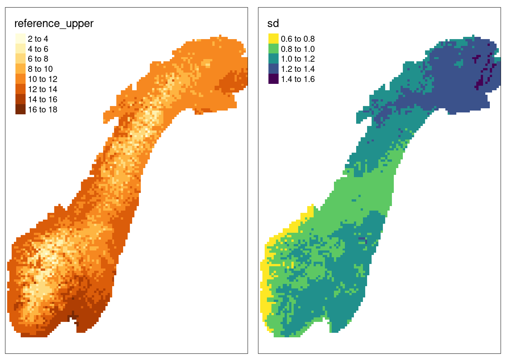
<p class="caption">(\#fig:unnamed-chunk-69)Showing the upper reference levels and the standard deviation from actual data of median summer temperatures.</p>
</div>

#### Combine

I need to combine the variables and the ref values in one data cube


```r
y_var <- summer_median_temp %>%
  split(3) %>%
  c(summer_median_temp_ref_long)
```

### Normalise variable


```r
# select the columns to normalise
cols <- names(y_var)[!names(y_var) %in% c("reference_upper", "sd") ]
cols_new <- cols
names(cols_new) <- gsub("v_", "i_", cols)
```


```r
# Mutate

# The break point scaling is actually not needed here, since 
# having the lower ref value to be 5 sd implies that the threshold is
# 2 sd in a linear scaling.

system.time(
y_var_norm <- y_var %>%
  mutate(reference_low = reference_upper - 5*sd ) %>%
  mutate(reference_low2 = reference_upper + 5*sd ) %>%
  mutate(threshold_low = reference_upper -2*sd ) %>%
  mutate(threshold_high = reference_upper +2*sd ) %>%
  mutate(across(all_of(cols), ~ 
                  if_else(.x < reference_upper,
                  if_else(.x < threshold_low, 
                                        (.x - reference_low) / (threshold_low - reference_low),
                                        (.x - threshold_low) / (reference_upper - threshold_low),
                                        ),
                  if_else(.x > threshold_high, 
                                        (reference_low2 - .x) / (reference_low2 - threshold_high),
                                        (threshold_high - .x) / (threshold_high - reference_upper),
                                        )
                ))) %>%
  mutate(across(all_of(cols), ~ if_else(.x > 1, 1, .x))) %>%
  mutate(across(all_of(cols), ~ if_else(.x < 0, 0, .x))) %>%
  rename(all_of(cols_new)) %>%
  c(select(y_var, all_of(cols)))
)
```

| user   | system | elapsed |
|--------|--------|---------|
| 14.803 | 2.717  | 17.512  |

Writing to file, this time as RData (could use rds) because tiff don't allow multiple attributes, and because we don't need to use `c.stars()` in this object.


```r
gc()
saveRDS(y_var_norm, "/data/P-Prosjekter2/41201785_okologisk_tilstand_2022_2023/data/climate_indicators/aggregated_climate_time_series/summer_median_temp_normalised.RData")
```


```r

lims <- c(-5, 22)

ggarrange(
ggplot() + 
  geom_stars(data = st_downsample(y_var_norm["v_1970"],10)) +
  coord_equal() +
  theme_void() +
  scale_fill_viridis_c(option = "D",
                       limits = lims) +  
  scale_x_discrete(expand = c(0, 0)) +
  scale_y_discrete(expand = c(0, 0))
,
ggplot() + 
  geom_stars(data = st_downsample(y_var_norm["reference_upper"], 10)) +
  coord_equal() +
  theme_void() +
  scale_fill_viridis_c(option = "D",
                       limits = lims) +  
  scale_x_discrete(expand = c(0, 0)) +
  scale_y_discrete(expand = c(0, 0))
,
ggplot() + 
  geom_stars(data = st_downsample(y_var_norm["reference_low"], 10)) +
  coord_equal() +
  theme_void() +
  scale_fill_viridis_c(option = "D",
                       limits = lims) +  
  scale_x_discrete(expand = c(0, 0)) +
  scale_y_discrete(expand = c(0, 0))
,

ggplot() + 
  geom_stars(data = st_downsample(y_var_norm["reference_low2"], 10)) +
  coord_equal() +
  theme_void() +
  scale_fill_viridis_c(option = "D",
                       limits = lims) +  
  scale_x_discrete(expand = c(0, 0)) +
  scale_y_discrete(expand = c(0, 0))
,

ggplot() + 
  geom_stars(data = st_downsample(y_var_norm["i_1970"],10)) +
  coord_equal() +
  theme_void() +
  scale_fill_viridis_c(option = "A",
                       limits = c(0, 1)) +  
  scale_x_discrete(expand = c(0, 0)) +
  scale_y_discrete(expand = c(0, 0))
, ncol=2, nrow=3, align = "hv"
)
```

<div class="figure">
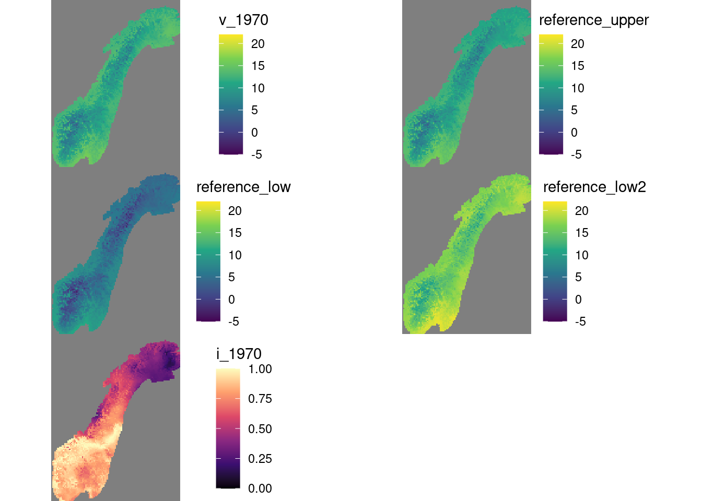
<p class="caption">(\#fig:unnamed-chunk-75)Example showing median summer tempretur in 1970, the upper and lwoer reference temperture, i.e. median and 5 SD units of the temperature between  1961-1990, and finally, the scaled indicator values.</p>
</div>

The *real* indicator values should be means over 5 year periods. Calculating a running mean for all time steps is too time consuming. Therefore, the scaled, regional indicator values will be calculated for distinct time steps. The time series can perhaps best be presented with yearly resolution.

### Plot time series as line graphs

We could also plot a time series as a series of maps, but then we need to average over these 5 year time periods first. We can get to that later.

To plot time series I first need to do a spatial aggregation. One option is to spatially aggregate the stars object directly, using the `reg` data set:


```r
temp <- y_var_norm[1,,] %>%
  aggregate(reg, mean, na.rm=T)
plot(temp)
temp2 <- temp %>%
  st_as_sf() # too slow
```

However, this does no preserve the region name, and a subsequent `st_intersection` taks a little while and gives some boundary problems.

I can also convert pixels to points and then do the intersection.


```r
temp_points <- y_var_norm[1,,] %>%
  st_as_sf(as_points = TRUE, merge = FALSE)
temp_points2 <- temp_points %>%
  st_intersection(reg) " too slow"
```

But this also took too long.

I can perhaps aggregate, and then turn to points and intersect, but that did not work perfect either.

I can rasterize the regions data set, turn it into a coded dimension and use st_apply, but that is tedious.

Let me try using `exact_extract`, as an alternative to `aggregate`. This requires us to turn to the `terra` package for a bit.


```r
system.time(
regional_means <- rast(y_var_norm) %>%
  exact_extract(reg, fun = 'mean', append_cols = "region", progress=T) %>%
  setNames(c("region", names(y_var_norm)))
  )
```

user; system; elapsed: 7.603; 3.071; 10.697

That was fast!

I should also get the sd:


```r
system.time(
regional_sd <- rast(y_var_norm) %>%
  exact_extract(reg, fun = 'stdev', append_cols = "region", progress=T) %>%
  setNames(c("region", names(y_var_norm)))
  )
```

user; system; elapsed: 7.420; 2.921; 10.355


```r
saveRDS(regional_means, "temp/regional_means.rds")
saveRDS(regional_sd, "temp/regional_sd.rds")
```


Reshape and plot


```r
div <- c("reference_upper",
         "reference_low",
         "reference_low2",
         "threshold_low",
         "threshold_high",
         "sd")

temp <- regional_means %>%
  as.data.frame() %>%
  select(region, div)
  
regional_means_long <- regional_means %>%
  as.data.frame() %>%
  select(!all_of(div)) %>%
  pivot_longer(!region) %>%
  separate(name, into=c("type", "year")) %>%
  pivot_wider(#id_cols = region,
              names_from = type)  %>%
  left_join(temp, by=join_by(region)) %>% 
  mutate(diff = v-reference_upper) %>%
  mutate(threshold_low_centered = threshold_low-reference_upper) %>%
  mutate(threshold_high_centered = threshold_high-reference_upper)

#Adding the spatial sd
(
regional_means_long <- regional_sd %>%
  select(!all_of(div)) %>%
  pivot_longer(!region) %>%
  separate(name, into=c("type", "year")) %>%
  pivot_wider(names_from = type) %>%
  rename(i_sd = i,
         v_sd = v) %>%
  left_join(regional_means_long, by=join_by(region, year))
)
#> # A tibble: 330 × 15
#>    region     year   i_sd  v_sd     i     v reference_upper
#>    <chr>      <chr> <dbl> <dbl> <dbl> <dbl>           <dbl>
#>  1 Nord-Norge 2022  0.246  1.90 0.523  11.5            10.2
#>  2 Nord-Norge 2021  0.255  1.65 0.672  10.8            10.2
#>  3 Nord-Norge 2020  0.143  1.82 0.784  10.3            10.2
#>  4 Nord-Norge 2019  0.290  1.77 0.623  10.8            10.2
#>  5 Nord-Norge 2018  0.344  1.64 0.523  12.5            10.2
#>  6 Nord-Norge 2017  0.145  1.79 0.794  10.1            10.2
#>  7 Nord-Norge 2016  0.175  1.74 0.705  10.8            10.2
#>  8 Nord-Norge 2015  0.198  1.61 0.682  10.6            10.2
#>  9 Nord-Norge 2014  0.297  1.65 0.545  13.1            10.2
#> 10 Nord-Norge 2013  0.202  1.65 0.479  11.4            10.2
#> # ℹ 320 more rows
#> # ℹ 8 more variables: reference_low <dbl>,
#> #   reference_low2 <dbl>, threshold_low <dbl>,
#> #   threshold_high <dbl>, sd <dbl>, diff <dbl>,
#> #   threshold_low_centered <dbl>,
#> #   threshold_high_centered <dbl>
```


```r
regOrder = c("Østlandet","Sørlandet","Vestlandet","Midt-Norge","Nord-Norge")

regional_means_long %>%
  mutate(col = if_else(diff>0, "1", "2")) %>%
  ggplot(aes(x = as.numeric(year), 
           y = diff, fill = col))+
  geom_bar(stat="identity")+
  geom_hline(aes(yintercept = threshold_low_centered),
        linetype=2)+
  geom_hline(aes(yintercept = threshold_high_centered),
        linetype=2)+
  geom_segment(x = 1961, xend=1990,
               y = 0, yend = 0,
               linewidth=2)+
  scale_fill_hue(l=70, c=60)+
  theme_bw(base_size = 12)+
  ylab("Sommertempratur\navvik fra 1961-1990")+
  xlab("")+
  guides(fill="none")+
  facet_wrap( .~ factor(region, levels = regOrder),
              ncol=3,
              scales = "free_y")
```

<div class="figure">
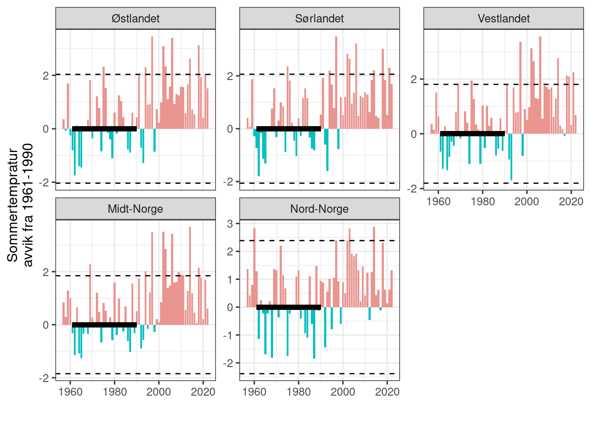
<p class="caption">(\#fig:unnamed-chunk-83)Times series for median summer temperature centered on the median value during the reference period. The reference period is indicated with a thick horizontal line. Dottet horisontal lines are 2 sd units for the reference period.</p>
</div>

Then we can take the mean over the last 5 years and add to a spatial representation.


```r
(
i_aggregatedToPeriods <- regional_means_long %>%
  mutate(year = as.numeric(year)) %>%
  mutate(period = case_when(
    year %between% c(2018, 2022) ~ "2018-2022",
    year %between% c(2013, 2017) ~ "2013-2017",
    year %between% c(2008, 2012) ~ "2008-2012",
    year %between% c(2003, 2007) ~ "2003-2007",
    .default = "pre 2003"
  )) %>%
  mutate(period_rank = case_when(
   period == "2018-2022" ~ 5,
   period == "2013-2017" ~ 4,
   period == "2008-2012" ~ 3,
   period == "2003-2007" ~ 2,
    .default = 1
  )) %>%
  group_by(region, period, period_rank) %>%
  summarise(indicator = mean(i),
            spatial_sd = sqrt(sum(i_sd^2))/length(i_sd)
            #,
            #spatial_sd_mean = mean(i_sd),
            #spatial_sd2_max = max(i_sd),
            #spatial_sd2_length = length(i_sd)
            )
)
#> `summarise()` has grouped output by 'region', 'period'. You
#> can override using the `.groups` argument.
#> # A tibble: 25 × 5
#> # Groups:   region, period [25]
#>    region     period    period_rank indicator spatial_sd
#>    <chr>      <chr>           <dbl>     <dbl>      <dbl>
#>  1 Midt-Norge 2003-2007           2     0.427     0.101 
#>  2 Midt-Norge 2008-2012           3     0.573     0.143 
#>  3 Midt-Norge 2013-2017           4     0.536     0.0986
#>  4 Midt-Norge 2018-2022           5     0.607     0.130 
#>  5 Midt-Norge pre 2003            1     0.642     0.0277
#>  6 Nord-Norge 2003-2007           2     0.460     0.122 
#>  7 Nord-Norge 2008-2012           3     0.675     0.109 
#>  8 Nord-Norge 2013-2017           4     0.641     0.0937
#>  9 Nord-Norge 2018-2022           5     0.625     0.118 
#> 10 Nord-Norge pre 2003            1     0.625     0.0266
#> # ℹ 15 more rows
```


```r
labs <- unique(i_aggregatedToPeriods$period[order(i_aggregatedToPeriods$period_rank)])

i_aggregatedToPeriods %>%
  ggplot(aes(x = period_rank, 
             y = indicator,
             colour=region))+
  geom_line() +
  geom_point() +
  geom_errorbar(aes(ymin=indicator-spatial_sd, 
                    ymax=indicator+spatial_sd), 
                    width=.2,
                 position=position_dodge(0.2)) +
  theme_bw(base_size = 12)+
  scale_x_continuous(breaks = 1:5,
                     labels = labs)+
  labs(x = "", y = "indikatorverdi")
```

<div class="figure">
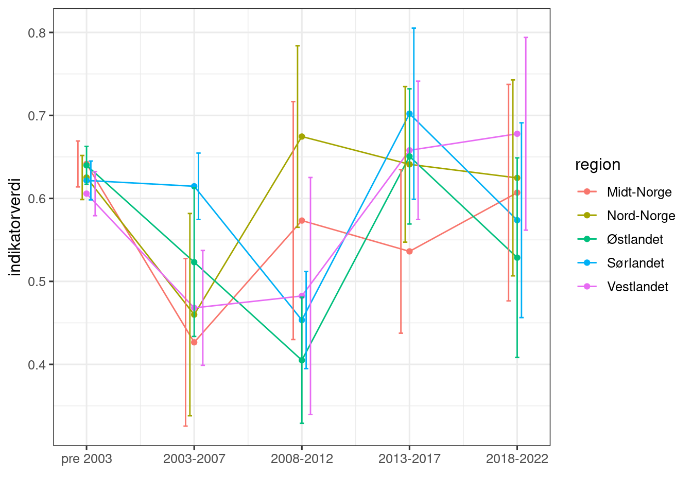
<p class="caption">(\#fig:unnamed-chunk-85)Scaled indicator values, aggregated over 5 year intervals. Errors represent spatial variation within regions and across years.</p>
</div>

Finally, I can add these values to the sp object.


```r
reg2 <- reg %>%
  left_join(i_aggregatedToPeriods[i_aggregatedToPeriods$period_rank==5,], by=join_by(region))
names(reg2)
#> [1] "id"          "region"      "GID_0"       "NAME_0"     
#> [5] "period"      "period_rank" "indicator"   "spatial_sd" 
#> [9] "geometry"
```


```r
myCol <- "RdYlGn"
myCol2 <- "-RdYlGn"

tm_main <- tm_shape(reg2)+
  tm_polygons(col="indicator",
              title="Indikator:\nsommertemperatur",
    palette = myCol,
    style="fixed",
    breaks = seq(0,1,.2)) 
  
tm_inset <- tm_shape(reg2)+
  tm_polygons(col="spatial_sd",
              title="SD",
              palette = myCol2,
              style="cont")+
  tm_layout(legend.format = list(digits=2))

tmap_arrange(tm_main, 
             tm_inset)
```

<div class="figure">
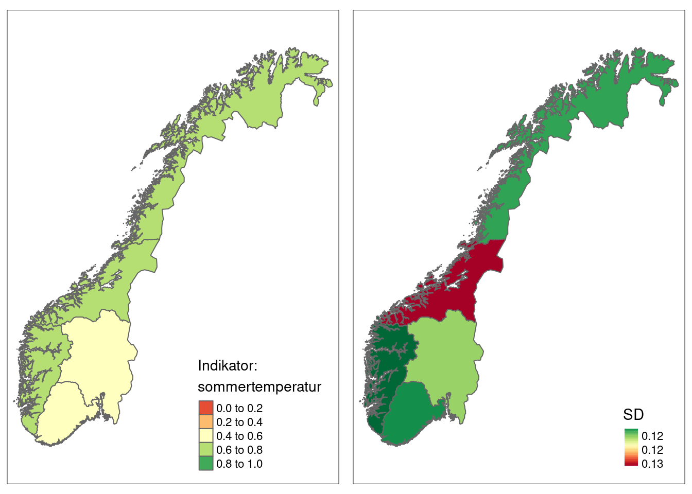
<p class="caption">(\#fig:unnamed-chunk-87)Summer tempreature indicator values for five accounting areas in Norway. SD is the spatial variation.</p>
</div>


<!--chapter:end:climate_indicators_explained.Rmd-->

